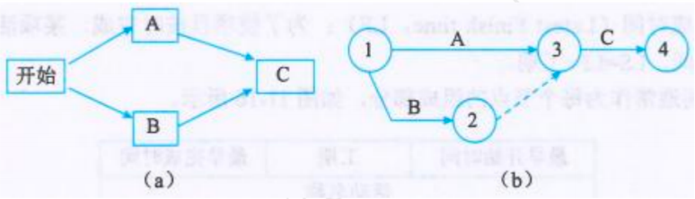
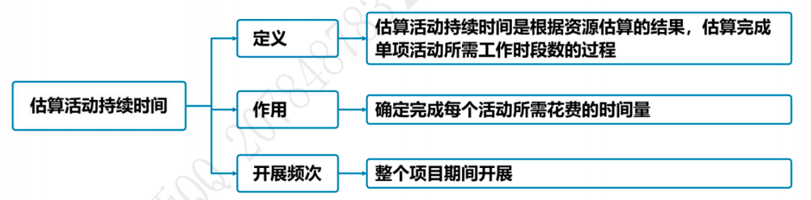
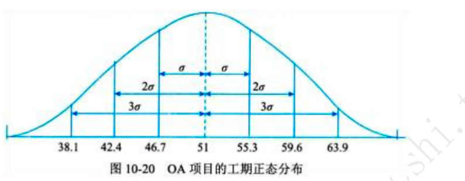

# 项目进度管理

## 10.1 管理基础 

### 10.1.1 项目进度计划的定义和总要求 :star::star::star:

1. 项目进度计划：提供了项目的详尽计划，说明项目如何以及何时交付项目范围中定义的产品、服务和成果，**是一种用于沟通和管理干系人期望的工具，为绩效报告提供依据**。
2. 编制进度计划的步骤：
   1. 首先选择进度计划方法，例如关键路径法；
   2. 然后将项目特定数据，如活动、计划日期、持续时间、资源、依赖关系和制约因素等输入进度计划编制工具，创建项目进度模型；
   3. 最后根据进度模型形成项目进度计划。

### 10.1.2 管理新实践 :star::star::star::star:

1. 具有未完成项的迭代型进度计划：这种方法**将需求记录在用户故事中，然后在建造之前按优先级排序并优化用户故事，最后在规定的时间内开发产品功能**。这一方法**通常用于向客户交付增量价值，或多个团队并行开发大量的、内部关联的、较小的功能**。
2. 按需进行的进度计划：按需进行的进度计划方法不依赖于预先定义好的进度计划，而是**在资源可用时立即从未完成项和工作序列中提取工作任务**，该方法适用于具有如下特征的项目：**一是在运营或持续环境中以增量方式研发产品的项目；二是工作任务的规模或范围相对类似的项目；三是可以按照规模或范围对任务进行组合的项且**。

## 10.2 项目进度管理过程

### 10.2.1 过程概述 :star::star::star::star::star:

项目进度管理过程:
  1. 规划-规划进度管理：
     1. 定义：规划进度管理是为规划、编制、管理、执行和控制项目进度而制定政策、程序和文档的过程。
     2. 作用：为如何在整个项目期间管理项目进度提供指南和方向。
     3. 开展次数：**仅开展一次**或仅在项目的预定义时开展
  2. 规划-定义活动：
     1. 定义：定义活动是识别和记录为完成项目可交付成果而须采取的具体行动的过程。
     2. 作用：将工作包分解为进度活动，作为对项目工作进行进度估算、规划、执行、监督和控制的基础。
     3. 开展次数：需要在整个项目期间**反复开展**。
  3. 规划-排序活动顺序：
     1. 定义：排列活动顺序是识别和记录项目活动之间关系的过程。
     2. 作用：定义工作之间的逻辑顺序，以便在既定的所有项目制约因素下获得最高的效率。
     3. 开展次数：需要在整个项目期间**反复开展**。
  4. 规划-估算活动持续时间：
     1. 定义：估算活动持续时间是根据资源估算的结果，估算完成单项活动所需工作时段数的过程。
     2. 作用：确定完成每个活动所需花费的时间量。
     3. 开展次数：需要在整个项目期间**反复开展**。
  5. 规划-制订进度计划：
     1. 定义：制订进度计划是分析活动顺序、持续时间、资源需求和进度制约因素，创建进度模型，从而落实项目执行和监控的过程。
     2. 作用：为完成项目活动而制定具有计划日期的进度模型。
     3. 开展次数：需要在整个项目期间**反复开展**。
  6. 监控-控制进度：
     1. 定义：控制进度是监督项目状态，以更新项目进度和管理进度基准变更的过程。
     2. 作用：在整个项目期间保持对进度基准的维护。
     3. 开展次数：需要在整个项目期间**反复开展**。

### 10.2.2 裁剪考虑因素

裁剪时应考虑的因素包括：**生命周期方法；资源可用性；项目维度；技术支持**。

### 10.2.3 敏捷与适应方法

在大型组织中，可能同时存在小规模项目和大规模项目的组合，**可能需要采用一系列技术，包括预测型方法、适应型方法或两种方法的混合**。

## 10.3 规划进度管理 :star::star::star::star::star:

1. 规划进度管理【输入】详细解析：
   1. **项目章程**。项目章程中规定的总体里程碑计划会影响项目的进度管理。
   2. **项目管理计划**:
      - 开发方法：提供进度活动相关的技术和方法。 
      - 范围管理计划：提供有关如何制订进度计划的信息。
   3. **事业环境因素**
   4. **组织过程资产**
2. 规划进度管理【工具与技术】详细解析：
   1. **专家判断**。专家利用自身的技能或经验来做出判断。
   2. **数据分析**。适用于规划进度管理过程的数据分析技术是备选方案分析。备选方案分析可包括确定采用哪些进度计划方法，以及如何将不同方法整合到项目中；此外，它还可以包括确定进度计划的详细程度、滚动式规划的持续时间以及审查和更新频率。
   3. **参会**。人员可包括项目经理、项目发起人、项目团队成员、选定的干系人、进度计划或执行负责人以及其他必要人员等。
3. 规划进度管理【输出】详细解析：
   1. **进度管理计划**：
      1. **进度管理计划可以是正式或非正式的，非常详细或高度概括的**。
      2. 进度管理计划的内容：项目进度模型、进度计划的发布和迭代长度、准确度、计量单位、工作分解结构、项目进度模型维护、控制临界值、绩效测量规则、报告格式。

## 10.4 定义活动 :star::star::star::star::star:

1. 定义活动【输入】详细解析：
   1. **项目管理计划**:
      - 进度管理计划：定义了相关的方法，以及管理工作所需的详细程度。 
      - 范围基准：需考虑范围基准中的WBS、可交付成果、制约因素和假设条件。
   2. **事业环境因素**。
   3. **组织过程资产**。 
2. 定义活动【工具与技术】详细解析：
   1. **专家判断**。专家利用自身的技能或经验来做出判断。
   2. **分解**：把WBS中的工作包分解成活动。**定义活动过程的最终输出是活动而不是可交付成果，可交付成果是指导与管理项目工作过程的输出。WBS和WBS字典是制定最终活动清单的基础**。
   3. **滚动式规划**：是一种迭代式的规划技术，即**详细规划近期要完成的工作，同时在较高层级上粗略规划远期工作**。它是一种渐进明细的规划方式。
   4. **会议**。会议可以是面对面或虚拟会议，正式或非正式会议。
3. 定义活动【输出】详细解析
   1. **活动清单**：包含项目所需的进展活动。**使用滚动式规划或敏捷技术的项目，活动清单会在项目进展过程中定期更新**。
   2. **活动属性**：活动描述、紧前活动、紧后活动、逻辑关系、提前量和滞后量、资源需求、强制日期、制约因素和假设条件。**活动属性随着项目进展情况演进并更新**。
   3. **里程碑**：里程碑是项目中的重要时点或事件，里程碑清单列出了项目所有的里程碑，并指明每个里程碑是强制性的（如合同要求的）还是选择性的（如根据历史信息确定的）。里程碑的持续时间为零，因为它们代表的只是一个重要时间点或事件。【里程碑是事件，是节点，不占资源，不耗时间】
   4. **变更请求**：一旦定义项目的基准后，在将可交付成果渐进明细为活动的过程中，**可能会发现原本不属于项目基准的工作，此时需要提出变更请求**。
   5. **项目管理计划（更新）**：
      1. 进度基准：在整个项目期间，工作包逐渐细化为活动。**在这个过程中，可能会发现原本不属于项目基准的工作需要增加，因此需要修改交付日期或其他重要的进度里程碑**。
      2. 成本基准：在针对进度活动的变更获得批准后，需要对成本基准做出相应的变更。

## 10.5 排列活动顺序 :star::star::star::star::star:

1. 排列活动顺序过程旨在**将项目活动列表转化为图表**，作为发布进度基准的第一步。
2. **除了首尾两项，每项活动都至少有一项紧前活动和一项紧后活动、并且逻辑关系适当**。
3. 排列活动顺序【输入】详细解析：
   1. **项目管理计划**:
      - 进度管理计划：规定了排列活动顺序的方法和准确度，以及所需的其他标准。 
      - 范围基准：需考虑范围基准中的WBS、可交付成果、制约因素和假设条件。
   2. **项目文件**：
      - 假设日志：日志所记录的假设条件和制约因素可能影响活动排序的方式。 
      - 活动属性：可能描述了事件之间顺序以及逻辑关系。
      - 活动清单：列出了项目所需的、待排序的全部进度活动。
      - 里程碑清单：该清单可能已经列出**特定里程碑的实现日期**。
   3. **事业环境因素**
   4. **组织过程资产**
4. 排列活动顺序【工具与技术】详细解析：
   1. **紧前关系绘图法**：
      1. 紧前关系绘图法（PDM），又称前导图法，是用于编制项目进度网络图的一种方法，它使用方框或者长方形（被称作节点）代表活动，节点之间用箭头连接，以显示节点之间的逻辑关系。这种网络图也被称作单代号网络图（只有节点需要编号）或活动节点图。
      2. PDM（紧前关系绘图法）包括四种依赖关系或逻辑关系：紧前活动是在进度计划的逻辑路径中，排在某个活动前面的活动。紧后活动是在进度计划的逻辑路径中，排在某个活动后面的活动。
         1. F-S型（完成-开始），只有紧前活动完成，紧后活动才能开始的逻辑关系；
         2. F-F型（完成-完成），只有紧前活动完成，紧后活动才能完成的逻辑关系；
         3. S-S型（开始-开始），只有紧前活动开始，紧后活动才能开始的逻辑关系；
         4. S-F型（开始-完成），只有紧前活动开始，紧后活动才能完成的逻辑关系；
      3. 在PDM图中，FS是最常用的逻辑关系类型；SF关系则很少使用。
      4. 在前导图法中，每个节点的活动会有如下几个时间：
         1. **最早开始时间（ES）**。某项活动能够开始的最早时间。
         2. **最早完成时间（EF）**。某项活动能够完成的最早时间。EF=ES+工期；
         3. **最迟开始时间（LS）**。为了使项目按时完成，某项活动必须开始的最迟时间。
         4. **最迟完成时间（LF）**。为了使项目按时完成，某项活动必须完成的最迟时间。LS=LF-工期。
      5. 虽然两个活动之间可能同时存在两种逻辑关系（例如 SS和FF），**但不建议相同的活动之间存在多种关系**。因此**必须做出影响最大的逻辑关系的决定**。此外**也不建议采用闭环的逻辑关系**。
   2. **箭线图法**：
      1. **箭线图法是用箭线表示活动、节点表示事件的一种网络图绘制方法**。这种网络图也被称作双代号网络图（节点和箭线都要编号）或活动箭线图。
      2. **在箭线图法中，有如下三个基本原则**：
         1. **网络图中每一活动和每一事件都必须有唯一的个代号，即网络图中不会有相同的代号**；
         2. **任两项活动的紧前事件和紧后事件代号至少有一个不相同，节点代号沿箭线方向越来越大**；
         3. **流入（流出）同一节点的活动，均有共同的紧后活动（或紧前活动）**。
      3. **为了绘图的方便，在箭线图中又人为引入了一种额外的、特殊的活动，叫作虚活动，在网络图中由一个虚箭线表示**。
      4. **虚活动不消耗时间，也不消耗资源，只是为了弥补箭线图在表达活动依赖关系方面的不足**。
      
   3. **确定和整合依赖关系**：四种依赖关系包括：
      1. 强制性依赖关系：又称硬逻辑关系或硬依赖关系。**强制性依赖关系往往与客观限制有关**。例如，在建筑项目中，只有在地基建成后，才能建立地面结构；在电子项目中，必须先把原型制造出来，然后才能对其进行测试。
      2. 选择性依赖关系：又称软逻辑关系。**选择性依赖关系应基于具体应用领域的最佳实践或项目的特殊性质对活动顺序的要求来创建**。如果打算进行快速跟进，则应当审查相应的选择性依赖关系，并考虑是否需要调整或去除。
      3. 外部依赖关系：项目活动与非项目活动之间的依赖关系。**这些依赖关系往往不在项目团队的控制范围内**。例如，软件项目的测试活动取决于外部硬件的到货；建筑项目的现场准备，可能要在政府的环境听证会之后才能开始。
      4. 内部依赖关系：**项目活动之间的紧前关系，通常在项目团队的控制之中**。例如，只有机器组装完毕，团队才能对其测试。
   4. **提前量和滞后量**：
      1. 提前量是相对于紧前活动，紧后活动可以提前的时间量，**提前量一般用负值表示**。滞后量是相对于紧前活动，紧后活动需要推迟的时间量，**滞后量一般用正值表示**。
      2. 【图例解析】下图中：
         1. B、C活动之间的关系是SS，C为B的紧后，意思只有B开始，C才能开始。
         2. H、I活动之间的关系是SS+10，I为H的紧后，如果是SS的话，意思只有H开始，I才能开始，现在是SS+10，意思就是只有H开始10天后，I才能开始。
         3. F、G活动之间的关系是FS+15，G为F的紧后，如果是FS的话，意思只有F完成后，G才能开始，现在是FS+15，意思只有F完成15天后，G才能开始。 
      
   5. **项目管理信息系统**。例如：MS Project、PingCode、Worktile、Jira等。
5. 排列活动顺序【输出】详细解析：
   1. **项目进度网络图**：
      1. 项目进度网络图是表示项目进度活动之间的逻辑关系（也叫依赖关系）的图形；
      2. 项目进度网络图可手工或借助项目管理软件来绘制，可包括项目的全部细节，也可只列出一项或多项概括性活动。
      3. **带有多个紧前活动的活动代表路径汇聚，而带有多个紧后活动的活动则代表路径分支**。**带汇聚和分支的活动受到多个活动的影响或能够影响多个活动，因此存在较大风险**。
   2. **项目文件（更新）**。活动属性、活动清单、假设日志、里程碑清单。

## 10.6 估算活动持续时间 :star::star::star::star::star:

1. 在估算活动持续时间过程中，**应该首先估算完成活动所需的工作量和计划投入该活动的资源数量，然后结合项目日历和资源日历**，据此估算出完成活动所需的工作时段。
2. **活动持续时间估算的准确性和质量会随着项目进展而逐步提高**。
3. 估算持续时间时需要考虑的其他因素包括：
   1. **递减规律：增加一个用于单位产出所需投入的因素（如资源）会最终达到一个临界点，在该点之后的产出或输出会随着增加这个因素而递减。【和边际效益一个意思】**
   2. **资源数量：增加资源数量，比如两倍投入资源但完成工作的时间不一定能缩短一半**。
   3. **技术进步：技术进步因素可能发挥重要作用**。
   4. **激励：项目经理还需要了解拖延症和帕金森定律。前者指出，人们只有在最后一刻，即快到期限时才会全力以赴。后者指出，只要还有时间，工作就会不断扩展，直到用完所有的时间**。
4. 估算活动持续时间【输入】详细解析：
   1. **项目管理计划**：
      - 进度管理计划：规定了用于估算活动持续时间的方法和准确度。 
      - 范围基准：包含可能影响人力投入和持续时间估算的技术细节。
   2. **项目文件**：假设日志、风险登记册、活动属性、活动清单、里程碑清单、经验教训登记册、资源需求、资源分解结构、资源日历、项目团队派工单。
   3. **事业环境因素**
   4. **组织过程资产**
5. 估算活动持续时间【工具与技术】详细解：
   1. **专家判断**。专家利用自身的技能或经验来做出判断。
   2. **类比估算**：【信息不足，采用类比，类比估算，不准确，耗时少，成本低】
      1. 类比估算是一种使用相似活动或项目的历史数据来估算当前活动或项目的持续时间或成本的技术，这**是一种粗略的估算方法**。
      2. **在项目详细信息不足时，经常使用类比估算来估算项目持续时间**。
      3. 相对于其他估算技术，**类比估算通常成本较低、耗时较少，但准确性也较低。类比估算可以针对整个项目或项目中的某个部分进行，也可以与其他估算方法联合使用**。如果以往活动是本质上而不是表面上类似，并且从事估算的项目团队成员具备必要的专业知识，那么类比估算可靠性会比较高。
   3. **参数估算**：【参数估算必须要有一个计算模型，比如：勾股定理，输入边长就可以求出玄长，这个就是输入参数->计算模型->输出结果】
      1. **参数估算是一种基于历史数据和项目参数，使用某种算法来计算成本或持续时间的估算技术**。
      2. 参数估算的准确性取决于**参数模型的成熟度和基础数据的可靠性**。**参数估算可以针对整个项目或项目中的某个部分，并可以与其他估算方法联合使用**。
   4. **三点估算**：
      1. 当历史数据不充分时，通过考虑估算中的不确定性和风险，可以提高活动持续时间估算的准确性。使用三点估算有助于界定活动持续时间的近似区间：【三点估算用在不确定性估算中】
         - 乐观时间（To）：任何事情都顺利的情况下，完成某项工作的时间。
         - 最可能时间（Tm）：正常情况下，完成某项工作的时间。
         - 悲观时间（Tp）：最不利的情况下，完成某项工作的时间。
      2. 基于持续时间在三种估算值区间内的假定分布情况，可计算期望持续时间Te。
         - 如果三个估算值服从三角分布，则：`Te = (To + Tm + Tp) / 3`
         - 如果三个估算值服从β分布，则：`Te = ( To + 4 * Tm + Tp) / 6`
      3. 【补充】β分布之项目周期估算【置信区间】
         - `准差(δ) = (悲观时间 - 乐观时间) / 6`
         - 一个标准差：68%（项目在一个标准差时间内完成的概率为68%）
         - 两个标准差：95%（项目在两个标准差时间内完成的概率为95%）
         - 三个标准差：99%（项目在三个标准差时间内完成的概率为99%）
      4. 在做项目时经常会预估，在某个时间范围完成项目的概率是多少。也就是在某个【开始时间至 结束时间】这段时间范围内完成项目的概率是多少。假设：`开始时间 = 期望时间 - 标准差 * X` `结束时间 = 期望时间 + 标准差 * X` 那么这个时候就看X的值是多少，如果是1那么完成概率就是68%，如果是2概率就是95%，如果是3概率就是99%。
      
   5. **自下而上估算**：自下而上估算是一种估算项目持续时间或成本的方法，通过从下到上逐层汇总WBS组成部分的估算而得到项目估算。【先计算最底层，再从下至上逐层汇总】
   6. **数据分析**：
      1. **备选方案分析**：备选方案分析用于比较不同的资源能力或技能水平、进度压缩技术、不同工具（手动和自动），以及关于资源的创建、租赁和购买决策。这有助于团队权衡资源、成本和持续时间变量，以确定完成项目工作的最佳方式。
      2. **储备分析**：
         1. 应急储备-在基准中
            1. PM可控制。随着项目信息越来越明确，可以动用、减少或取消应急储备。风险已知；
            2. 应急储备可以预留再某个活动中，也可以从各个活动中剥离出来后汇总。风险未知；
         2. 管理储备-不在基准中
            1. PM无控制权。风险未知。
            2. 使用管理储备可能需要变更进度基准。风险未知。
   7. **决策**：适用于估算活动持续时间过程的决策技术是投票。举手表决是从投票方法衍生出来的一种形式，经常用于敏捷项目中。
   8. **会议**。召开会议来估算活动持续时间。
6. 估算活动持续时间【输出】详细解析：
   1. **持续时间估算**：持续时间估算是对完成某项活动、阶段或项目所需的工作时段数的定量评估，**其中并不包括任何滞后量，但可指出一定的变动区间**。
   2. **估算依据**：持续时间估算所需的支持信息的数量和种类，因应用领域的不同而不同。不论其详细程度如何，支持性文件都应该清晰、完整地说明持续时间估算是如何得出的。
   3. **项目文件（更新）**。活动属性、假设日志、经验教训登记册。

## 10.7 制订进度计划 :star::star::star::star::star:

1. 首先，项目管理团队选择进度计划方法，例如关键路径法或敏捷方法。然后，项目管理团队将项目特定数据，如活动、计划日期、持续时间、资源、依赖关系和制约因素等输入进度计划编制工具，以创建项目进度模型。
2. **制订可行的项目进度计划是一个反复进行的过程**。
3. 制订进度计划的4个关键步骤：
   1. 定义项目里程碑，识别活动并排列活动顺序，估算持续时间，并确定活动的开始和完成日期。
   2. 由配至各个活动的项目人员审查其被分配的活动。
   3. 项目人员确认开始和完成日期与资源日历和其他项目或任务没有冲突，从而确认计划日期的有效性。
   4. 分析进度计划，确定是否存在逻辑关系冲突，以及在批准进度计划并将其作为基准之前是否需要资源平衡，并同步修订和维护项目进度模型，确保进度计划在整个项目期间一直切实可行。
4. 制订进度计划【输入】详细解析：
   1. **项目管理计划**：
      - 进度管理计划：规定了用于制订进度计划的编制方法和工具。 
      - 范围基准：范围说明书、WBS和WBS字典包含了项目可交付成果的详细信息。
   2. **项目文件**：假设日志、风险登记册、活动属性、活动清单、里程碑清单、项目进度网络图、估算依据、持续时间估算、经验教训、资源需求、项目团队派工单、资源日历。
   3. **协议**。外包的工作，供应商为项目进度提供了输入。
   4. **事业环境因素**。
   5. **组织过程资产**。
5. 制订进度计划【工具与技术】详细解析：
   1. **进度网络分析**，是创建项目进度模型的一种综合技术：
      - 当多个路径在同一时间点汇聚或分叉时，评估汇总进度储备的必要性，以减少出现进度落后的可能性；
      - 审查网络，查看关键路径是否存在高风险活动或具有较多提前量的活动，是否需要使用进度储备或执行风险应对计划来降低关键路径的风险。
      - **进度网络分析是一个反复进行的过程，一直持续到创建出可行的进度模型**。
   2. **关键路径法**： 
      1. **关键路径法用于在进度模型中估算项目的最短工期。关键路径是项目中时间最长的活动顺序，决定着可能的项目最短工期。最长路径的总浮动时间通常为零**。
      2. 关键路径法有如下2个规则：
         1. **某项活动的最早开始时间必须相同或晚于直接指向这项活动的最早结束时间中的最晚时间**。
         2. **某项活动的最迟结束时间必须相同或早于该活动直接指向的所有活动的最迟开始时间的最早时间**。
      3. 计算工作最早完工时间（正向计算）:
         1. 从网络图始端向终端计算；
         2. 第一活动的开始为项目开始；
         3. 活动完成时间为开始时间加持续时间；
         4. 后续活动的开始时间根据前置活动的时间和搭接时间而定；
         5. 多个前置活动存在时，根据最迟活动时间来定。
      4. 计算工作最晚完工时间（反向计算）:
         1. 从网络图终端向始端计算；
         2. 最后一个活动的完成时间为项目完成时间；
         3. 活动开始时间为完成时间减持续时间；
         4. 前置活动的完成时间根据后续活动的时间和搭接时间而定；
         5. 多个后续活动存在时，根据最早活动时间来定。
      5. **总浮动时间**：在任一网络路径上，进度活动可以从最早开始时间推迟或拖延的时间，而不至于延误项目完成日期或违反进度制约因素，这个时间就是总浮动时间。总浮动时间的计算方法为：**本活动的最迟完成时间减去本活动的最早完成时间，或本活动的最迟开始时间减去本活动的最早开始时间**。
      6. **自由浮动时间**：自由浮动时间就是指在不延误任何紧后活动最早开始时间或不违反进度制约因素的前提下，某进度活动可以推迟的时间量。**其计算方法为：紧后活动最早开始时间的最小值减去本活动的最早完成时间**。
      7. **进度网络图可能有多条关键路径**。为了使网络路径的总浮动时间为零或正值，可能需要调整活动持续时间、逻辑关系、提前量和滞后量，或其他进度制约因素。
   3. **资源优化**：
      1. **资源平衡**：如果共享资源或关键资源只在特定时间可用而且数量有限，如一个资源在同一时段内被分配至两个或多个活动，就需要进行资源平衡。**资源平衡往往导致关键路径改变，通常是延长**。【不考计算，只考选择概念】
      
      2. **资源平滑**：对进度模型中的活动进行调整，从而使项目资源需求不超过预定的资源限制的一种技术。**资源平滑不会改变项目关键路径，完工日期也不会延迟。活动只在其自由浮动时间和总浮动时间内延迟。因此，资源平滑技术可能无法实现所有资源的优化**。【计算题的主力，其原理是将原本并行的工作，进行适当调整，使得资源的使用不再集中，从而达到优化的效果。但是，他只能在其允许的机动时间内调整。】
       
   4. **数据分析**：
      1. 假设情景分析：假设情景分析就是对“如果情景X出现，情况会怎样?”
      2. 模拟：最常见的模拟技术是蒙特卡罗分析。
   5. **提前量和滞后量**：提前量用于在条件许可情况下提早开始紧后活动；而滞后量是在某些限制条件下，在紧前和紧后活动之间增加一段不需要工作或资源的自然时间。
   6. **进度压缩**：
      1. **赶工**：是通过增加资源，以最小的成本代价来压缩进度工期的一种技术。**赶工只适用于那些通过增加资源就能缩短持续时间的且位于关键路径上的活动。但赶工并非总是切实可行的，因它可能导致风险和/或成本的增加**。
      2. **快速跟进**：将正常情况下按顺序进行的活动或阶段改为至少是部分并行开展。**快速跟进可能造成返工和风险增加**，所以它只适用于能够通过并行活动来缩短关键路径上的项目工期的情况。快速跟进还有可能增加项目成本。
   7. **计划评审技术**：又称为三点估算技术，参考前面的三点估算技术。
   8. **项目管理信息系统**。进度计划软件等。
   9. **敏捷或适应型发布规划**。敏捷或适应型发布规划基于项目路线图和产品发展愿景，提供了高度概括的发布进度时间轴（通常是3~6个月）。同时还确定了发布的迭代或冲刺次数。
6. 制订进度计划【输出】详细解析
   1. **进度基准**：
      1. 进度基准是经过批准的进度模型，只有通过正式的变更控制程序才能进行变更，用作与实际结果进行比较的依据。进度基准是项目管理计划的组成部分。 
      2. 经干系人接受和批准，进度基准包含基准开始日期和基准结束日期。
   2. **项目进度计划**：
      1. 项目进度计划可以是概括的或详细的。常用项目进度计划图形：
         - 横道图：横道图也称为“甘特图”，是展示进度信息的一种图表方式。 
         - 里程碑图：里程碑图与横道图类似，但**仅标示出主要可交付成果和关键外部接口的计划开始或完成日期**。
         - 项目进度网络图：项目进度网络图通常用活动节点法绘制。项目进度网络图也可以是包含时间刻度的进度网络图，称为“时标图”。
      2. 进度计划的三种形式：
         1. 里程碑进度计划，也叫里程碑图。
         2. 概括性进度计划，也叫横道图。
         3. 详细进度计划，也叫项目进度网络图。
    3. **进度数据**：
       1. 进度数据至少包括进度里程碑、进度活动、活动属性，以及已知的全部假设条件与制约因素。
       2. 进度数据还可以包括资源直方图、现金流预测，以及订购与交付进度安排等其他相关信息。
    4. **项目日历**：在项目日历中规定可以开展进度活动的可用工作日和工作班次，它把可用于开展进度活动的时间段（按天或更小的时间单位）与不可用的时间段区分开来。**在一个进度模型中，可能需要采用不止一个项目日历来编制项目进度计划**，因为有些活动需要不同的工作时段。因此，可能需要对项目日历进行更新。
    5. **变更请求**。修改项目范围或项目进度计划之后，可能会对范围基准和/或项目管理计划的其他组成部分提出变更请求。
    6. **项目管理计划（更新）**。进度管理计划；成本基准。
    7. **项目文件（更新）**。活动属性；假设日志；持续时间估算；经验教训登记册；资源需求；风险登记册。

## 10.8 控制进度 :star::star::star::star::star:

1. **进度基准的任何变更都必须经过实施整体变更控制过程的审批**。
2. 控制进度作为实施整体变更控制过程的一部分，关注内容包括：
   - 判断项目进度的当前状态；
   - 对引起进度变更的因素施加影响； 
   - 重新考虑必要的进度储备；
   - 判断项目进度是否已经发生变更；
   - 在变更实际发生时对其进行管理。
3. 将工作外包时，定期向承包商和供应商了解里程碑的状态更新是确保工作按商定进度进行的一种途径，有助于确保进度受控。
4. **通常可用以下一些方法缩短活动的工期**：
   - 赶工，投入更多的资源或增加工作时间，以缩短关键活动的工期。
   - 快速跟进，并行施工，以缩短关键路径的长度。
   - 使用高素质的资源或经验更丰富的人员。
   - 经过客户同意，减小活动范围或降低活动要求。
   - 改进方法或技术，以提高生产效率。
   - 加强质量管理，及时发现问题，减少返工，从而缩短工期。
5. 控制进度【输入】详细解析：
   1. **项目管理计划**：
      - 进度管理计划：描述了进度的控制方式。 
      - 进度基准：把进度基准与实际结果相比，以判断是否需要进行变更或采取纠正或预防措施。
      - 范围基准：需考虑范围基准中的相关因素。
      - 绩效测量基准：将绩效测量基准与实际结果比较，以决定是否有必要进行变更，采取纠正措施或预防措施。
   2. **项目文件**：
      - 资源日历：显示了团队和物质资源的可用性。  
      - 项目进度计划：是最新版本的项目进度计划。
      - 项目日历：在一个进度模型中，可能需要不止一个项目日历来预测项目进度。
      - 进度数据：在控制进度过程中需要对进度数据进行审查和更新。
      - 经验教训登记册：在项目早期的经验教训可运用到后期阶段，以改进进度控制。
   3. **工作绩效数据**。工作绩效数据包含关于项目状态的数据。
   4. **组织过程资产**。正式和非正式的政策、程序和指南；进度控制工具；可用的监督和报告方法等。
6. 控制进度【工具与技术】详细解析
   1. **数据分析**：
      1. 挣值分析：进度绩效测量指标（如进度偏差（SV）和进度绩效指数（SPI））用于评价偏离初始进度基准的程度。
      2. 迭代燃尽图：
         - 用于追踪迭代未完项中尚待完成的工作，它分析与理想燃尽图的偏差。可使用预测趋势线来预测迭代结束时可能出现的偏差。
         - 燃尽图中先用对角线表示理想的燃尽情况，再每天画出实际剩余工作，最后基于剩余工作计算出趋势线以预测完成情况。
          
      3. **绩效审查**：**是指根据进度基准，测量、对比和分析进度绩效**。
      4. **趋势分析**：趋势分析检查项目绩效随时间的变化情况，以确定**绩效是在改善还是在恶化**。
      5. **偏差分析**：偏差分析关注实际开始和完成日期与计划的偏离，实际持续时间与计划的差异，以及浮动时间的偏差。
      6. **假设情景分析**：假设情景分析基于项目风险管理过程的输出，**对各种不同的情景进行评估，促使进度模型符合项目管理计划和批准的基准**。
   2. **关键路径法**：
      - **关键路径上的偏差将对项目的结束日期产生直接影响**。 
      - **评估次关键路径上的活动的进展情况，有助于识别进度风险**。
   3. **项目管理信息系统**：项目管理信息系统包括进度计划工具和软件，可以对照计划日期跟踪实际日期，对照进度基准报告偏差和进展，以及预测项目进度模型变更的影响。 
   4. **资源优化**：在同时考虑资源可用性和项目时间的情况下，对活动和活动所需资源进行的进度规划。
   5. **提前量和滞后量**：在网络分析中调整提前量与滞后量，设法使进度滞后的项目活动赶上计划。
   6. **进度压缩**：进度压缩技术使进度落后的项目活动赶上计划，可以对剩余工作使用**快速跟进或赶工**方法。
7. 控制进度【输出】详细解析：
   1. **工作绩效信息**。工作绩效信息包括与进度基准相比较的项目工作执行情况。
   2. **进度预测**。根据已有的信息和知识，对项目未来的情况和事件进行的估算或预计。
   3. **变更请求**。通过分析进度偏差，审查进展报告、绩效测量结果和项目范围或进度调整情况，可能会对进度基准、范围基准和/或项目管理计划的其他组成部分提出变更请求。
   4. **项目管理计划（更新）**。进度管理计划；进度基准；成本基准；绩效测量基准。
   5. **项目文件（更新）**。假设日志；估算依据；经验教训登记册；项目进度计划；资源日历；进度数据；风险登记册。