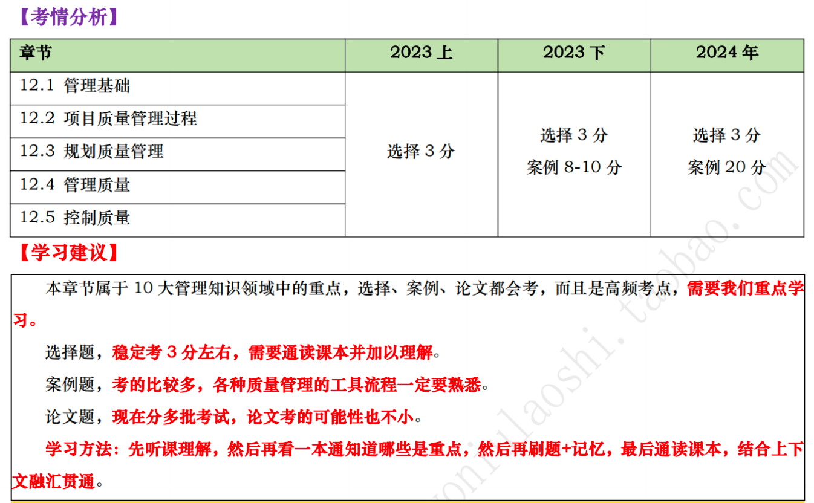

# 项目质量管理

## 12.1 管理基础

### 12.1.1 质量与项目质量 :star::star::star:

1. 国家标准(GB/T 19000-2008)对质量的定义为：“一组固有特性满足要求的程度”。
2. 质量通常是指产品的质量，广义上的质量还包括工作质量。产品质量是指产品的使用价值及其属性；而工作质量则是产品质量的保证，它反映了与产品质量直接有关的工作对产品质量的保证程度。
3. **质量与等级是两个不同的概念**。一个低等级（功能有限）、高质量（无明显缺陷，用户手册易读）的软件产品，该产品适合一般使用，可以被认可。一个高等级（功能繁多）、低质量（有许多缺陷，用户手册杂乱无章）的软件产品，该产品的功能会因质量低劣而无效和/或低效，不会被使用者接受。
4. **预防胜于检查**。最好将质量设计到可交付成果中，而不是在检查时发现质量问题。**预防错误的成本通常远低于在检查或使用中发现并纠正错误的成本**。
5. **项目管理团队应了解的与统计相关的术语包括**：
   - **“预防”——保证过程中不出现错误** ；
   - **“检查”——保证错误不落到客户手中**；
   - **“公差”——结果的可接受范围**；
   - **“控制界限”——在统计意义上稳定的过程或过程绩效的普通偏差的边界**。
6. 从项目作为一次性的活动来看，项目质量体现在由WBS反映出的项目范围内所有的阶段、子项目、项目工作单元的质量构成，即项目的工作质量。
7. 从项目作为一项最终产品来看，项目质量体现在其性能或者使用价值上，即项目的产品质量。
8. **项目的质量是顺应顾客的要求进行的，不同的顾客有着不同的质量要求**，其意图已反映在项目合同中。因此，**项目合同通常是进行项目质量管理的主要依据**。

### 12.1.2 质量管理 :star::star::star:

1. **质量方针**体现了该组织的质量意识和质量追求，**是组织内部的行为准则**。质量方针是总方针的一个组成部分，**由最高管理者批准**。
2. **质量目标**是落实质量方针的具体要求，它从属于质量方针。
3. **按有效性递增排列的五种质量管理水平**：
   1. **通常，代价最大的方法是让客户发现缺陷**。
   2. **控制质量过程包括先检测和纠正缺陷，再将可交付成果发送给客户**。
   3. **通过质量保证检查并纠正过程本身**。
   4. **将质量融入项目和产品的规划和设计中**。
   5. **在整个组织内创建一种关注并致力于实现过程和产品质量的文化**。

### 12.1.3 质量管理标准体系

1. **全面质量管理**：以质量为中心，以全员参与为基础。由结构、技术、人员和变革推动者4个要素组成。
2. **全面质量管理的4个核心的特征**：
   1. 全员参加的质量管理；
   2. 全过程的质量管理；
   3. 全面方法的质量管理；
   4. 全面结果的质量管理。

### 12.1.4 管理新实践 :star::star:

1. 现代质量管理方法力求缩小差异，交付满足干系人要求的成果，项目质量管理的新趋势和新兴实践包括：**客户满意；持续改进；管理层的责任；与供应商的互利合作关系**。
2. **在敏捷环境中，干系人与项目管理团队合作可确保在整个项目期间始终做到客户满意**。
3. 休哈特提出并经戴明完善的**`计划一实施一检查一行动（PDCA）循环是质量改进的基础`**，另外，**全面质量管理（TQM）**、**六西格玛**和**精益六西格玛**等质量改进举措也可提高项目管理的质量以及最终产品、服务或成果的质量。

## 12.2 项目质量管理过程

### 12.2.1 过程概述 :star::star::star::star::star:

1. 项目质量管理过程：
   1. **规划-规划质量管理**：规划质量管理过程关注工作需要达到的质量；
      1. 定义：规划质量管理是**识别项目及其可交付成果的质量要求、标准，并书面描述项目将如何证明符合质量要求、标准的过程**。
      2. 作用：**在整个项目期间如何管理和核实质量提供指南和方向**。
      3. 开展次数：**仅开展一次**或仅在项目的预定义时开展
   2. **执行-管理质量**：管理质量则关注管理整个项目期间的质量；
      1. 定义：**管理质量是把组织的质量政策用于项目，并将质量管理计划转化为可执行的质量活动的过程**。
      2. 作用：
         1. **提高实现质量目标的可能性**；
         2. **识别无效过程和导致质量低劣的原因**；
         3. **使用控制质量过程的数据和结果向干系人展示项目的总体质量状态**。
      3. 开展次数：需要在整个项目期间**反复开展**。
   3. **监控-控制质量**：控制质量关注工作成果与质量要求的比较，确保结果可接受；
      1. 定义：**控制质量是为了评估绩效，确保项目输出完整、正确且满足客户期望，而监督和记录质量管理活动执行结果的过程**。
      2. 作用：
         1. **核实项目可交付成果和工作已经达到主要干系人的质量要求，可供最终验收**；
         2. **确定项目输出是否达到预期目的，这些输出需要满足所有适用标准、要求、法规和规范**。
      3. 开展次数：需要在整个项目期间**反复开展**。
2. 项目质量管理知识领域有两个用于其他知识领域的特定输出，即**核实的可交付成果和质量报告**。

### 12.2.2 裁剪考虑因素

裁剪时应考虑的因素包括：政策合规与审计；标准与法规合规性；持续改进；干系人参与。

### 12.2.2 敏捷与适应方法 :star::star:

1. 敏捷或适应型方法要求多个质量与审核步骤**贯穿整个项目，而不是在面临项目结束时才执行**。
2. 为促进频繁的增量交付，**敏捷或适应型方法关注于小批量工作**，纳入尽可能多的项目可交付成果的要素，小批量系统的目的是在项目生命周期早期（整体变更成本较低）就能发现不一致和质量问题。

## 12.3 规划质量管理 :star::star::star::star::star:

1. **质量规划应与其他知识领域规划过程并行开展**。
2. 规划质量管理【输入】详细解析：
   1. **项目章程**。项目章程中包含对项目和产品特征的高层级描述，还包括可以影响项目质量管理的项目审批要求、可测量的项目目标和相关的成功标准。
   2. **项目管理计划**。
      - 需求管理计划：提供了识别、分析和管理需求的方法。 
      - 风险管理计划：提供了识别、分析和监督风险的方法。
      - 干系人参与计划：提供了记录干系人需求和期望的方法。
      - 范围基准：需要考虑范围说明书中可交付成果的验收标准。
   3. **项目文件**。假设日志；需求文件；需求跟踪矩阵；风险登记册；干系人登记册。
   4. **事业环境因素**。
   5. **组织过程资产**。
3. 规划质量管理【工具与技术】详细解：
   1. **专家判断**。专家利用自身的技能或经验来做出判断。
   2. **数据收集**：
      1. 标杆对照：将实际或计划的项目实践或项目的质量标准与可比项目的实践进行比较，以便识别最佳实践。**作为标杆的项目可以来自执行组织内部或外部，或者来自同一应用领域或其他应用领域。标杆对照也允许用不同应用领域或行业的项目做类比**。
      2. 头脑风暴：通过头脑风暴可以向团队成员或主题专家收集数据，以制订最适合新项目的质量管理计划。
      3. 访谈：访谈有经验的项目参与者、干系人和主题专家有助于了解他们对项目和产品质量的隐性和显性、正式和非正式的需求和期望。
   3. **数据分析**：
      1. 成本效益分析：成本效益分析是用来估算备选方案优势和劣势的财务分析工具，以**确定可以创造最佳效益的备选方案**。
      2. 质量成本：
         - **预防成本：预防特定项目的产品、可交付成果或服务质量低劣所带来的成本**。
         - **评估成本：评估、测量、审计和测试特定项目的产品、可交付成果或服务所带来的成本**。
         - **失败成本（内部/外部）：因产品、可交付成果或服务与干系人需求或期望不一致而导致的成本**
          
   4. **决策技术**：多标准决策分析是适用于规划质量管理过程的一种决策技术，多标准决策分析工具可用于识别关键事项和合适的备选方案，并通过一系列决策排列出备选方案的优先顺序。它**有助于排定质量测量指标的优先顺序**。
   5. **数据表现**：
      1. 流程图：流程图也称过程图，**用来显示将一个或多个输入转化成一个或多个输出的过程中。流程图有助于了解和估算一个过程的质量成本**。流程图有时又被称为“过程流程图”或“过程流向图”，可帮助改进过程并识别可能出现质量缺陷或可以纳入质量检查的地方。
      2. 逻辑数据模型：逻辑数据模型把组织数据可视化，用业务语言加以描述，不依赖任何特定技术。**逻辑数据模型可用于识别会出现数据完整性或其他问题的地方**。
      3. 矩阵图：矩阵图在行列交叉的位置展示因素、原因和目标之间的强弱关系。在规划质量管理过程中，**矩阵图有助于识别对项目成功至关重要的质量测量指标**。
      4. 思维导图：思维导图是一种用于可视化组织信息的绘图法。**思维导图技术可以有助于快速收集项目质量要求、制约因素、依赖关系和联系**。
   6. **测试与检查的规划**：项目经理和项目团队决定如何测试或检查产品、可交付成果或服务，以满足干系人的需求和期望，以及如何满足产品的绩效和可靠性目标。
   7. **会议**。参会者包括项目经理、项目发起人、选定的项目团队成员、选定的干系人、项目质量管理活动的负责人以及其他必要人员。
4. 规划质量管理【输出】详细解析：
   1. **质量管理计划**：质量管理计划可以是正式或非正式的，非常详细或高度概括的。质量管理计划内容一般包括：
      1. 项目采用的质量标准；
      2. 项目的质量目标；
      3. 质量角色与职责；
      4. 需要质量审查的项目可交付成果和过程；
      5. 为项目规划的质量控制和质量管理活动；
      6. 项目使用的质量工具；
      7. 与项目有关的主要程序。
   2. **质量测量指标**：**质量测量指标专用于描述项目或产品属性，以及控制质量过程将如何验证符合程度**。质量测量指标的例子**包括按时完成的任务的百分比、以CPI测量的成本绩效、故障率、识别的日缺陷数量、每月总停机时间、每个代码行的错误、客户满意度分数，以及测试计划所涵盖的需求的百分比（即测试覆盖度）**。
    
   3. **项目管理计划（更新）**。风险管理计划、范围基准。
   4. **项目文件（更新）**。经验教训登记册、需求跟踪矩阵、风险登记册、干系人登记册。

## 12.4 管理质量 :star::star::star::star::star:

1. **管理质量有时被称为“质量保证”,但“管理质量”的定义比“质量保证”更广，因其可用于非项目工作**。
2. **质量保证着眼于项目使用的过程**，旨在高效地执行项目过程，包括遵守和满足标准，向干系人保证最终产品可以满足他们的需求、期望和要求。
3. **管理质量包括所有质量保证活动，还与产品设计和过程改进有关。管理质量的工作属于质量成本框架中的一致性工作**。
4. **管理质量有助于**：
   1. 通过执行有关产品特定方面的设计准则，设计出最优的成熟产品；
   2. 建立信心，可以使未来输出在完工时满足特定的需求和期望；
   3. 确保使用质量过程并确保其使用能够满足项目的质量目标；
   4. 提高过程和活动的效率与效果，获得更好的成果和绩效并提高干系人的满意度。
5. 管理质量是所有人的共同职责。**在敏捷型项目中，整个项目期间的质量管理由所有团队成员执行；但在传统项目中，质量管理通常是特定团队成员的职责**。
6. 管理质量【输入】详细解析：
   1. **项目管理计划**。质量管理计划定义了项目和产品质量的可接受水平，并描述了如何确保可交付成果和过程达到这一质量水平。质量管理计划还描述了不合格产品的处理方式以及须采取的纠正措施。
   2. **项目文件**：
      1. 经验教训登记册：项目早期与质量管理有关的经验教训，可以运用到项目后期阶段，以提高质量管理的效率与效果。
      2. 质量控制测量结果：**用于分析和评估项目过程和可交付成果的质量是否符合执行组织的标准或特定要求**，质量控制测量结果也有助于分析这些测量结果的产生过程，以**确定实际测量结果的正确程度**。
      3. 质量测量指标：**核实质量测量指标是控制质量过程的一个环节。管理质量过程依据这些质量测量指标设定项目的测试场景和可交付成果，用作改进举措的依据**。
      4. 风险报告：管理质量过程使用风险报告识别整体项目风险的来源以及整体风险敞口的最重要的驱动因素，这些因素能够影响项目的质量目标。
   3. **组织过程资产**。政策、程序及指南的组织质量管理体系；质量模板等。
7. 管理质量【工具与技术】详细解析：
   1. **数据收集**：核对单：
      1. **核对单是一种结构化工具，通常列出特定组成部分，用来核实所要求的一系列步骤是否已得到执行或检查需求列表是否已得到满足**。
      2. **许多组织都有标准化的核对单，用来规范地执行经常性任务**。
      3. **质量核对单应该涵盖在范围基准中定义的验收标准**。
   2. **数据分析**：
      1. 备选方案分析：该技术用于评估已识别的可选方案，以选择那些最合适的质量方案或方法。
      2. 文件分析：分析项目控制过程所输出的不同文件，如质量报告、测试报告、绩效报告和偏差分析，**可以重点指出可能超出控制范围之外并阻碍项目团队满足特定要求或干系人期望的过程**。
      3. 过程分析：**该分析可以识别过程改进机会，同时检查在过程期间遇到的问题、制约因素以及非增值活动**。
      4. 根本原因分析：**用于识别问题的根本原因并解决问题。消除所有根本原因可以杜绝问题再次发生**。
   3. **决策技术**：适用于本过程的决策技术包括但不限于多标准决策分析。
   4. **数据表现**：
      1. 亲和图：亲和图可以对潜在缺陷成因**进行分类**，展示最应关注的领域。
      2. 因果图：因果图又称“鱼骨图”“why-why分析图”和“石川图”,将问题陈述的原因分解为离散的分支，**有助于识别问题的主要原因或根本原因**。
      3. 流程图：流程图展示了引发缺陷的一系列步骤。
      4. 直方图：直方图是一种展示数字数据的条形图。**可以展示每个可交付成果的缺陷数量、缺陷成因的排列、各个过程的不合规次数，或项目与产品缺陷的其他表现形式**。
      5. 矩阵图：矩阵图在**行列交叉**的位置展示因素、原因和目标之间的关系强弱。
      6. 散点图：**是一种展示两个变量之间的关系的图形**，它能够展示两支轴的关系，一般一支轴表示过程、环境或活动的任何要素，另一支轴表示质量缺陷。
   5. **审计**：
      1. 审计是用于确定项目活动**是否遵循了组织和项目的政策**、过程与程序的一种**结构化且独立的过程**。质量审计**通常由项目外部的团队开展**，如组织内部审计部门、项目管理办公室或组织外部的审计师。
      2. **质量审计可事先安排，也可随机进行；可由内部或外部审计师进行**。
      3. 质量审计目标一般包括：
         - **识别全部正在实施的良好及最佳实践**； 
         - **识别所有违规做法、差距及不足**；
         - **分享所在组织和（或）行业中类似项目的良好实践**；
         - **积极、主动地提供协助，以改进过程的执行，从而帮助团队提高生产效率**；
         - **强调每次审计都应对组织经验教训知识库的积累做出贡献**。
   6. **面向X的设计**：面向X的设计（DfX）是产品设计期间可采用的一系列技术指南，旨在优化设计的特定方面，可以控制或提高产品最终特性。DfX中的X可以是产品开发的不同方面。使用DFX可以降低成本、改进质量、提高绩效和客户满意度。
   7. **问题解决**：
      1. 问题可能在控制质量过程或质量审计中发现，也可能与过程或可交付成果有关。
      2. 使用结构化的问题解决方法有助于消除问题和制定长久有效的解决方案。
      3. 解决步骤：定义问题、识别根本原因，生成可能的解决方案、选择最佳解决方案，执行解决方案，验证解决方案的有效性等
   8. **质量改进方法**：**计划-实施-检查-行动（PDCA）和六西格玛**是最常用于分析和评估改进机会的两种质量改进工具。
8. 管理质量【输出】详细解析：
   1. **质量报告**：
      1. **质量报告可能是图形、数据或定性文件**，其中包含的信息可帮助其他过程和部门采取纠正措施，以实现项目质量目标。
      2. 质量报告的信息可以**包含团队上报的质量管理问题，针对过程、项目和产品的改善建议，纠正措施建议（包括返工、缺陷/漏洞补救、100%检查等），以及在控制质量过程中发现的情况的概述**。
   2. **测试与评估文件**：可基于行业需求和组织模板创建测试与评估文件。它们是控制质量过程的输入，**用于评估质量目标的实现情况**。
   3. **变更请求**。
   4. **项目管理计划（变更）**。
      1. 质量管理计划：可能需要根据实际结果修改已商定的质量管理方法。
      2. 范围基准：可能因特定的质量管理活动而变更。
      3. 进度基准：可能因特定的质量管理活动而变更。
      4. 成本基准：可能因特定的质量管理活动而变更。
   5. **项目文件（更新）**。问题日志、经验教训登记册、风险登记册。

## 12.5 控制质量 :star::star::star::star::star:

1. 控制质量过程的目的是**在用户验收和最终交付之前**测量产品或服务的完整性、合规性和适用性。
2. 在整个项目期间应执行质量控制，**用可靠的数据来证明项目已经达到发起人和/或客户的验收标准**。
3. **在敏捷或适应型项目中，控制质量活动可能由所有团队成员在整个项目生命周期中执行；在瀑布或预测型项目中，控制质量活动由特定团队成员在特定时间点或者项目或阶段快结束时执行**。
4. 控制质量【输入】详细解析：
   1. **项目管理计划**。质量管理计划定义了如何在项目中开展质量控制。
   2. **项目文件**：
      - 测试与评估文件：**用于评估质量目标的实现程度**。 
      - 质量测量指标：专用于描述项目或产品属性，以及控制质量过程将如何验证符合程度。
      - 经验教训登记册：在项目早期的经验教训可以运用到后期阶段，以改进质量控制。
   3. **可交付成果**：可交付成果指的是在某一过程、阶段或项目完成时，必须产出的任何独特并可核实的产品、成果或服务能力。
   4. **工作绩效数据**：工作绩效数据包括产品状态数据，例如观察结果、质量测量指标、技术绩效测量数据，以及**关于进度绩效和成本绩效的项目质量信息**。
   5. **批准的变更请求**：批准的变更请求的实施须核实，并需要确认完整性、正确性以及是否重新测试。
   6. **事业环境因素**。
   7. **组织过程资产**。
5. 控制质量【工具与技术】详细解析：
   1. **数据收集**：
      1. 核对单：核对单有**助于以结构化方式管理控制质量活动**。
      2. 核查表：**又称计数表**，用于合理排列各种事项，以便有效地收集关于潜在质量问题的有用数据。
      3. 统计抽样：是指**从目标总体中选取部分样本用于检查**（如从75张工程图纸中随机抽取10张）。**抽样的频率和规模应在规划质量管理过程中确定**。
      4. 问卷调查：问卷调查可用于在部署产品或服务之后收集关于客户满意度的数据。**在问卷调查中识别的缺陷相关成本可被视为COQ模型中的外部失败成本，给组织带来的影响会超出成本本身**。
   2. **数据分析**：
      1. 绩效核查：绩效审查针对实际结果，测量、比较和分析规划质量管理过程中定义的质量测量指标。
      2. 根本原因分析：根本原因分析用于识别缺陷成因。
   3. **检查**：**可以检查单个活动的成果，也可以检查项目的最终产品。检查也可称为审查、同行审查、审计或巡检**等。
   4. **测试/产品评估**：
      1. **测试的目的是找出产品或服务中存在的错误、缺陷、漏洞或其他不合规问题**。
      2. **测试可以贯穿于整个项目，可以在项目的不同组成部分完成时进行，也可以在项目结束时进行**。
      3. 早期测试有助于识别不合规问题，帮助减少修补不合规组件的成本。
      4. **软件测试可能包括单元测试、集成测试、黑盒测试、白盒测试、接口测试、回归测试、a测试**等。
      5. **硬件开发中，测试可能包括环境应力筛选、老化测试、系统测试等**。
   5. **数据表现**：
      1. 因果图：因果图用于识别质量缺陷和错误可能造成的结果。
      2. 控制图：
         1. **控制图用于确定一个过程是否稳定，或者是否具有可预测的绩效**；
         2. **七点运行定律是指如果在一个质量控制图中，连续的7个数据点都低于平均值或高于平均值，或者都是上升的，或者都是下降的，那么这个过程就需要因为非随机问题而接受检查**。
      3. 直方图：直方图可按来源或组成部分展示缺陷数量。
      4. 散点图：散点图可在一个轴上展示计划的绩效，在另一个轴上展示实际绩效。
   6. **会议**：对所有已批准的变更请求进行审查，以核实它们是否已按批准的方式实施，回顾/经验教训。
6. 控制质量【输出】详细解析：
   1. **工作绩效信息**。工作绩效信息包含有关项目需求实现情况的信息、拒绝的原因、要求的返工等。
   2. **质量控制测量结果**：控制质量的测量结果是对质量控制活动的结果的书面记录。
   3. **核实的可交付成果**：**控制质量过程的一个目的就是确定可交付成果的正确性。开展控制质量过程的结果是核实的可交付成果，后者又是确认范围过程的一项输入，以便正式验收**。
   4. **变更请求**。
   5. **项目管理计划（更新）**。
   6. **项目文件（更新）**。问题日志；经验教训登记册；风险登记册；测试与评估文件。