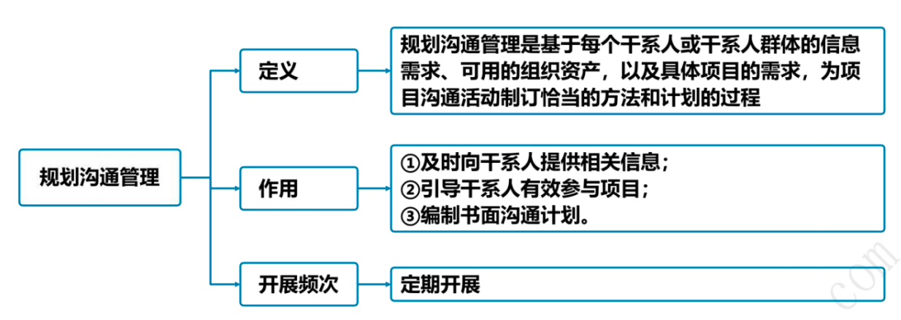
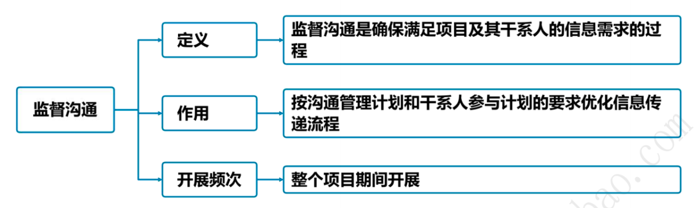

# 项目沟通管理

## 14.0 沟通管理概述 :star::star:

1. 与IT项目成功有关的最重要的四个因素是：主管层的支持、用户参与、有经验的项目经理和清晰的业务目标。
2. 项目沟通管理是确保及时、正确地产生、收集、分发、存储和最终处理项目信息所需的过程。
3. **成功沟通三要素：人员、观点、信息**。
4. 项目沟通管理由两部分组成：**一是制定策略，确保沟通对干系人行之有效；二是执行必要活动，以落实沟通策略**。

## 14.1 管理基础 

### 14.1.1 沟通

1. 沟通是指用各种可能的方式来发送或接收信息。**发送或接收的信息可以是想法、指示或情绪**。
2. 项目经理的大多数时间用于与团队成员和其他项目干系人沟通，包括来自组织内部（组织的各个层级）和组织外部的人员。

### 14.1.2 沟通模型 :star::star::star:

1. 沟通模型：

| 关键要素       | 释义                                                       |
| -------------- | ---------------------------------------------------------- |
| 编码           | 把思想或想法转化为他人能理解的语言                         |
| 信息和反馈信息 | 编码过程所得到的结果                                       |
| 媒介           | 用来传递信息的方法                                         |
| 噪声           | 干扰信息传输和理解的因素（如距离、新技术、缺乏背景信息等） |
| 解码           | 把信息还原成有意义的思想或想法                             |
2. 基本沟通模型包含5个基本状态：已发送、已收到、已理解、已认可、已转化为积极的行动。
   1. 已发送：信息已发送。当你传送信息给他人，这并不表示对方已经读取或听到了。
   2. 已收到：对方信息已收到。但这并不表示对方有意图去读取、理解或解决信息。
   3. 已理解：正确地消化和理解信息中的内容是简单接收信息中关键的一环。
   4. 已认可：理解了传达的信息并不代表对方已同意这个观点。或许对方明白了发送者的意思，但完全不同意。因此，达成一致仍然是做出项目决策和有效沟通的关键一环。
   5. 已转化为积极的行动：正确地理解和达成一致的认可比较难，但更加困难的是让对方转化为实际的、积极的行动，而且是方向正确无误的行动。这是整个过程中最难的一环，通常需要反复地沟通，在一定的监督或帮助下才能较好地完成。

### 14.1.3 沟通分类

1. 内部沟通：项目内部或组织内部的干系人；
2. 外部沟通：外部干系人，如客户、供应商、公众等。
3. 正式沟通：报告、正式会议、会议议程记录、干系人简报和演示。
4. 非正式沟通：电子邮件、社交媒体、网站和非正式讨论的一般沟通活动。
5. 层级沟通：采取向上（针对高层）、向下（针对团队成员）和横向（针对同级项目经理或其他人员）等不同的沟通方式，保证有效沟通。
6. 官方沟通：年报、呈交监管机构或政府部门的报告。
7. 非官方沟通：灵活（往往为非正式）的手段。
8. 书面与口头沟通：口头及非口头、社交媒体和网站、媒体发布

### 14.1.4 沟通技巧 :star::star::star::star::star:

1. 有效的沟通活动和成果创建具有如下3个基本属性：**①沟通目的明确；②尽量了解沟通接收方，满足其需求及偏好；③监督并衡量沟通的效果**。
2. 书面沟通的5C原则：
   1. 正确的语法和拼写（Correctness）。
   2. 简洁的表述（Concise）。
   3. 清晰的目的和表述（Clarity）；
   4. 连贯的思维逻辑（Coherent）；
   5. 善用控制语句和承接（Controlling）。
3. 项目经理除了要掌握书面沟通的5C原则，还需配合下列沟通技巧：①积极倾听；②理解文化和个人差异；③识别、设定并管理干系人期望；④强化技能。

### 14.1.5 管理新实践 :star::star::star:

1. 项目沟通管理的新趋势和新兴的实践主要包括：**(1)将干系人纳入项目评审范围。(2)让干系人参加项目会议。(3)社交工具的使用日益增多。(4)多面性沟通方法**。
2. **有效的沟通策略要求定期且及时地评审干系人**，以及管理成员及其态度的变化。
3. 社交媒体工具不仅能支持信息交换，而且也有助于建立更深层次的信任和社群关系。
4. **多面性方法能够提高与不同年代和文化背景的干系人沟通的效果**。

## 14.2 项目沟通管理过程 

### 14.2.1 过程概述 :star::star::star::star::star:

1. 项目沟通管理过程：
   1. 规划-规划沟通管理：
      1. 定义：规划沟通管理是基于每个干系人或干系人群体的信息需求、可用的组织资产，以及具体项目的需求，**为项目沟通活动制定恰当的方法和计划的过程**。
      2. 作用：**①及时向干系人提供相关信息；②引导干系人有效参与项目；③编制书面沟通计划**。
      3. 开展次数：需要在整个项目期间**定期开展**。
   2. 执行-管理沟通：
      1. 定义：管理沟通是**确保项目信息及时且恰当地收集、生成、发布、存储、检索、管理、监督和最终处置的过程**。
      2. 作用：**促成项目团队与干系人之间的有效信息流动**。
      3. 开展次数：需要在整个项目期间**反复开展**。
   3. 监控-监督沟通：
      1. 定义：**是确保满足项目及其干系人的信息需求的过程**。
      2. 作用：**按沟通管理计划和干系人参与计划的要求优化信息传递流程**。
      3. 开展次数：需要在整个项目期间**反复开展**。

### 14.2.2 裁剪考虑因素 :star::star::star:

裁剪考虑因素包括：**干系人、物理地点、沟通技术、语言、知识管理**。

### 14.2.3 敏捷与适应方法 :star::star::star:

应该尽量**简化团队成员获取信息的通道，让团队成员集中办公，以透明的方式发布项目成果，并定期邀请于系人评审项目成果**。

## 14.3 规划沟通管理 star::star::star:star::star:

1. 项目经理需在项目**生命周期的早期**，针对项目干系人多样性的信息需求，制订有效的沟通管理计划。应该**在整个项目期间**，定期审查本过程的沟通管理计划并做必要修改，以确保其持续适用。例如，**在干系人发生变化或每个新项目阶段开始时**。
2. 在大多数项目中，需要及早开展沟通的规划工作，例如在识别干系人及制订项目管理计划期间。虽然所有项目都需要进行信息沟通，但是各项目的信息需求和信息发布方式可能差别很大。
3. 规划沟通管理【输入】详细解析：
   1. **项目章程**。项目章程包含与干系人角色及职责有关的信息。
   2. **项目管理计划**.
      1. 资源管理计划：团队成员和小组可能有沟通要求，应该在沟通管理计划中列出。
      2. 干系人参与计划：干系人参与计划确定了有效吸引干系人参与所需的管理策略。
   3. **项目文件**。
      1. 需求文件：可能包含项目干系人对沟通的需求。
      2. 干系人登记册：用于规划与干系人的沟通活动。
   4. **事业环境因素**。
   5. **组织过程资产**。
4. 规划沟通管理【工具与技术】详细解：
   1. **专家判断**。专家利用自身的技能或经验来做出判断。
   2. **沟通需求分析**：分析沟通需求，确定项目干系人的信息需求，包括所需信息的类型和格式，以及信息对干系人的价值。
   3. **沟通技术**：影响沟通技术的选择的因素包括：**①信息需求的紧迫性；②技术的可用性与可靠性；③易用性；④项目环境；⑤信息的敏感性和保密性**。
   4. **沟通模型**：
      1. 在跨文化沟通中，确保信息能被正确理解具有一定挑战性。主要影响因素有：**当前情绪、知识、背景、个性、文化和偏见**。
      2. 跨文化沟通的沟通模型有助于制定人对人或小组对小组的沟通策略和计划，**但不能用于制定采用其他沟通成果**（如电子邮件、广播信息和社交媒体）的沟通策略和计划。
   5. **沟通方法**：
      1. **互动沟通**，在两方或多方之间进行多向信息交换。如会议、电话、即时通信、视频会议、社交媒体；
      2. **推式沟通**，向需要接收信息的特定接收方发送或发布信息。这种方法可以确保信息的发送，但不能确保信息送达受众或被目标受众理解。如信件、备忘录、报告、电子邮件、传真、语音邮件、博客、新闻稿；
      3. **拉式沟通**，**用于信息量很大或受众很多的情况。要求接收者自行地访问信息内容**。如门户网站、组织内网、电子在线课程、经验教训数据库、知识库。
      - 可以采用如下方法来实现沟通管理计划所规定的主要的沟通需求：
        - 人际沟通：个人之间交换信息，通常以面对面的方式进行。 
        - 小组沟通：在3~6名人员的小组内部开展。
        - 公众沟通：单个演讲者面向一群人。
        - 大众传播：信息发送人员或小组与大量目标受众之间只有最低程度的联系。
        - 网络和社交工具沟通：借助社交工具和媒体，开展多对多的沟通。
   6. **人际关系与团队技能** ：
      1. 沟通风格评估：评估沟通风格并识别偏好的沟通方法、形式和内容的技术。
      2. 政策意识：政策意识有助于项目经理根据项目环境和组织的政策环境来规划沟通。理解组织战略、了解谁能行使权力和施加影响，以及培养与这些干系人沟通的能力，都属于政策意识范畴。
      3. 文化意识：文化意识指理解个人、群体和组织之间的差异，并据此调整项目的沟通策略。
   7. **数据表现**：**适用于规划沟通管理过程的数据表现技术是干系人参与度评估矩阵。干系人参与度评估矩阵显示了个体干系人当前和期望参与度之间的差距**。
   8. **会议**。项目会议可包括虚拟（网络）或面对面会议，且可用文档协同技术进行辅助，包括电子邮件信息和项目网站。
5. 规划沟通管理【输出】详细解析：
   1. **沟通管理计划**：
      1. 沟通管理计划是项目管理计划的组成部分，描述将如何规划、结构化、执行与监督项目沟通，以提高沟通的有效性。
      2. 沟通管理计划中还包括关于项目状态会议、项目团队会议、网络会议和电子邮件等的指南和模板。如果项目要使用项目网站和项目管理软件，需要将其写入沟通管理计划。
   2. **项目管理计划（更新）**。可能需要变更的项目管理计划组件是干系人参与计划。
   3. **项目文件（更新）**。干系人登记册、项目进度计划。

## 14.4 管理沟通 :star::star::star::star::star:

1. 有效的沟通管理需要借助的技术主要包括：
   1. **送方-接收方模型**：运用反馈循环，为互动和参与提供机会，并清除妨碍有效沟通的障碍。
   2. **媒介选择**：为满足特定的项目需求而使用合理的沟通方法。例如，何时进行书面沟通或口头沟通，何时准备非正式备忘录或正式报告，何时使用推式或拉式沟通，以及该选择何种沟通技术。
   3. **写作风格**：选择适当的语态、句子结构，以及使用适当的词汇。
   4. **会议管理**：准备议程，邀请重要参会者并确保他们出席；处理会议现场发生的冲突，或因对会议纪要和后续行动跟进不力而导致的冲突，或因不当人员与会而导致的冲突。
   5. **演示**：了解肢体语言和视觉辅助设计的作用。
   6. **引导**：达成共识、克服障碍（如小组缺乏活力），以及维持小组成员兴趣和热情。
   7. **积极倾听**：包括告知已收到、澄清与确认信息、理解，以及消除妨碍理解的障碍。
2. 管理沟通【输入】详细解析：
   1. **项目管理计划**：
      - 资源管理计划：描述为管理团队或物质资源所需开展的沟通。 
      - 沟通管理计划：描述将如何对项目沟通进行规划、结构化和监控。
      - 干系人参与计划：描述如何用适当的沟通策略引导干系人参与。
   2. **项目文件**。变更日志、问题日志、经验教训登记册、质量报告、风险报告、干系人登记册。
   3. **工作绩效报告** ：典型示例包括**状态报告和进展报告**。工作绩效报告可以**包含挣值图表和信息、趋势线和预测、储备燃尽图、缺陷直方图、合同绩效信息以及风险概述信息**。可表现为**仪表指示图、热点报告、信号灯图或其他形式**。
   4. **事业环境因素**。
   5. **组织过程资产**。
3. 管理沟通【工具与技术】详细解析：
   1. **沟通技术**：**会影响技术选用的因素包括团队是否集中办公、需要分享的信息是否需要保密、团队成员的可用资源，以及组织文化会如何影响会议和讨论的正常开展**。
   2. **沟通方法**：沟通方法的选择应具有灵活性，以应对干系人成员变化。
   3. **沟通技能**：
      1. **沟通胜任力**：**有助于明确关键信息的目的、实现信息共享和采取领导行为**。
      2. **反馈**：反馈是关于沟通、可交付成果或情况的反应信息。反馈支持项目经理和团队及所有其他项目干系人之间的互动沟通，例如指导、辅导和磋商。
      3. **非口头技能**：例如，通过示意、语调和面部表情等适当的肢体语言来表达意思。镜像模仿和眼神交流也是重要的技能。【肢体语言】
      4. **演示**：**是信息和文档的正式交付**。包括：①向干系人报告项目进度和信息更新；②提供背景信息；③提供关于项目及其目标的通用信息；④提供具体信息等。
   4. **项目管理信息系统**：
      1. 电子项目管理工具：项目管理软件、会议和虚拟办公支持软件、网络界面、专门的项目门户网站和状态仪表盘，以及协同工作管理工具；
      2. 电子沟通管理：电子邮件、传真和语音邮件，音频、视频和网络会议，以及网站和网络发布；
      3. 社交媒体管理：网站和网络发布，以及为促进干系人参与和形成在线社区而建立的博客和应用程序。
   5. **项目报告**：
      1. **项目报告发布是收集和发布项目信息的行为**。**应针对每种干系人来调整项目信息发布的适当层次、形式和细节**。从简单的沟通到详尽的定制报告和演示，报告的形式各不相同。可以定期准备信息或基于例外情况准备。
      2. 虽然工作绩效报告是监控项目工作过程的输出，但是本过程会编制临时报告、项目演示、博客，以及其他类型的信息。
   6. **人际关系与团队技能**：
      1. 积极倾听：包括告知已收到、澄清与确认信息、理解，以及消除妨碍理解的障碍。
      2. 冲突管理：采用特定方式对冲突进行管理。
      3. 文化意识：理解个人、群体和组织之间的差异，并据此调整项目的沟通策略。
      4. 会议管理：采取步骤确保会议有效并高效地达到预期目标。规划会议时的一般步骤包括：①准备并发布会议议程（其中包含会议目标）；②确保会议在规定的时间开始和结束；③确保适当参与者受邀并出席；④切题；⑤处理会议中的期望、问题和冲突；⑥记录所有行动以及所分配的行动责任人。
      5. 人际交往：通过与他人互动交流信息，建立联系。**人际交往有利于项目经理及其团队通过韭正式组织解决问题，影响干系人的行动**，以及提高干系人对项目工作和成果的支持，从而改善绩效。
      6. 政策意识：有助于项目经理在项目期间引导干系人参与，以保持干系人的支持。【了解组织政策】
   7. **会议**。可以召开会议，支持沟通策略和沟通计划所定义的行动。
4. 管理沟通【输出】详细解析：
   1. **项目沟通记录**：**项目沟通记录主要包括：绩效报告、可交付成果的状态、进度进展、产生的成本、演示，以及干系人需要的其他信息**。
   2. **项目管理计划（更新）**。沟通管理计划、干系人参与计划。
   3. **项目文件（更新）**。问题日志、经验教训登记册、项目进度计划、风险登记册、干系人登记册。
   4. **组织过程资产（更新）**。项目记录，例如往来函件、备忘录、会议记录及项目中使用的其他文档；计划内的和临时的项目报告和演示等。

## 14.5 监督沟通 :star::star::star::star::star:

1. **项目沟通的影响和结果应该接受正式的评估和监督**，以确保在正确的时间，通过正确的渠道，将正确的内容传递给正确的受众。
2. 监督沟通可能需要采取各种方法，例如，**开展客户满意度调查、整理经验教训、开展团队观察、审查问题日志和评估变更**.
3. 监督沟通过程可能触发规划沟通管理、管理沟通过程的迭代，以便修改沟通计划并开展额外的沟通活动，来提升沟通的效果。**这种迭代体现了项目沟通管理各过程的持续性。问题、关键绩效指标、风险或冲突，都可能立即触发重新迭代开展这些过程**。
4. 监督沟通【输入】详细解析：
   1. **项目管理计划**.
      - 资源管理计划：资源管理计划可用于理解实际的项目组织及其任何变更。 
      - 沟通管理计划：它确定了沟通过程中的团队成员、干系人和有关工作。
      - 干系人参与计划：确定了计划用以引导干系人参与的沟通策略。
   2. **项目文件**。问题日志、经验教训登记册、项目沟通记录。
   3. **工作绩效数据**。工作绩效数据包含关于已开展的沟通类型和数量的数据。
   4. **事业环境因素**。
   5. **组织过程资产**。
5. 监督沟通【工具与技术】详细解析；
   1. 专家判断。专家利用自身的技能或经验来做出判断。
   2. 项目管理信息系统。需要监控系统中的信息以评估其有效性和效果。
   3. **数据表现**：**监督沟通时，适用的数据表现技术是干系人参与度评估矩阵**。应该检查干系人的期望与当前参与度的变化情况，并对沟通进行必要调整。
   4. **人际关系与团队技能**：适用于监督沟通过程的人际关系与团队技能主要**包括观察和交谈。通过观察和交谈，项目经理能够发现团队内的问题、人员间的冲突，或个人绩效问题**。
   5. **会议**。面对面或虚拟会议适用于制定决策，回应干系人请求，与提供方、供应方及其他项目干系人讨论。
6. 监督沟通【输出】详细解析：
   1. **工作绩效信息**。包括：计划沟通的实际开展情况；对沟通的反馈，例如关于沟通效果的调查结果。
   2. **变更请求**。变更请求可能导致：①修正干系人的沟通要求②建立消除瓶颈的新程序等。
   3. **项目管理计划（更新）**。沟通管理计划、干系人参与计划。
   4. **项目文件（更新）**。问题日志、经验教训登记册、干系人登记册。