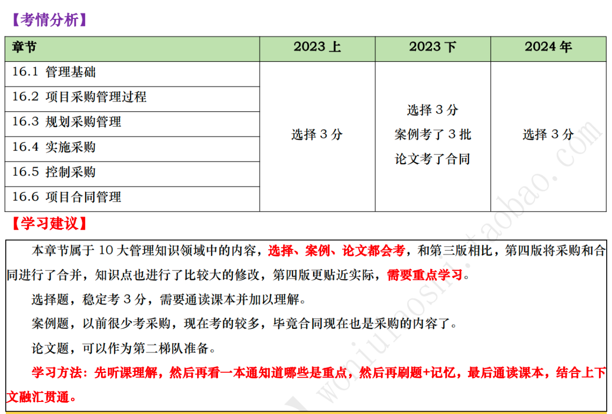

# 项目采购管理 

## 16.1 管理基础

### 16.1.1 协议/采购合同 :star::star:

1. **被授权采购项目所需货物、服务的人员可以是项目团队、管理层或组织采购部的成员。**
2. **协议可以是合同、服务水平协议（SLA）、谅解备忘录、协议备忘录（MOA）或订购单**。
3. 合同应明确说明预期的可交付成果和结果，包括从卖方到买方的任何知识转移。**合同中未规定的任何事项则不具法律强制力**。开展国际合作的项目经理应牢记，无论合同规定如何详尽，文化和当地法律对合同及其可执行性均有影响。
4. **在复杂项目中，可能需要同时或先后管理多个合同**。这种情况下，**不同合同的生命周期可在项目生命周期的任何阶段开始与结束**。买卖方关系是采购组织与外部组织之间的关系，可存在于项目的许多层次上。
5. 卖方可以是承包商、供货商、服务提供商或供应商；买方可能为最终产品的所有人、分包商、收购机构、服务需求者或购买方。

### 16.1.2 管理新实践 :star::star::star:

1. 项目采购管理的发展趋势和新兴实践主要包括：工具的改进、更先进的风险管理、变化中的合同签暑实践、物流和供应链管理、技术和相关方关系、试用采购。
2. **在合同中可以明确规定风险管理是合同工作的一部分。**
3. 全球很多国家会要求跨国承包商至少向当地供应商采购一定比例的材料和用品。
4. **在决定大批量采购之前，有些项目会试用多个候选卖方，向它们采购少量的可交付成果和工作产品。**

## 16.2 项目采购管理过程

### 16.2.1 过程概述 :star::star::star::star::star:

1. 项目采购管理过程：
   1. **规划-规划采购管理**：
      1. 定义：**是记录项目采购决策、明确采购方法，及识别潜在卖方的过程**。
      2. 作用：**确定是否从项目外部获取货物和服务，如果是，则还要确定将在什么时间、以什么方式获取什么货物和服务。**
      3. 开展次数：**仅开展一次**或仅在项目的预定义时开展
   2. **执行-实施采购**：
      1. 定义：**是获取卖方应答、选择卖方并授予合同的过程**。
      2. 作用：**选定合格卖方并签署关于货物或服务交付的法律协议。**
      3. 开展次数：需要在整个项目期间**定期开展**。
   3. **监控-控制采购**：
      1. 定义：**是管理采购关系、监督合同绩效、实施必要的变更和纠偏，以及关闭合同的过程**。
      2. 作用：**确保买卖双方履行法律协议，满足项目需求。**
      3. 开展次数：需要在整个项目期间**反复开展**。

### 16.2.2 裁剪考虑因素 :star::star::star:

裁剪项目采购管理过程时需要考虑因素：采购的复杂性、物理地点、治理和法规环境。

### 16.2.3 敏捷与适应方法 :star::star::star:

1. 在敏捷或适应型环境中，**可能需要与特定卖方进行协作来扩充团队**。这种协作关系能够营造风险共担式采购模型，让买方和卖方共担项目风险和共享项目收益。
2. **在大型项目上，可能针对某些可交付成果采用敏捷或适应型方法，而对其他部分则采用更稳定的方法**。在这种情况下，可以通过主体协议，如主要服务协议（MSA）来管理整体协作关系，而将敏捷或适应型工作写入附录或补充文件。这样一来，变更只针对敏捷或适应型工作，而不会对主体协议造成影响。

## 16.3 规划采购管理 :star::star::star::star::star:

1. 货物和服务可从执行组织的其他部门采购，或者从外部渠道采购。
2. 应该在规划采购管理过程的早期确定与采购有关的角色和职责。
3. 采购过程的参与者可能包括购买部或采购部的人员，以及法务部的人员。这些人员的职责也应记录在采购管理计划中。
4. 采购步骤为：
   1. **准备采购工作说明书（SOW）或工作大纲（TOR）；**
   2. **准备高层级的成本估算，制定预算**；
   3. **发布招标广告**；
   4. **确定合格卖方的名单**；
   5. **准备并发布招标文件**；
   6. **由卖方准备并提交建议书**；
   7. **对建议书开展技术（包括质量）评估**；
   8. **对建议书开展成本评估**；
   9. **准备最终的综合评估报告（包括质量及成本）,选出中标建议书**；
   10. **结束谈判，买方和卖方签署合同**。
5. **项目进度计划对规划采购管理过程中的采购策略制定有重要影响**。在制订采购管理计划时所做出的决定也会影响项目进度计划。在开展制定进度计划过程、估算活动资源过程以及自制或外购决策制定时，都需要考虑这些决定。
6. 规划采购管理【输入】详细解析：
   1. **立项管理文件**。立项管理会包含商业需求和成本效益分析，以论证项目的合理性并确定项目边界。
   2. **项目章程**。项目章程包括目标、项目描述、总体里程碑，以及预先批准的财务资源。
   3. **项目管理计划**。
      - 范围管理计划：**说明如何在项目实施阶段管理承包商的工作范围**。 
      - 质量管理计划：包含项目需要遵循的行业标准与准则。这些标准与准则应写入招标文件，如建议邀请书，并将最终在合同中引用。这些标准与准则也可用于供应商资格预审，或作为供应商甄选标准的一部分。
      - 资源管理计划：包括关于哪些资源需要采购或租赁的信息。
      - 范围基准：**项目范围中已知的工作编制工作说明书（SOW）和工作大纲（TOR）**。
   4. **项目文件** 。
      - 风险登记册：**有些风险应通过采购协议转移给第三方。** 
      - 干系人登记册：提供有关项目参与者及其项目利益的详细信息，包括监管机构、合同签署人员和法务人员。
      - 需求文件：一是卖方需要满足的技术要求；二是具有合同和法律意义的需求。
      - 需求跟踪矩阵：**将产品需求从来源连接到满足需求的可交付成果**。
      - 里程碑清单：**重要里程碑清单说明卖方需要在何时交付成果**。
      - 资源需求：包含关于某些特定需求的信息，例如，可能需要采购的团队及实物资源。
      - 项目团队派工单：如果项目团队不具备开展采购活动的能力，则需要外聘人员或对现有人员进行培训，或者二者同时进行。
   5. **事业环境因素** 。
      - 市场条件；可从市场获得的产品、服务和成果； 
      - 卖方，包括其以往绩效或声誉；
      - 关于产品、服务和成果的典型条款和条件，或适用于特定行业的典型条款和条件；
      - 特殊的当地要求，例如关于雇用当地员工或卖方的法规要求；
      - 关于采购的法律建议；
      - 合同管理系统，包括合同变更控制程序；
      - 已有的多层级供应商系统，其中列出了基于以往经验而预审合格的卖方；
      - 财务会计和合同支付系统等。
   6. **组织过程资产**。预先批准的卖方清单、正式的采购政策、程序和指南、合同类型。
      1. **总价合同**：此类合同为既定产品、服务或成果的采购设定一个总价。**这种合同应在已明确定义需求，且不会出现重大范围变更的情况下使用**。
      2. **成本补偿合同**：此类合同向卖方支付为完成工作而发生的全部合法实际成本（可报销成本），外加一笔费用作为卖方的利润。**这种合同适用于工作范围预计会在合同执行期间发生重大变更的情况**。
      3. **工料合同**：工料合同（又称时间和手段合同），是兼具成本补偿合同和总价合同特点的混合型合同。**这种合同往往适用于在无法快速编制出准确的工作说明书的情况下扩充人员、聘用专家或寻求外部支持**。
7. 规划采购管理【工具与技术】详细解析：
   1. **专家判断**。专家利用自身的技能或经验来做出判断。
   2. **数据收集**。适用于规划采购管理过程的数据收集技术是市场调研。
   3. **数据分析**：适用于规划采购管理过程的数据分析技术是**自制或外购分析**。制定自制或外购决策时应考虑的因素包括：**组织当前的资源配置及其技能和能力，对专业技术的需求，不愿承担永久雇用的义务，以及对独特技术专长的需求；还要评估与每个自制或外购决策相关的风险**。
   4. **供方选择分析**：
      1. 最低成本：**适用于标准化或常规采购**。此类采购有成熟的实践与标准，有具体明确的预期成果，可以用不同的成本来取得。
      2. 仅凭资源：**适用于采购价值相对较小，不值得花时间和成本开展完整选择过程的情况**。买方会确定短名单，然后根据可信度、相关资质、经验、专业知识、专长领域和参考资料选择最佳的投标人。
      3. 基于质量或技术方案得分：邀请一些组织提交建议书，同时列明技术和成本详情；如果技术建议书可以接受，再邀请它们进行合同谈判。**采用此方法，会先对技术建议书进行评估，考察技术方案的质量。如果经过谈判，证明它们的财务建议书是可接受的，那么就会选择技术建议书得分最高的卖方**。
      4. 基于质量和成本：在基于质量和成本的方法中，成本也是用于选择卖方的一个考虑因素。一般而言，**如果项目的风险和（或）不确定性较高，相对于成本而言，质量就应该是一个关键因素**。
      5. 唯一来源：**买方要求特定卖方准备技术和财务建议书，然后针对建议书开展谈判。由于没有竞争，因此仅在有适当理由时才采用此方法，而且应将其视为特殊情况**。
      6. 固定预算：在建议邀请书中**向受邀的卖方披露可用预算**，然后**在此预算内选择技术建议书得分最高的卖方**。因为有成本限制，所以卖方会在建议书中调整工作的范围和质量，以适应该预算。买方应该确保固定预算与工作说明书相符，且卖方能够在该预算内完成相关任务。**此方法仅适用于工作说明书定义精确、预期不会发生变更，而且预算固定且不得超出的情况**。
   5. **会议**。会议可用于确定管理和监督采购的策略。
8. 规划采购管理【输出】详细解析：
   1. **采购管理计划**：采购管理计划包括以下内容：
      1. 如何协调采购与项目的其他工作，例如项目进度计划制订和控制；
      2. 开展重要采购活动的时间表；
      3. 用于管理合同的采购测量指标；
      4. 与采购有关的干系人角色和职责，如果执行组织有采购部，项目团队拥有的职权和受到的限制：
      5. 可能影响采购工作的制约因素和假设条件；
      6. 司法管辖权和付款货币；
      7. 是否需要编制独立估算，以及是否应将其作为评价标准；
      8. 风险管理事项，包括对履约保函或保险合同的要求，以减轻某些项目风险：
      9. 拟使用的预审合格的卖方（如果有）等。
   2.  **采购策略**：
       1. 交付方法：
          1. 专业服务项目的交付方法：主要涉及的项目类型包括：买方或服务提供方不得分包、买方或服务提供方可以分包、买方和服务提供方设立合资企业、买方或服务提供方仅充当代表。
          2. 工业或商业施工项目的交付方法：主要涉及的项目类型包括：交钥匙式、设计-建造（DB）、设计-招标-建造（DBB）、设计-建造-运营（DBO）、建造-拥有-运营-转让（BOOT）及其他。
       2. 合同支付类型：合同支付类型与项目交付方法无关，需要与采购组织的内部财务系统相协调。主要包括以下合同类型：
          1. **总价合同适用于工作类型可预知、需求能清晰定义且不太可能变更的情况。**
          2. **成本补偿合同适用于工作不断演进、很可能变更或未明确定义的情况。激励和奖励费用可用于协调买方和卖方的目标。**
       3. 采购阶段相关信息：
          1. 采购工作的顺序安排或阶段划分、每个阶段的描述，以及每个阶段的具体目标；
          2. 用于监督的采购绩效指标和里程碑；
          3. 从一个阶段过渡到下一个阶段的标准；
          4. 用于追踪采购进展的监督和评估计划；
          5. 向后续阶段转移知识的过程。
    3. **采购工作说明书**：
       1. 依据项目范围基准，为每次采购编制工作说明书（SOW），仅对将要包含在相关合同中的那一部分项目范围进行定义。
       2. **工作说明书的内容包括：规格、所需数量、质量水平、绩效数据、履约期间、工作地点和其他要求。**
       3. 采购工作说明书应力求清晰、完整和简练。需要说明所需的附加服务，例如，报告绩效，或对采购品的后续运营支持。
       4. 在采购过程中，应根据需要对工作说明书进行修订，直到它成为所签协议的一部分。
       5. 对于服务采购，可能会用“工作大纲（TOR）”这个术语，与采购工作说明书类似，工作大纲通常包括以下内容：
          - 承包商需要执行的任务，以及所需的协调工作；
          - 承包商必须达到的适用标准；
          - 需要提交批准的数据；
          - 由买方提供给承包商的，适用时，将用于合同履行的全部数据和服务的详细清单；
          - 关于初始成果提交和审查（或审批）的进度计划。
    4. **招标文件**：招标文件可以是**信息邀请书、报价邀请书、建议邀请书**，或其他适当的采购文件。
       1. **信息邀请书（RFT）**：如果需要卖方提供关于拟采购货物和服务的更多信息，就使用信息邀请书。随后一般还会使用报价邀请书或建议邀请书。
       2. **报价邀请书（RFQ）**：如果需要供应商提供关于将如何满足需求和或将需要多少成本的更多信息，就使用报价邀请书。
       3. **建议邀请书（RFP）**：如果项目中出现问题且解决办法难以确定，就使用建议邀请书。这是最正式的“邀请书”文件。采购文件会包括规定的应答格式、相关的采购工作说明书，以及所需的合同条款。
       - 采购文件的复杂和详细程度应与采购的价值及相关的风险相符。**采购文件既需要具备足够详细的信息，以确保卖方做出一致且适当的应答，同时它又要有足够的灵活度，让卖方为满足相同的要求而提出更好的建议**。
    5. **自制或外购决策**：通过自制或外购分析，做出某项特定工作最好由项目团队自己完成，还是需要从外部渠道采购的决策。
    6. **独立成本估算**：**可以自行估算，也可以聘用外部专业估算师估算**，并将其作为评价卖方报价的对照基准。如果二者之间存在明显差异，则可能表明采购工作说明书存在缺陷或模糊，或者潜在卖方误解了或未能完全响应采购工作说明书。
    7. **供方选择标准**：供方选择标准主要包括：**能力和潜能；产品成本和生命周期成本；交付日期；技术专长和方法；具体的相关经验；用于响应工作说明书的工作方法和工作计划；关键员工的资质、可用性和胜任力；组织的财务稳定性；管理经验；知识转移计划，包括培训计划**等。
    8. **变更请求**。对项目管理计划及其子计划和其他组件的修改都可能导致会影响采购行为的变更请求。
    9. **项目文件（更新）**。可在规划采购管理过程更新的项目文件主要包括：
       1. 经验教训登记册：更新以记录任何与法规和合规性、数据收集、数据分析和供方选择分析相关的经验教训。
       2. 里程碑清单：重要里程碑清单说明卖方需要在何时交付成果。
       3. 需求文件：可能包括卖方需要满足的技术要求；具有合同和法律意义的需求，如健康、安全、安保、绩效、环境、保险、知识产权、同等就业机会、执照、许可证以及其他非技术要求。
       4. 需求跟踪矩阵：将产品需求从来源连接到满足需求的可交付成果。
       5. 风险登记册：取决于卖方的组织、合同的持续时间、外部环境、项目交付方法、所选合同类型，以及最终商定的价格，任何被选中的卖方都会带来特殊的风险。
       6. 干系人登记册：更新以记录任何关于干系人的补充信息，尤其是监管机构、合同签署人员，以及法务人员的信息。
    10. **组织过程资产（更新）**。

## 16.4 实施采购 :star::star::star::star::star:

1. 实施采购【输入】详细解析：
   1. **项目管理计划**。范围管理计划、需求管理计划、沟通管理计划、风险管理计划、采购管理计划、配置管理计划、成本基准。
   2. **项目文件**。需求文件、项目进度计划、风险登记册、干系人登记册、经验教训登记册。
   3. **采购文档**：
      1. **采购文档是用于达成法律协议的各种书面文件，其中可能包括当前项目启动之前的较旧文件。**
      2. **采购文档可包括：招标文件、采购工作说明书、独立成本估算和供方选择标准**等。
         1. **招标文件**。招标文件包括发给卖方的信息邀请书、建议邀请书、报价邀请书或其他文件，以便卖方编制应答文件。
         2. **采购工作说明书**。采购工作说明书向卖方清晰地说明目标、需求及成果，以便卖方据此做出量化应答。
         3. **独立成本估算**。独立成体估算可由内部或外部人员编制，用于评价投标人提交的建议书的合理性。
         4. **供方选择标准**。供方选择标准描述如何评估投标人的建议书，包括评估标准和权重。
   4. **卖方建议书**：**卖方为响应采购文件包而编制的建议书，其中包含的基本信息将被评估团队用于选定一个或多个投标人（卖方）**。如果卖方将提交价格建议书，最好要求他们将价格建议书与技术建议书分开。评估团队会根据供方选择标准审查每一份建议书，然后选出最能满足采购组织需求的卖方。
   5. **事业环境因素**。
   6. **组织过程资产**。
2. 实施采购【工具与技术】详细解析：
   1. **专家判断**。专家利用自身的技能或经验来做出判断。
   2. **广告**。大多数政府机构都要求公开发布采购广告，或在网上公布拟签署的政府合同的信息。
   3. **投标人会议**。**卖方提交建议书之前，在买方和潜在卖方之间召开的会议，其目的是确保所有潜在投标人对采购要求都有清楚且一致的理解，并确保没有任何投标人会得到特别优待**。
   4. **数据分析**。适用于实施采购过程的数据分析技术主要包括建议书评估。
   5. **人际关系与团队技能**。
      1. 适用于实施采购过程的人际关系与团队技能是**谈判**。谈判以签署买方和卖方均可执行的合同文件或其他正式协议而结束。
      2. **谈判应由采购团队中拥有合同签署职权的成员主导。项目经理和项目管理团队的其他成员可以参加谈判并提供必要的协助。**
3. 实施采购【输出】详细解析：
   1. **选定的卖方**：选定的卖方是在建议书评估或投标评估中被判断为最有竞争力的投标人。对于较复杂、高价值和高风险的采购，**在授予合同前，要把选定卖方报给组织高级管理人员审批**。
   2. **协议**：协议文本的主要内容包括：
      1. 采购工作说明书或主要的可交付成果；
      2. 进度计划、里程碑，或进度计划中规定的日期；
      3. 绩效报告；
      4. 定价和支付条款；
      5. 检查、质量和验收标准；
      6. 担保和后续产品支持；
      7. 激励和惩罚；
      8. 保险和履约保函；
      9. 下属分包商批准；
      10. 一般条款和条件；
      11. 变更请求处理；
      12. 终止条款和替代争议解决方法等。
   3. **变更请求**。
   4. **项目管理计划（更新）**。需求管理计划、质量管理计划、沟通管理计划、风险管理计划、采购管理计划、范围基准、进度基准、成本基准。
   5. **项目文件（更新）**。经验教训登记表、需求文件、需求跟踪矩阵、资源日历、风险登记册、干系人登记册。
   6. **组织过程资产（更新）**。潜在和预审合格的卖方清单；与卖方合作的相关经验等。

## 16.5 控制采购 :star::star::star::star::star:

1. **对于有多个供应商的较大项目，合同管理的一个重要方面就是管理各个供应商之间的沟通。**
2. **虽然采购管理员可以是项目团队成员，但通常还应向另一部门的合同管理经理报告。**
3. **控制采购的质量，包括采购审计的独立性和可信度，是采购系统可靠性的关键决定因素。**
4. 需要重点关注的一点是，确保向卖方的付款与卖方实际已经完成的工作量之间有密切的关系。
5. 在合同收尾前，**若双方达成共识，可以根据协议中的变更控制条款，随时对协议进行修改。通常要书面记录对协议的修改**。
6. 控制采购【输入】详细解析：
   1. **项目管理计划**。需求管理计划、风险管理计划、采购管理计划、变更管理计划、进度基准。
   2. **项目文件**。假设日志、需求文件、需求跟踪矩阵、里程碑清单、风险登记册、干系人登记册、质量报告、经验教训登记册。
   3. **采购文档**。采购文档包含用于管理采购过程的完整支持性记录，**包括工作说明书、支付信息、承包商工作绩效信息、计划、图纸和其他往来函件**。
   4. **协议**。协议是双方达成的包括对各方义务的一致理解。
   5. **工作绩效数据**。工作绩效数据包含与项目状态有关的卖方数据，例如，技术绩效，已启动、进展中或已结束的活动，已产生或投入的成本。**工作绩效数据还可能包括已向卖方付款的情况**。
   6. **批准的变更请求**。批准的变更请求可能包括对合同条款和条件的修改，例如，修改采购工作说明书、定价，以及对产品、服务或成果的描述。**与采购相关的任何变更，在通过控制采购过程实施之前，都需要以书面形式正式记录，并取得正式批准。在复杂的项目和项目集中，变更请求可能由参与项目的卖方提出**，并对参与项目的其他卖方造成影响。项目团队应该有能力识别、沟通和解决会影响多个卖方的工作的变更。
   7. **事业环境因素**。合同变更控制系统；市场条件；财务管理和应付账款系统；采购组织的道德规范等。
   8. **组织过程资产**。能够影响控制采购过程的组织过程资产主要是**采购政策**。
7. 控制采购【工具与技术】详细解析：
   1. **专家判断**。专家利用自身的技能或经验来做出判断。
   2. **索赔管理**：**谈判是解决所有索赔和争议的首选方法。**
   3. **数据分析**：
      1. 绩效审查：绩效审查是指对照协议，对质量、资源、进度和成本绩效进行测量、比较和分析，以审查合同工作的绩效。
      2. 挣值分析：挣值分析用于计算进度和成本偏差，以及进度和成本绩效指数，以确定偏离目标的程度。
      3. 趋势分析：趋势分析可用于编制关于成本绩效的完工估算（EAC），以确定绩效是正在改善还是恶化。
   4. **检查**：是指对承包商正在执行的工作进行结构化审查，检查包括买方和承包商联合巡检现场，以确保双方对正在进行的工作有共同的认识。
   5. **审计**：**审计是对采购过程的结构化审查**。应该在采购合同中明确规定与审计有关的权利和义务。**买卖双方的项目经理都应该关注审计结果，以便对项目进行必要的调整**。
8. 控制采购【输出】详细解析：
   1. **采购关闭**：
      1. 买方通常通过其**授权的采购管理员**，向卖方发出合同已经完成的正式书面通知。项目管理团队应该在关闭采购之前批准所有的可交付成果。
      2. 正式关闭采购的要求包括：
         - **已按时按质按技术要求交付全部可交付成果；** 
         - **没有未决索赔或发票，全部最终款项已付清。**
   2. **采购文档（更新）**。采购文档还包括由卖方编制的技术文件，以及其他工作绩效信息，例如，可交付成果的状况、卖方绩效报告和担保、财务文件（包括发票和支付记录），以及与合同相关的检查结果。
   3. **工作绩效信息**。**卖方正在履行的工作的绩效情况**。
   4. **变更请求**。已提出而未解决的变更可能包括买方发布的指示或卖方采取的行动，而对方认为该指示或行动已构成对合同的推定变更。因为双方可能对推定变更存在争议，并可能引起一方向另一方索赔，所以通常应该在项目往来函件中对推定变更进行专门识别和记录。
   5. **项目管理计划（更新）**。
      - 风险管理计划：每个协议和卖方都会带来独特的风险，因此可能需要更新风险管理计划。如果在执行合同期间发生重大的意外风险，则风险管理计划可能需要更新。应该把具体的风险记录到风险登记册中。
      - 采购管理计划：包含在采购过程中需要开展的活动。可能需要基于卖方执行工作的绩效情况对采购管理计划进行更新。
      - 进度基准：如果卖方的重大进度变更影响到了项目的整体进度绩效，则可能需要更新并审批基准进度计划，以反映当前的期望。买方应该注意某个卖方的进度拖延，这可能会对其他卖方的工作造成连锁影响。
      - 成本基准：在项目交付期间，承包商的材料价格和人力价格可能随外部经济环境而频繁变动。这种变动需要反映到成本基准中。
   6. **项目文件（更新）**。经验教训登记册、资源需求、需求跟踪矩阵、风险登记册、干系人登记册。 
   7. **组织过程资产（更新）**。支付计划和请求、卖方绩效评估文件、预审合格卖方清单更新、经验教训知识库、采购档案。

## 16.6 项目合同管理 

**在复杂项目中，可能需要同时或先后管理多个合同或分包合同。在这种情况下，单项合同的生命周期可在项目生命周期中的任何阶段结束。**

### 16.6.1 合同的类型 :star::star::star::star::star:

1. **按项目范围划分**。以项目的范围为标准划分，可以分为**项目总承包合同、项目单项承包合同和项目分包合同**三类。
   1. **总承包合同**：**买方将项目的全过程作为一个整体发包给同一个卖方。此合同要求只与同一个卖方订立承包合同，但并不意味着只订立一个总合同。**
   2. **单项承包合同**：
      1. **一个卖方只承包某一项或某几项内容，买方分别与不同卖方订立的合同。**
      2. 有利于吸引更多卖方参与投标，使买方可以选择在某一单项上实力强的卖方。
   3. **分包合同**：
      - **卖方**将其承包项目的某一部分或某几个部分**再发包**给具有相应资质条件的分包方而订立的合同。
      - **若分包的项目出现问题，买方既可要求卖方、也可直接要求分包方承担责任。**
      - **分包的必要条件：**
        1. **过买方认可**；
        2. **分包的部分必须是项目非主体工作**；
        3. **只能分包部分项目，而不能转包整个项目**；
        4. **分包方必须具备相应的资质条件**；
        5. **分包方不能再次分包**。
2. **按项目付款方式划**。以项目付款方式为标准进行划分，通常可将合同分为两大类，即**总价和成本补偿类**。还有第三种常用合同类型，即**混合型的工料合同**。在项目实践中，**合并使用两种甚至更多合同类型进行单次采购的情况也不罕见**。
   1. **总价合同**：
      1. **固定总价合同（FFP）**：
         - 常用的合同类型。采购的价格在一开始就确定，并且不允许改变（除非工作范围发生变更）。
         - 合同履行不好而导致的任何成本增加都由卖方承担。
      2. **总价加激励费用合同（FPIF）**：
         - 允许一定的绩效偏离，并对实现既定目标给与相关的财务奖励（通常取决于卖方的成本、进度或技术绩效）。
         - **在FPIF合同中，要设置价格上限，卖方必须完成工作并且要承担高于上限的全部成本。** 
      3. **总价加经济价格调整合同（FPEPA）**：特殊的总价合同。适用于卖方履约期将跨越几年。允许根据条件变化（如通货膨胀、某些特殊商品的成本增降），以事先确定的方式对合同价格进行最终调整。
      4. **订购单（单边合同）**：非大量采购标准化产品时，可由买方直接填写卖方提供的订购单，卖方照此供货。
      - 以上前三种适用范围：
        - **工作范围很明确，且项且的设计已具备详细的细节。**
        - 卖方承担成本风险。
        - 买方负责范围变更风险。
      - 第四种适用范围：**购买标准产品，且数量不大**。
   2. **成本补偿合同**：
      1. **成本加固定费用合同（CPFF）**：为卖方报销一切合法成本，并向卖方支付一笔固定费用。这是**最常用的成本补偿合同**，对卖方有一定的制约作用。
      2. **成本加激励费用（CPIF）**：为卖方报销一切合法成本，并在卖方达到合同规定的绩效目标时，向卖方支付预先确定的激励费用。在CPIF合同下：
         1. **如果实际成本大于目标成本**：卖方可以得到的**付款总数 = “目标成本 + 目标费用 + 买方应负担的成本超支”**。
         2. **如果实际成本小于目标成本**：卖方可以得到的**付款总数 = “目标成本 + 目标费用 - 买方应享受的成本节约”**
      3. **成本加奖励费用（CPAF）**：为卖方报销一切合法成本，买方再凭自己的主观感觉给卖方支付一笔利润，**完全由买方根据自己对卖方绩效的主观判断来决定奖励费用，并且通常不允许申诉**。
      - 适用范围：
        - 在这种合同下，买方的成本风险最大。 
        - 这种合同适用于买方仅知道要一个什么产品但不知道具体工作范围的情况，也就是工作范围很不清楚的项目。
        - 当然，成本补偿合同也适用于买方特别信得过的卖方，想要与卖方全面合作的情况。
   3. **工料合同**：
      - 工料合同是兼具成本补偿合同和总价合同的某些特点的混合型合同。
      - 这类合同与成本补偿合同的相似之处在于它们都是**开口合同**，合同价因成本增加而变化。
      - **这种合同往往适用于在无法快速编制出准确的工作说明书的情况下扩充人员、聘用专家或寻求外部支持。**
      - **按事先确定的单位工时费用标准和单位材料费用标准进行付款。**
      - 买方承担工作量变动的风险；卖方承担单价风险。
      - 适用范围：
        - 工作性质清楚，工作范围比较明确，但具体的工作量无法确定的项目；
        - 双方分担风险；
        - **金额小、工期短、不复杂的项目上可以有效使用，但在金额大、工期长的复杂项目上不适用。**

### 16.6.2 合同的内容

应包括：
   1. 项且名称。
   2. 标的内容和范围。
   3. 项目的质量要求。
   4. 项目的计划、进度、地点、地域和方式。
   5. 项目建设过程中的各种期限。
   6. 技术情报和资料的保密。
   7. 风险责任的承担。
   8. 技术成果的归属。
   9. 验收的标准和方法。
   10. 价款、报酬（或使用费）及其支付方式。
   11. 违约金或者损失赔偿的计算方法。
   12. 解决争议的方法。
   13. 名词术语解释。

### 16.6.3 合同管理过程 :star::star::star::star::star:

合同管理包括：**合同的签订管理、合同的履行管理、合同的变更管理、合同档案管理和合同违约索赔管理**。

1. **合同的签订管理**:
   1. 在合同签订之前，应当做好以下3项工作：①市场调查。②进行潜在合作伙伴或者竞争对手的资信调查。③了解相关环境。
   2. 为了使签约各方对合同有一致理解。建议如下：
      - 使用国家或行业标准的合同格式； 
      - 认真审阅买方拟订的合同条款；
      - 对合同中质量条款应具体写清规格、型号、适用的标准等；
      - 对于合同中需要变更、转让和解除等内容也应详细说明；；
      - 如果合同有附件，对于附件的内容也应精心准备，并注意保持与主合同一致；
      - 对于既有投标书，又有正式合同书、附件等包含多项内容的合同，要在条款中列明适用顺序；
      - 为避免合同纠纷保证合同订立的合法性和有效性，当事人可以执签订的合同到公证机关进行公证；
      - 避免方案变更导致工程变更，从而引发新的误解；
      - 注意合同内容的前后一致性。
2. **合同的履行管理**：
   1. 在解决合同争议的方法中，其**优先顺序为谈判（协商）、调解、仲裁、诉讼**。
   2. **如果约定了仲裁且约定了仲裁裁决的终局性，就不能向法院诉讼。**
3. **合同的变更管理**：合同变更特征：①项目合同的双方当事人必须协商一致；②改变了合同的内容；③变更的法律后果是将产生新的债权和债务关系。
4. **合同的档案管理**：在文本格式上，为了限制执行人员随意修改合同，一般要求采用计算机打印文本，手写的旁注和修改等不具有法律效力。
5. **合同违约索赔管理**：
   1. 卖方向买方的索赔称为**合同索赔**，而将买方向卖方的索赔称为**合同反索赔**。
   2. 合同索赔的重要前提条件是合同一方或双方存在违约行为和事实，并且由此造成了损失，责任应由对方承担。**对提出的合同索赔，凡属于客观原因造成的延期、属于买方也无法预见到的情况，例如，特殊反常天气达到合同中特殊反常天气的约定条件，卖方可能得到延长工期，但得不到费用补偿。对于属于买方的原因造成拖延工期，不仅应给卖方延长工期，还应给予费用补偿**。
   3. **索赔是合同管理的重要环节，应按以下原则进行索赔：**
      1. 索赔必须以合同为依据。
      2. 必须注意资料的积累。
      3. 及时、合理地处理索赔。
      4. 加强索赔的前瞻性。
   4. **合同索赔流程**：
      1. 项目发生索赔事件后，一般先由监理工程师调解，若调解不成，由政府建设主管机构进行调解，若仍调解不成，由经济合同仲裁委员会进行调解或仲裁。
      2. 在整个索赔过程中，遵循的原则是索赔的**有理性**、索赔依据的**有效性**、索赔**计算的正确性**。
      3. **索赔具体流程如下：**
         1. **提出索赔要求**。当出现索赔事项时，索赔方以书面的索赔通知书形式，在索赔事项发生后的**28天**以内，向监理工程师正式提出索赔意向通知。
         2. **报送索赔资料**。在索赔通知书发出后的**28天**内，向监理工程师提出索赔报告及有关资料。
         3. **监理工程师答复**。监理工程师在收到送交的索赔报告有关资料后，于**28天**内给予答复，或要求索赔方进一步补充索赔理由和证据。
         4. **监理工程师逾期答复后果**。监理工程师在收到承包人送交的索赔报告的有关资料后**28天**未予答复或未对承包人作进一步要求，视为该项索赔已经认可。
         5. **持续索赔**。当索赔事件持续进行时，索赔方应当阶段性向监理工程师发出索赔意向，在索赔事件**终了后28天**内，向监理工程师送交索赔的有关资料和最终索赔报告，监理工程师应在**28天**内给予答复或要求索赔方进一步补充索赔理由和证据。逾期未答复，视为该项索赔成立。
         6. **仲裁与诉讼**。监理工程师对索赔的答复，索赔方或发包人不能接受，即进入仲裁或诉讼程序。
   5. **合同解释的原则** :star::star::star::star:
      1. **主导语言原则**：如果合同存在两种语言的文本，必须约定哪一种语言是主导语言。**当两者不一致时，应该以主导语言文本为准**。
      2. **适用法律原则**：合同中**应该规定以哪个国家的法律作为合同的适用法律**，合同的解释必须根据适用法律进行。
      3. **整体解释原则**：**特殊条件优先于一般条件，具体规定优先于笼统规定，手写条文优先于印刷条文，单价优先于总价，价格的文字表达优先于阿拉伯数字表达，技术规范优先于图纸。**
      4. **公平诚信原则**：如果按整体解释原则进行解释后仍含糊不清，则可**按不利于合同起草一方（一般为买方）的原则进行解释**。

