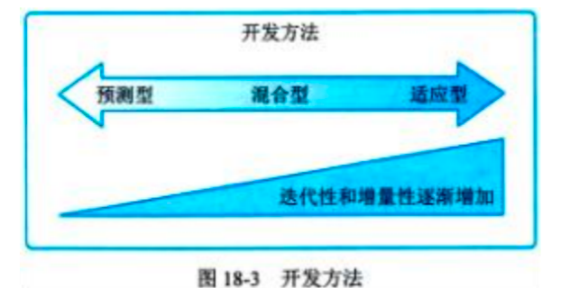

# 项目绩效域

## 18.0 项目绩效域概述

1. 系统内的8个绩效域是相互作用、相互关联和相互依赖，并协调一致、共同运作，支撑项目目标和价值的实现。**这些绩效域相互重叠和关联，并在项目中同时开展，我们不能把某一个绩效域当作一个孤立的工作进行处理**。
2. 实际项目进行过程中，每个绩效域中开展的活动是由组织的背景、项目、可交付物、项目团队、干系人和其他因素确定的，**它们之间并没有特定的执行顺序和权重**。

## 18.1 干系人绩效域 :star::star::star::star::star:

1. 干系人绩效域涉及与干系人相关的活动和职能。
   1. **预期目标**：
      1. **与干系人建立高效的工作关系**；
      2. **干系人认同项目目标**；
      3. **支持项目的干系人提高了满意度，并从中收益**；
      4. **反对项目的干系人没有对项目产生负面影响**。
   2. **绩效要点**：**促进干系人参与**

### 18.1.1 绩效要点

1. 项目经理需要在整个项目生命周期过程中持续促进干系人参与到项目中。为了有效地让干系人参与，项目经理可带领项目团队按以下步骤开展工作。
2. 促进干系人参与，开展步骤：
   1. 识别：在组建项目团队之前，可以先识别高层级的干系人，再逐步逐层识别详细的干系人。**在项目进展期间，如果出现新的干系人或者干系人环境发生了变化，项目团队需要重复进行干系人识别活动**。
   2. 理解和分析：
      1. 随着时间推移和环境的变化，干系人对项目的立场和持有的观点会发生变化，因此，**理解和分析干系人是项目生命周期中一项持续进行的工作**。
      2. 对干系人进行分析时，需要考虑的因素包括：权力、作用、态度、信念、期望、影响程度、与项目的邻近性、在项目中的利益、与干系人和项目互动相关的其他方面。
      3. 在实际项目中，干系人通常会结成联盟，因此**除了需要针对干系人进行独立分析外，项目经理和项目团队还需要考虑并分析干系人之间的互动关系**。
   3. 优先级排序：项目经理和项目团队需要对干系人进行优先级排序，**将管理焦点聚焦于权力和利益大的干系人**。在项目进展期间，**如果出现新的干系人或者干系人环境发生了变化，项目团队需要重新进行优先级排序**。
   4. 参与：
      1. 项目执行过程中，项目经理和项目团队需要促进干系人参与到项目中。和干系人一起管理需求、进行谈判、解决问题，并做出决策。
      2. 促进干系人参与时需要运用一些软技能，如积极倾听、人际关系技能和冲突管理，以及创建愿景和批判性思维等领导技能。
   5. 监督：
      1. 在整个项目期间需要对干系人参与的数量和有效性进行监督，除了不断识别和分析新的干系人外，还要评估当前的参与策略是否有效或是否需要调整。
      2. **可以通过干系人满意度指标来评估干系人绩效域的有效性**。通常可以通过与干系人的对话来确定干系人满意度，也可以通过项目或迭代审查会、产品审查会和其他方法获得定期反馈。如果有大量的干系人，还可以使用问卷调查来评估满意度，必要时，甚至可以通过更新干系人参与方法来提高干系人的满意度。

### 18.1.2 与其他绩效域的相互作用

干系人主要参与的项目工作包括：
1. 为项目团队定义需求和范围，并对其进行优先级排序；
2. 参与并制定规划；
3. 确定项目可交付物和项目成果的验收和质量标准；
4. 客户、高层管理人员、项目管理办公室领导或项目集经理等干系人将重点关注项目及其可交付物绩效的测量。

### 18.1.3 执行效果检查

1. 在项目整个生命周期过程中，项目经理和项目团队需要对干系人绩效域的执行效果进行检查，确保其有效执行并实现预期目标。
2. 干系人绩效域的检查方法：
   | 预期目标                                                                         | 指标及检查方法                                                                                                                                                                                                                                                                                                                                    |
   | -------------------------------------------------------------------------------- | ------------------------------------------------------------------------------------------------------------------------------------------------------------------------------------------------------------------------------------------------------------------------------------------------------------------------------------------------- |
   | 建立高效的工作关系                                                               | **干系人参与的连续性**：通过观察、记录方式，对干系人参与的连续性进行衡量                                                                                                                                                                                                                                                                          |
   | 干系人认同项目目标                                                               | **变更的频率**：对项目范围、产品需求的大量变更或修改可能表明干系人没有参与进来或与项目目标不一致                                                                                                                                                                                                                                                  |
   | 支持项目的干系人提高了满意度，并从中收益；反对项目的干系人没有对项目产生负面影响 | ①**干系人行为**：干系人的行为可表明项目受益人是否对项目感到满意和表示支持，或者他们是否反对项目。②**干系人满意度**：可通过调研、访谈和焦点小组方式，确定干系人满意度，判断干系人是否感到满意和表示支持，或者他们对项目及其可交付物是否表示反对。③**干系人相关问题和风险**：对项目问题日志和风险登记册的审查可以识别与单个干系人有关的问题和风险。 |
  
## 18.2  团队绩效域 :star::star::star::star::star:

1. 团队绩效域涉及项目团队人员有关的活动和职能。
2. **预期目标**：
   1. **共享责任**；
   2. **建立高绩效团队；**
   3. **所有团队成员都展现出相应的领导力和人际关系技能。**
3. **绩效要点**：**项目团队文化、高绩效项目团队和领导力技能。**

### 18.2.1 绩效要点

1. 项目团队文化：项目团队文化反映了项目团队中个体的工作和互动方式。每个项目团队都会发展出自己的团队文化。**项目团队文化可以通过制定项目团队规范这种方式有意识地形成，也可以通过项目团队成员的行为非正式地形成**。建设方法：
   1. 透明：保持透明有助于识别和分享。同时对偏见也要保持透明。
   2. 诚信：由**职业道德行为**和**诚实**组成。
      1. 表现诚实的方式包括：揭示风险、说明自己的假设和估算依据、及早发布坏消息、确保状态报告准确等。
      2. 职业道德行为包括：在产品设计中揭示潜在缺陷或负面影响，披露潜在利益冲突，确保公平以及根据环境、干系人和财务影响做出决策。
   3. 尊重：尊重每个人及其思维方式、技能以及他们为项目团队的贡献。
   4. 积极的讨论：通过对话或辩论等方式进行积极的讨论，处理各种意见，消除误解。
   5. 支持：通过解决问题和消除障碍因素来向项目团队成员提供支持。支持也可以通过提供鼓励、体现同理心和参与积极倾听来加以展现。
   6. 勇气：勇于提出建议、表达异议或尝试新事物有助于形成一种文化。
   7. 庆祝成功：要实时庆祝并认可团队的创新和他人的贡献。
2. 高绩效项目团队：项目经理和项目团队通过以下方式打造高绩效项目团队：
   1. 开诚布公的沟通：**达成共识、信任和协作的基石。**
   2. 共识：共享项目的目的及其将带来的收益。
   3. 共享责任：**项目团队成员对成果的主人翁意识越强，表现得就越好。**
   4. 信任：成员相互信任的项目团队愿意付出额外的努力来取得成功。
   5. 协作：**项目团队相互协作与合作，有助于产生多样化的想法，获得更好的成果。**
   6. 适应性：**项目团队能够根据环境和情况调整工作方式，使工作更加有效。**
   7. 韧性：**出现问题或故障时，高绩效项目团队可以快速恢复。**
   8. 赋能：给项目团队成员赋能，有助于其有权就所采取的工作方式做出决策。
   9. 认可：获得认可更有可能继续取得出色绩效。
3. 领导力技能：与领导力相关的特征和活动包括：
   1. 建立和维护愿景：愿景还可以作为激励工具，当项目团队成员专注于日常工作的琐碎细节时，共同的愿景有助于让大家朝着相同的方向努力。良好的愿景应该具备如下特征：
      1. 用强有力的词句或简短的描述对项目做出概括描述；
      2. 描述可实现的最佳成果；
      3. 在项目团队成员脑海中形成一幅共同的、有凝聚力的画面；
      4. 激发人们对实现成果的热情。
   2. 批判性思维：
      1. 包括概念想象力、洞察力、直觉、反思性思维和元认知。它需要项目团队成员具备开放思维和客观分析问题的能力。
      2. 项目团队成员可应用批判性思维来进行如下工作：
         1. 研究和收集无偏见的、均衡的信息；
         2. 识别、分析和解决问题；
         3. 识别偏见、未说明的假设以及价值观；
         4. 辨别语言的使用情况以及对自己和他人的影响；
         5. 分析数据和证据，以评估论点和观点；
         6. 观察事件，以识别模式和关系；
         7. 适当地运用归纳、演绎和溯因推理；
         8. 识别并阐明错误前提、错误类比、情绪化诉求和其他错误逻辑。
   3. 激励：
      1. 内在激励：
         1. 内在激励源自个人内心，它与在工作本身中寻找乐趣有关，而不是只关注奖励本身；**项目的许多工作都与内在激励相一致**。
         2. 内在激励因素包括：**成就、挑战、对工作的信念、改变现状的需要、自我指导和自主权、责任、个人成长、相互关系和谐的需要、成为项目团队一员的需要**。想要有效激励项目团队成员，需要了解每位成员的首要激励因素，根据首要激励因素和个人偏好选取合适的激励方法。
      2. 外在激励：**外在激励源自外部奖励（如奖金）**。
   4. 人际关系技能：
      1. 情商：
         1. **情商是识别自己的和他人的情绪的能力，情商是领导力的基础，有助于积极沟通、协作，并形成有效领导力**。
         2. 情商一般集中在4个层次：
            1. **自我意识**。自我意识是进行现实的自我评估的能力。
            2. **自我管理**。自我管理也称为“自我调节”，是控制破坏性感受和冲动并使它们改变方向的能力。
            3. **社交意识**。社交意识涉及体现同理心以及理解并考虑他人的感受的能力，包括读懂非语言暗示和肢体语言的能力。
            4. **社交技能**。社交技能是情商的高阶境界，它涉及管理项目团队、建立社交网络、寻找与干系人的共同基础以及建立融洽的关系。某些情商模型还包括第5个方面，即**动机**。**动机是理解驱动和激励人的因素**。
      2. 决策：
         1. **决策可由项目经理和项目团队成员单方面做出。单方面决策速度快，但容易出错。群体决策具有包容性的特点，缺点是需要参与者从工作中停下来，所以耗时较长。**
         2. **发散/汇聚的模式**：首先由干系人分别参与，制定一套广泛的备选解决方案；然后项目团队再将方案汇聚一起，确定一个首选的解决方案。
         3. 对于超出项目团队决策权的议题，可以调查备选方案，并**将决策升级到拥有适当决策权的人员进行最后决策**，保持与组织治理目标的一致性。
      3. 冲突管理：**并非所有冲突都是负面的**，有效处理冲突可以帮助决策并形成良好的解决方案。解决冲突的方法包括：①尊重。②聚焦于问题。③聚焦于当前和未来。④共同寻找备选方案。

### 18.2.2 与其他绩效域的相互作用

在整个项目期间项目团队成员都需要全程展现团队相关的领导力素质和技能。

### 18.2.3 执行效果检查

团队绩效域的检查方法：
| 预期目标                                       | 指标及检查方法                                                                                                                                                     |
| ---------------------------------------------- | ------------------------------------------------------------------------------------------------------------------------------------------------------------------ |
| 共享责任                                       | **目标和责任心**：所有项目团队成员都了解愿景和目标。项目团队对项目的可交付物和项目成果承担责任。                                                                   |
| 建立高绩效团队                                 | **信任与协作程度**：项目团队彼此信任，相互协作。**适应变化的能力**：项目团队适应不断变化的情况。**彼此赋能**：项目团队感到被赋能，同时项目团队对其成员赋能并认可。 |
| 所有团队成员都展现出相应的领导力和人际关系技能 | **管理和领导力风格适宜性**：项目团队成员的管理和领导力风格适合项目的背景和环境。                                                                                   |
## 18.3 开发方法和生命周期绩效域 :star::star::star::star::star:

1. 开发方法和生命周期绩效域涉及与项目的开发方法、节奏和生命周期相关的活动和职能。
   1. **预期目标**：
      1. **开发方法与项目可交付物相符合；**
      2. **将项目交付与干系人价值紧密关联；**
      3. **项目生命周期由促进交付节奏的项目阶段和产生项目交付物所需的开发方法组成。**
   2. **绩效要点**：**交付节奏、开发方法及其选择、协调交付节奏和开发方法及生命周期。**

### 18.3.1 绩效要点

1. 交付节奏：交付节奏是指项目可交付物的时间安排和频率，项目可以**一次性交付、多次交付、定期交付和持续交付**。
   1. 一次性交付：**一次性交付的项目只在项目结束时交付**。例如，对于流程再造项目只在项目结束时进行交付，在项目接近收尾、新过程推出之前，可能不会进行任何交付。
   2. 多次交付：一个项目可能包含多个组件，这些组件会**在整个项目期间的不同时间交付**，因此有些项目会进行多次交付。例如，新药开发项目可能会进行多次交付：临床前建议、第1阶段临床试验结果、第2阶段临床试验结果、第3阶段临床试验结果、注册和上市。
   3. 定期交付：定期交付与多次交付非常相似，但定期交付是**按固定的交付计划进行**。例如每月或每两个月交付一次。新的软件应用程序可能每两周进行一次内部交付，然后定期向市场发布。
   4. 持续交付：持续交付是将项目特性增量交付给客户，通常通过使用**小批量工作和自动化技术完成**。持续交付聚焦于在整个产品生命周期内产生的收益和价值。**这种交付类型更适合于人员稳定的项目团队**。
2. 开发方法：当前行业普遍认同的三种开发方法是**预测型方法、混合型方法和适应型方法**，三种方法通常被视为一个频谱，随着迭代性和增量性逐渐增加，从频谱一端的预测型方法到另一端的适应型方法逐渐变化。
   
   1. 预测型方法：**预测型方法又称为瀑布型方法**。这种开发方法相对稳定，范围、进度、成本、资源和风险可以在项目生命周期的早期阶段进行明确定义。**当涉及重大投资和高风险项且，需要频繁审查、改变控制机制以及在开发阶段之间重新规划时，可以使用此方法**。
   2. 混合型方法：混合型开发方法是**适应型方法和预测型方法的结合体。当需求存在不确定性或风险时，这种开发方法非常有用**。混合型方法通常使用迭代型方法或增量型方法。**迭代型方法适合于澄清需求和调查各种可选项，在最后一个迭代之前，迭代型方法可以完成可接受的全部功能**；增量型方法是用于在一系列迭代过程中生成可交付物，每个迭代都会在预先确定的煎间期限（时间盒）内增加功能，**该可交付物包含的功能只有在最后一个迭代结束后才被完成**。
   3. 适应型方法：
      1. 适应型方法在项目开始时确立了明确的愿景，之后在项目进行过程中在最初已知需求基础上，按照用户反馈、环境或意外事件来不断完善、说明、更改或替换。**当需求面临高度的不确定性和易变性，且在整个项目期间不断变化时，适合采用适应型方法**。
      2. **敏捷方法可以视为一种适应性方法**。项目团队积极参与每次迭代的规划，**根据优先级确定的待办事项列表**来决定可以实现的目标和范围，估算所涉及的工作，并在整个迭代期间进行协作，以不断确定范围并实现目标。
3. 开发方法的选择：
   1. 影响开发方法的产品、服务或成果的相关因素包括：
   
   | 因素           | 预测型                     | 适应型                     |
   | -------------- | -------------------------- | -------------------------- |
   | 创新程度       | 范围和需求明确，能提前规划 | **创新程度高或没做过**     |
   | 需求确定性     | 需求易于定义               | **需求不确定、易变**       |
   | 范围稳定性     | 范围稳定且变化小           | **范围有许多变更**         |
   | 变更的难易程度 | 可交付物不易变更           | 适应变更的可交付物         |
   | 交付物的性质   | 大型项目                   | 可以分组件开发或交付的产品 |
   | 风险           | 高风险的产品               |                            |
   | 安全需求       | 严格安全需求的产品         |                            |
   | 法规           | 具有重大监管监督的环境     |                            |
   2. 影响开发方法的项目相关的因素包括：
    
    | 因素         | 预测型 | 适应型                         |
    | ------------ | ------ | ------------------------------ |
    | 干系人       |        | **需要干系人大量参与**         |
    | 进度制约因素 |        | **需要尽早交付，即使不是成品** |
    | 资金可用情况 |        | 资金不确定的环境               |

   3. 影响开发方法的组织相关的因素包括：

   | 因素                     | 预测型                                   | 适应型                 |
   | ------------------------ | ---------------------------------------- | ---------------------- |
   | 组织结构                 | **有多层级、严格汇报结构、官僚作风浓厚** | **扁平式结构**         |
   | 文化                     | 具有指导文化的组织                       | **团队自管理的组织**   |
   | 组织能力                 |                                          | 组织具有敏捷性         |
   | 项目团队的规模和所处位置 | **大型团队和虚拟团队**                   | **规模不大，集中办公** |
4. 协调交付节奏和开发方法：

| 可交付物         | 交付节奏   | 开发方法 |
| ---------------- | ---------- | -------- |
| 建筑物           | 一次性交付 | 预测     |
| 老年人服务       | 多次交付   | 迭代     |
| 网站             | 定期交付   | 自适应   |
| 社区行动巡查培训 | 多次交付   | 增量     |

### 18.3.2 与其他绩效域的相互作用

1. 开发方法和生命周期绩效域与干系人绩效域、规划绩效域、不确定性绩效域、交付绩效域、项目工作绩效域和团队绩效域相互作用。
   1. 与干系人绩效域：**如果一个可交付物存在要与干系人验收相关的大量风险，则可能会选择迭代方法**；
   2. 与规划绩效域：**预测型生命周期会提前进行大部分规划工作，项目进展中使用滚动式规划和渐进明细来重新规划**，随着威胁和机会的发生，计划也会得到更新；
   3. 与不确定性绩效域：**如果一个可交付物存在与监管要求相关的大量风险，则可能会选择预测型方法**进行额外测试、文档编写，并采用健全的流程和程序；
   4. 与交付绩效域：开发方法和生命周期绩效域与交付绩效域的关注点会有很多重叠，**交付节奏是确保实际项目的价值交付和可行性规划保持一致的主要因素之一**；
   5. 与项目工作绩效域和团队绩效域：**项目团队的工作方式和项目经理的风格会因开发方法的不同而存在很大差异**。
2. 【总结】采用预测型方法时，通常需要更加重视预先规划、测量和控制，适应型方法（特别是在使用敏捷方法时）需要更多的服务型领导风格。

### 18.3.3 执行效果检查

发方法和生命周期绩效域的检查方法：

| 预期目标                                                               | 指标及检查方法                                                                                                   |
| ---------------------------------------------------------------------- | ---------------------------------------------------------------------------------------------------------------- |
| 开发方法与项目可交付物相符合                                           | **产品质量和变更成本**：采用适宜的开发方法（预测型、混合型或适应型），可交付物的产品变量比较高，变更成本相对较小 |
| 将项目交付与干系人价值紧密联系                                         | **价值导向型项目阶段**：按照价值导向将项目工作从启动到收尾划分为多个项目阶段                                     |
| 项目生命周期由促进交付节奏的项目阶段和产生项目交付物所需的开发方法组成 | **适宜的交付节奏和开发方法：如果项目具有多个可交付物，且交付节奏和开发方法不同，可将生命周期阶段进行重叠或重复** |

## 18.4 规划绩效域 :star::star::star::star::star:

1. 规划绩效域涉及整个项目期间组织与协调相关的活动与职能，这些活动和职能是最终交付项目和成果所必须的:
   1. **预期目标**：
      1. **项目以有条理、协调一致的方式推进；**
      2. **应用系统的方法交付项目成果；**
      3. **对演变情况进行详细说明；**
      4. **规划投入的时间成本是适当的；**
      5. **规划的内容对管理干系人的需求而言是充分的；**
      6. **可以根据新出现的和不断变化的需求进行调整。**
   2. **绩效要点**：**规划的影响因素、项目估算、项目团队组成和结构规划、沟通规划、实物资源规划、采购规划、变更规划、度量指标和一致性。**

### 18.4.1 绩效要点

1. 规划的影响因素：**影响项目规划的因素包括：(1)开发方法。(2)项目可交付物。(3)组织需求。(4)市场条件。(5)法律或法规限制**。
   1. 开发方法：
      1. **采用预测型开发方法**：在项目生命周期早期进行规划或组织，**大部分规划都是预先进行的**。预先进行高层级规划，随后使用原型方法进行设计，在项目团队和干系人对设计表示同意后，项目团队再完成更详细的规划。
      2. 项目团队实施**迭代的适应型方法**，一些规划会提前进行，以便制订发布计划，**而进一步的规划会在每个迭代开始时进行**。
   2. 项目可交付物：产品开发或高技术项目可以采用持续性和适应性的规划，以便根据干系人的反馈和技术进步进行演变和变更。
   3. 组织需求：组织治理、政策、流程和文化会要求项目经理提供特定的规划成果。
   4. 市场条件：产品开发项目可能会在竞争激烈的市场环境中进行，在这种情况下，项目团队可以进行最低限度的前期规划，以加快产品投入市场的速度。
   5. 法律或法规限制：监管机构或法规有时要求必须先提供特定的规划文件，然后才能得到授权实施，或者获得批准向市场发布项目可交付成果。
2. 项目估算：
   1. **估算是对某一变量的可能数值或结果的定量评估。随着项目的发展，估算可能会随着信息的变化而变化**。影响估算的4个方面的因素包括：**(1)区间；(2)准确度；(3)精确度；(4)信心**。
      1. **区间**：**项目开始时，估算往往有较大的区间，随着项目进展，估算区间会逐步缩小。**
      2. **准确度**：**准确度是指估算的正确性**。项目开始时的估算准确度将低于项目进展中的估算准确度。
      3. **精确度**：**精确度与准确度不同，精确度指与估算相关的精准度，估算精确度应与所需的准确度相匹配。**
      4. 信息：信心会随经验的增长而增加，处理以前的类似项目的经验有助于提高信心，面对新的和不断演变的技术，估算的信心会降低。
   2. 可采用的估算方法包括：**(1)确定性估算和概率估算；(2)绝对估算和相对估算；(3)基于工作流的估算；(4)对不确定性的调整估算**
      1. **确定性估算和概率估算**：
         1. **确定性估算，也称为点估算，表示为一个数字或金额**，如36个月。
         2. **概率估算包括一定区间内的估算以及该区间内的相关概率**。概率估算的三个因素：**具有一定区间、置信程度、概率分布**。
      2. **绝对估算和相对估算**：**绝对估算是具体信息，使用实际数字，相对估算一般会基于某一个特定基准进行。**
      3. 基于工作流的估算：是通过确定周期和产量来制定的，**周期是一个产品经过一个完整过程的总消耗时间，产量是指可以在给定时间内完成一个完整过程的产品数**，这两个数字可以提供完成指定工作量所需的估算值。
      4. 对不确定性的调整估算：可根据不确定性模拟的结果，通过增加应急储备的方式，调整关键可交付物的交付日期或成本估算值。
3. **项目团队组成和结构规划**：
   1. 规划项目团队的组成和结构时，首先要确定完成项目工作所需的技能组合，包括技能、熟练程度和类似项目的经验。
   2. 在针对项目团队进行规划时，项目经理需要考虑项目团队在同一地点开展工作的优势和必要性。在同一个房间工作的小型项目团队能够利用渗透式沟通，在问题出现时及时将其解决。项目团队成员位于不同地点，通过虚拟方式开展工作需要花费更多时间，并需要借用技术手段。如果需要聘请组织外部的人员，项目经理需要对比收益和成本，在所需技能给项目带来的收益和产生的成本之间进行权衡。
4. **沟通规划**：沟通是争取干系人有效参与的最重要的因素，对沟通进行规划时，需要与干系人绩效域进行关联。
5. **实物资源规划**：
   1. **实物资源指人力资源以外的任何资源，包括材料、设备、软件、测试环境、许可证**等。
   2. 规划实物资源需要对**资源的交付、移动、存储和处置进行规划**，包括对实物资源的流动轨迹进行跟踪。
6. **采购规划**：**采购可以在项目期间的任何时候进行**，预先规划有助于明确目标，确保采购过程顺利进行。合同签订人员需要事先了解所需采购货物或服务的类型，何时需要以及所采购货物或服务所需的技术规范。一旦了解了高层目标和范围，项目团队就可以进行自制或外购分析，这些分析会影响项目团队进度计划和后续工作。
7. **变更规划**：项目团队应对变更进行规划，并制定相关变更管理流程，以便在整个项目期间可以按照变更控制流程、重新确定待办事项列表的优先级排序，或者重新确定项目基准，**签订合同的项目还需要遵循已定义的合同变更流程**。
8. **度量指标和一致性**：
   1. **度量指标**。项目进行过程中，**规划、交付和度量工作之间存在自然的联系，这种联系就是度量指标**。确定度量指标、基准和临界值，以及确定测试和评估方法及流程是规划绩效域的重要工作。规划绩效域通过度量指标、基准和测试流程与度量绩效域相关联，这些都被作为评估实际绩效是否存在偏差的依据。制定度量指标包括：**设定临界值，确定度量目标和度量频率。度量目标的原则是“只测量重要的东西”**。
   2. **一致性**。整个项目生命周期过程中，要保证规划和实际的一致性。某个项目可能与一个项目集或其他项目并行实施，则该项目工作的时间安排应与相关项目的工作和组织中其他业务工作的需要保持一致。大型项目可以将规划成果整合到一个大的项目管理计划中。

### 18.4.2 与其他绩效域的相互作用

规划绩效域和其他所有绩效域都有相互作用。

### 18.4.3 执行效果检查 

划绩效域的检查方法：
| 预期目标                                 | 指标及检查方法                                                                                                                                                               |
| ---------------------------------------- | ---------------------------------------------------------------------------------------------------------------------------------------------------------------------------- |
| 项目以有条理、协调一致的方式推进         | **绩效偏差**：对照项目基准和其他度量指标对项目结果进行绩效审查表明项目正在按计划进行，绩效偏差处于临界值范围内                                                               |
| 应用系统的方法交付项目成果               | **规划的整体性**：交付进度、资金提供、资源可用性、采购等表明项目是以整体方式进行规划的，没有差距或不一致之处                                                                 |
| 对演变情况进行详细说明                   | **规划的详尽程度**：与当前信息相比，可交付物和需求的初步信息是适当的、详尽的；与可行性研究与评估相比，当前信息表明项目可以生成预期的可交付物和成果                           |
| 规划投入的时间成本是适当的               | **规划适宜性**：项目计划和文件表明规划水平适合于项目                                                                                                                         |
| 规划的内容对管理干系人的需求而言是充分的 | **规划的充分性**：沟通管理计划和干系人信息表明沟通足以满足干系人的期望                                                                                                       |
| 可以根据新出现的和不断变化的需求进行调整 | **可适应变化**：**采用待办事项列表的项目，在整个项目期间会对各个计划做出调整。采用变更控制过程的项目具有变更控制委员会**，会议的变更志日志和文档表明变更控制过程正在得到应用 |

## 18.5 项目工作绩效域 :star::star::star::star::star:

1. 项目工作绩效域涉及项目工作相关的活动和职能。项目工作可使项目团队保持专注，并使项目活动顺利进行。
   1. **预期目标**：
      1. **高效且有效的项目绩效**；
      2. **适合项目和环境的项目过程**；
      3. **干系人适当的沟通和参与**；
      4. **对实物资源进行了有效管理**；
      5. **对采购进行了有效管理**；
      6. **有效处理了变更**；
      7. **通过持续学习和过程改进提高了团队能力**。
   2. **绩效要点**：**项目过程、项目制约因素、专注于工作过程和能力、管理沟通和参与、管理实物资源、处理采购事宜、监督新工作和变更、学习与持续改进。**

### 18.5.1 绩效要点

1. **项目过程**：
   1. **项目经理和项目团队**应建立项目过程，并对过程进行定期审查，检查该过程是否高效、是否存在瓶颈、工作是否按照预期进行、是否存在阻碍等。
   2. 过程评估可以包括**过程审计**和**质量保证活动**，可使用如下方法来优化过程：
      1. 精益生产法：通过价值流图来测量增值活动和非增值活动之间的比率，用以识别是否存在非增值的冗余活动。
      2. 召开回顾会议：召开回顾会议或经验教训相关的会议可以使项目团队审查自己的工作方式，并在必要时提出改进建议，以改善流程和效率。
      3. 价值导向审查：以价值为导向，审视“下一笔资金应该花在哪里”，帮助项目团队确定他们应该继续执行当前任务还是进入下一项活动，以便优化价值交付。
   3. **非增值工作示例**：项目管理办公室（PMO）希望跟踪项目团队成员正在开展的工作，PMO要求项目团队在时间表上按特定类别记录他们正在开展的工作，项目团队进行归类和记录所花费的时间可被视为非增值工作。
2. **项目制约因素**：
   1. 制约因素包括最后交付日期、法律法规、固定预算和质量政策等，在整个项目生命周期过程中，**制约因素可能会发生变化**。
   2. 平衡不断变化的制约因素，同时维护干系人的满意度是一项持续进行的项目工作，**需要在整个项目生命周期过程中持续开展**。
3. **专注于工作过程和能力**：项目工作要聚焦在工作过程（交付价值）和保护项目团队的工作能力（项目团队的高效性和满意度）两个方面，从而使项目团队专注于交付价值。
4. **管理沟通和参与**：在项目进行过程中，**如有大量的新的沟通请求提出，说明沟通规划不足以满足干系人的需要，此时需要干系人进一步参与，对沟通计划进行变更**。
5. **管理实物资源**：管理实物资源的目标主要包括：
   1. **减少或消除现场的材料搬运和储存**；
   2. **消除材料等待时间**；
   3. **最小化报废和浪费**；
   4. **促进安全的工作环境等**。
6. **处理采购事宜**：
   1. 在大多数组织中，**项目经理没有签订合同的权限**，他们会与合同签约负责人或在合同、法律和法规方面具有专业知识的其他人员共同开展工作。
   2. 可以根据项目特点选择合同方式。例如，项目中有的交付物采用适应型方法，有的交付物需要采用预测型方法，则总体合同可以使用主协议，**将适应多变的工作放入附录或增补条款中，这样可以灵活应对变更，而不会对总体合同造成影响**。
   3. **采购在项目生命周期过程中的任何阶段都可进行**。
7. **监督新工作和变更**：
   1. **敏捷或适应型项目中**，项目工作会不断演变和调整。因此，可以根据需要将新工作增加到待办事项列表中，项目经理持续对项目待办事项列表进行优先级排序，并在进度或预算受到限制的条件下，保证始终完成优先级高的事项。
   2. **在预测型项目中**，项目经理和项目团队与变更控制委员会和变更的请求者一起协作，通过变更控制流程积极管理变更，确保范围基准中只包含已批准的变更。
8. **学习和持续改进**：
   1. 在项目整个生命周期过程中需要持续学习，有些学习是单个项目内部的，例如学习为完成项目所需的某些特定方法和技术；有些学习是项目集和项目组合层面的，例如学习其他项目用于减少缺陷的优秀的质量保证方法；还有一些学习是组织层面的，例如培训用户如何使用新的软件应用程序。
   2. **项目具有临时性特点，项目完成后大部分知识可能会丢失，因此项目完成后的知识转移对组织非常重要。**

### 18.5.2 与其他绩效域的相互作用

项目工作绩效域和其他所有绩效域都有相互作用。
- 项目工作可促进并支持有效率且有效果的规划、交付和度量；
- 项目工作可为项目团队互动和干系人参与提供有效的环境；
- 项目工作可为驾驭不确定性、模糊性和复杂性提供支持，平衡其他项目制约因素。

### 18.5.3 执行效果检查

项目工作绩效域的检查方法：
| 预期目标                             | 指标及检查方法                                                                                                                                                                                                                             |
| ------------------------------------ | ------------------------------------------------------------------------------------------------------------------------------------------------------------------------------------------------------------------------------------------ |
| 高效且有效的项目绩效                 | **状态报告**：通过状态报告可以表明项目工作有效率且有效果                                                                                                                                                                                   |
| 适合项目和环境的项目过程             | **①过程的适宜性**：证据表明，项目过程是为满足项目和环境的需要而裁剪的；**②过程相关性和有效性**：过程审计和质量保证活动表明，过程具有相关性且正得到有效使用                                                                                 |
| 干系人适当的沟通和参与               | **沟通有效性**：项目沟通管理计划和沟通文件表明，所计划的信息与干系人进行了沟通，如有新的信息沟通需求或误解，可能表明干系人的沟通和参与活动缺乏成效。                                                                                       |
| 对实物资源进行了有效管理             | **资源利用率**：所用材料的数量、抛弃的废料和返工量表明，资源正得到高效利用                                                                                                                                                                 |
| 对采购进行了有效管理                 | **采购过程适宜**：采购审计表明，所采用的适当流程足以开展采购工作，而且承包商正在按计划开展工作                                                                                                                                             |
| 有效处理了变更                       | **变更处理情况**：**使用预测型方法的项目已建立变更日志**，该日志表明，正在对变更做出全面评估，同时考虑了范围、进度、预算、资源、干系人和风险的影响；**采用适应型方法的项目已建立待办事项列表**，该列表显示完成范围的比率和增加新范围的比率 |
| 通过持续学习和过程改进提高了团队能力 | **团队绩效**：团队状态报告表明，错误和返工减少，而效率提高                                                                                                                                                                                 |

## 18.6 交付绩效域 :star::star::star::star::star:

1. 交付绩效域涉及与交付项目相关的活动和职能：
   1. **预期目标**：
      1. **项目有助于实现业务目标和战略**；
      2. **项目实现了预期成果**；
      3. **在预定时间内实现了项目收益**；
      4. **项目团队对需求有清晰的理解**；
      5. **干系人接受项目可交付物和成果，并对其满意**。
   2. **重点关注**：**价值的交付、可交付物、质量**。

### 18.6.1 绩效要点

1. **价值的交付**：
   1. 如果项目所使用的开发方法支持在整个项目生命周期内发布可交付物，在项目进展过程中就可以向干系人交付价值；而在项目生命周期结束时才发布可交付物的项目，则会在项目完成后产生价值。**有的项目在项目结束后的一段时间内，还可以继续获得价值**。
   2. 可行性研究和评估通常会提供对项目预期价值的预测，可行性研究与评估相关文件说明了项目预期成果如何与组织的业务目标保持一致。**项目授权文件试图量化项目的预期成果，以便进行定期测量。这些文件包括项目章程和详细的基准计划**，用于概述项目生命周期、关键里程碑、关键可交付物、评审和其他顶层信息。
2. **可交付物**： 
   1. **可交付物是指项目的临时或最终的产品、服务或结果，它有助于取得项目所要实现的最终成果。可交付物反映了干系人的需求、范围和质量**。
   2. 不管是什么类型的项目，**需求都有可能会随着时间的推移而发生演变，都需要对其进行管理**。
      1. **需求启发**：需求启发是指引导说出、产生或唤起干系人的需求，包括记录相关需求并征得干系人同意。记录需求的要求主要包括：
         1. **清晰**：只有一种解释需求的方式。
         2. **简洁**：要用尽可能少的文字表述需求。
         3. **可核实**：有至少一种方法可以核实需求是否已得到满足。
         4. **一致性**：没有相互矛盾的需求。
         5. **完整**：所有需求代表了当前项目或产品需要的全部。
         6. **可跟踪**：每个需求都可以由一个唯一的标识来识别。
      2. **不断演变和发现的需求**：在采用迭代型、增量型或适应型开发方法的项目中，需求一般不能预先明确定义，可以使用原型、演示、故事板和模型等方法，通过需求的演变，让干系人“眼见为实”地制定需求。
      3. **管理需求**：需求管理人员使用专用软件、待办事项列表、索引卡、需求跟踪矩阵等方法，确保需求相对稳定，并确保新的和不断变化的需求获得干系人的认同。
      4. **定义范围和管理变更**：
         1. **范围是项目所提供的产品、服务和结果的总和**。与需求一样，范围可以预先被定义好，也可以随着时间的推移而演变，或可以新发现。
         2. 在稳定的环境中运行的项目通常会面临“范围蔓延”，**为了应对范围蔓延，项目团队会使用变更控制系统来处理范围变更**。
3. **质量**：
   1. 交付不仅仅是范围和需求。**范围和需求聚焦于需要交付的内容，而质量聚焦于需要达到的绩效水平**。
   2. 设计和开发工作通常基于前期的需求、范围等工作开展。如果前期工作存在缺陷，则后续工作存在的缺陷会累积更多，因此，**发现缺陷的时间越晚，纠正缺陷的成本就越高**。同理，**前期工作完成得越多，变更的成本就越大**。
   3. **Boehm变更成本曲线表明随着时间的推移，变更的费用会变得更加昂贵**。

### 18.6.2 与其他绩效域的相互作用

**交付绩效域是在规划绩效域中所执行所有工作的终点**。交付节奏基于开发方法和生命周期绩效域中工作的结构方式。

### 18.6.3 执行效果检查

交付绩效域的检查方法：
| 预期目标                                 | 指标及检查方法                                                                                                                                                   |
| ---------------------------------------- | ---------------------------------------------------------------------------------------------------------------------------------------------------------------- |
| 项目有助于实现业务目标和战略             | **且标一致性**：组织的战略计划、可行性研究报告以及项目授权文件表明，项目可交付物和业务目标保持一致                                                               |
| 项目实现了预期成果                       | **项目完成度**：项目基础数据表明，项目仍处于正轨，可实现预期成果                                                                                                 |
| 在预定时间内实现了项目收益               | **项目收益**：进度表明财务指标和所规划的交付正在按计划实现                                                                                                       |
| 项目团队对需求有清晰地理解               | **需求稳定性**：在预测型项目中，初始需求的变更很少，表明对需求的真正理解度较高。在需求不断演变的适应型项目中，项目进展中阶段性需求确认反映了干系人对需求的理解。 |
| 干系人接受项目可交付物和成果，并对其满意 | **①干系人满意度**：访谈、观察和最终用户反馈可表明干系人对可交付物的满意度；**②质量问题**：投诉或退货等质量相关问题的数量也可用于表示满意度                       |

## 18.7 度量绩效域 :star::star::star::star::star:

1. 度量绩效域涉及评估项目绩效和采取应对措施相关的活动和职能。度量是评估项目绩效，并采取适当的应对措施，以保持最佳项目绩效的过程：
   1. **预期目标**：
      1. **对项目状况充分理解；**
      2. **数据充分，可支持决策**；
      3. **及时采取行动，确保项且最佳绩效**；
      4. **能够基于预测和评估作出决第，实现目标并产生价值**。
   2. **绩效要点**：**制定有效的度量指标、度量内容及相应指标、展示度量信息和结果、度量陷阱、基于度量进行诊断持续改进**。

### 18.7.1 绩效要点

1. **制定有效的度量指标**：
   1. 有效的度量指标可以跟踪、评估和报告项目进展，有助于描述项目状态、改善项目绩效，并降低绩效恶化的可能性，使项目团队能够利用度量结果及时做出决策并采取有效行动。
      1. **关键绩效指标**：项目的关键绩效指标（KPI）是用于评估项目成功与否的量化的指标，KPI有提前指标和滞后指标两种类型。
         - **提前指标**：提前指标用于预测项目的变化或趋势，**提前指标可以量化**。
         - **滞后指标**：滞后指标用于测量项目可交付物或重大项目事件（event），它们在事后提供信息，滞后指标反映的是过去的绩效或状况。**滞后指标比提前指标更容易测量**。
      2. **有效度量指标**：度量需要投入的时间和精力，因此项目团队应该只测量相关的必要内容，并确保度量指标有用。有效的度量指标具有**SMART特征**如下：
         - **S=Specific（具体的）**：针对要度量的内容，度量指标是具体的。例如缺陷数量、已修复的缺陷和修复缺陷平均花费的时间等。 
         - **Measurable（有意义的）**：度量指标应与基准或需求相关。
         - **Attainable（可实现的）**：目标是可以实现的。
         - **Relevant（具有相关性）**：度量指标应具有相关性，度量结果应能带来价值，并且可付诸行动。
         - **Time-bount（具有及时性）**：有用的度量指标具有及时性。
2. **度量内容及相应指标**：
   1. 度量内容、参数和度量方法取决于项目目标、预期成果以及项目的环境。好的度量标准有助于了解项目绩效和成果的整体情况。**常见的度量指标类别包括可交付物、交付、基准绩效、资源、价值、干系人和预测型度量指标**。
      1. **可交付物的度量指标**：度量指标的实用性是由所交付的产品、服务或结果来决定的。针对可交付物，常见的度量指标包括：
         - 有关错误或缺陷的信息：包括缺陷来源、识别的缺陷数量和已解决的缺陷数量等。
         - 绩效度量指标：描述与系统运行相关的物理或功能属性，例如尺寸、重量、容量、准确度、可靠性和效率等。 
         - 技术绩效度量指标：用于度量系统组件是否符合技术要求。可帮助项目团队及时了解技术解决方案的实现进展情况。
      2. **交付的度量指标**：交付度量指标与正在进行中的工作相关。针对交付，常见的度量指标包括：
         - 在制品：任何特定时间正在处理的工作事项的数量。该指标可以帮助项目团队将正在进行的工作事项的数量限制到可管理的规模和范围。 
         - 提前期：进入待办事项列表到迭代或发布结束的实际消耗时间。提前期越短，表明过程越有效，项目团队工作越高效。
         - 周期时间：与提前期相关，指项目团队完成任务所需的时间。周期时间越短，表明项目团队工作越高效，如果工作时间相对稳定，则可以据此更好地预测未来的工作进展速度。
         - 队列大小：用于跟踪队列中事项的数量。可以将此度量指标与在制品限值进行比较。利特尔法则（Little's Law）说明，队列大小与事项进入队列的比率和队列中工作事项的完成率成正比。可以通过测量在制品并预测未来的工作完成情况来了解完成时间。
         - 批量大小：可度量预期一次迭代中完成的工作（人力投入量、故事点等）。
         - 过程效率：通常应用在精益系统中，用于优化工作流程的比率，可通过计算增值时间和非增值活动时间二者的比率进行衡量。正在等待的任务会增加非增值时间，正在开发或正在核实的任务代表着增值时间。这一比率越高，表明过程效率越高。
      3. **基准绩效的度量指标**：
         1. 项目中最常见的基准是进度基准和成本基准，对于范围基准或技术基准的度量可应用可交付物的度量指标。
         2. 针对**进度基准**，常见的度量指标包括：**①开始日期和完成日期。②人力投入和持续时间。③进度偏差(SV)。④进度绩效指数(SPI)**。
         3. 针对**成本基准**，常见的度量指标包括：**①与计划成本相比的实际成本。②成本偏差(CV)。③成本绩效指数(CPI)**。
      4. **资源度量指标**：针对资源，常见的度量指标包括：
         - **与实际资源利用率相比的计划资源利用率**。此度量指标将资源的实际利用率与估算利用率进行比较，利用率偏差可通过从实际利用率中减去计划利用率得出。 
         - **与实际资源成本相比的计划资源成本**。此度量指标将资源的实际成本与估算成本进行比较，偏差可通过从实际成本中减去估算成本得出。
      5. **价值的度量指标**：价值有许多方面，包括财务的和非财务的。针对价值，常见的度量指标包括：
         - **成本效益比**：成本效益比用于确定项目的成本是否超过其收益。 
         - **计划收益交付与实际收益交付的对比**：度量项目进展中交付的收益和价值，并与预期收益进行比较，以决定继续开展项目还是取消项目。
         - **投资回报率（ROI）**：ROI是一种将财务回报金额与成本进行比较的度量指标，通常在决定开展项目时参考这一指标。
         - **净现值（NPV）**：NPV是一段时间内资本流入的现值与资本流出的现值之差。
      6. **干系人的度量指标**：可以通过满意度调查或推断，或查看有关度量指标来对干系人进行度量。针对干系人，常见的度量指标包括：
         - **净推荐值（NPS）**：净推荐值用于度量干系人（通常是客户）愿意向他人推荐产品或服务的程度，它的测量范围为-100~100。 
         - **情绪图**：情绪图用于跟踪重要的干系人（包括项目团队成员）的情绪或反应。跟踪项目团队的情绪或单个团队成员的情绪有助于确定潜在问题和需要改进的领域。
         - **士气**：情绪图具有主观性，还可以通过问卷调查来度量项目团队的士气。
         - **离职率**：跟踪士气的另一种方法是查看意料之外的项目团队成员的离职率，离职率高可能表明士气低落。
      7. **预测型度量指标**：**预测可以是定性的**，例如使用专家判断来预测，也可以是定量的，例如定量预测试图利用过去的定量信息来估算未来的情况。可用于预测的度量指标包括：
         - 完工尚需估算（ETC）
         - 完工估算（EAC）
         - 完工偏差（VAC）
         - 完工尚需绩效指数（TCPI）
         - 回归分析。回归分析通过考察一系列输入变量及其对应的输出结果建立数学或统计关系，可以用来推断未来的绩效。
         - 产量分析。这种分析方法可评估在固定时间范围内巳完成事项的数量。 
3. **展示度量信息和结果**：度量信息要想使其在项目中有用，就必须可以及时、容易地获取，易于吸收和领会，并加以展示，以图表的方式可视化地展示度量信息或结果，可以帮助干系人理解。常用的图表类型包括：
   1. **仪表盘**：用于提供高层级的概要信息，对于超出既定临界值的任何度量指标，辅助使用文本进行解释。**仪表盘包括信号灯图、横道图、饼状图和控制图**。
   2. **大型可见图表**：**大型可见图表（BVC）也称为信息发射源，是一种可见的实物展示工具**，可向组织内成员提供度量信息和结果，支持及时的知识共享。
   3. **任务板**：任务板通过直观看板方式，**显示己准备就绪并可以开始（待办）的工作、正在进行和已完成的工作**，是对计划工作的可视化表示，可以帮助项目成员随时了解各项任务的状态。
   4. **燃烧图**：燃烧图（**包括燃起图或燃尽图**）用于显示项目团队的“速度”，此“速度”可度量项目的生产率。
4. **度量陷阱**：常见的度量陷阱：
   1. **霍桑效应（Hawthorneeffect）**：霍桑效应指出，**对某一事物进行度量时会对其行为产生影响，因此需要谨慎制定度量指标**。
   2. **虚荣指标（Vanity metric）**：**对决策没有帮助的度量指标一般属于虚荣指标**。比如：新访问者的数量比网站的页面访问量更加有用。
   3. **士气低落**：**如果设定了无法实现的度量指标和目标**，项目团队的士气可能会下降。
   4. **误用度量指标**：尽量避免度量指标的误用。例如：专注于不太重要的度量指标；以牺牲长期度量指标为代价，专注于做好短期度量工作；为了改进绩效指标，开展易于完成的无序活动。
   5. **确认偏见**：度量过程中应尽量摆脱偏见。
   6. **相关性与因果关系混淆**：**解释度量数据的一个常见错误是将两个变量之间的相关性与一个变量导致了另一个变量的因果性混淆**。
5. **基于度量进行诊断**：
   1. 项目经理需要对于超出临界值的度量进行策划并制订诊断计划，基于度量数据进行故障诊断。**诊断计划是在超过临界值或预测时采取的一组行动**。
   2. **偏差程度将取决于干系人的风险承受力。项目团队不应等到突破临界值才采取行动。**
6. **持续改进**：**度量、展示度量信息和度量结果的目的是为了持续改进**，度量结果和相关报告有助于：①避免间题或缺陷：②防止绩效下降；③促使项目团队学习，提高能力；④改进产品或项目绩效；⑤推动决策；⑥更好地创造价值等。

### 18.7.2 与其他绩效域的相互作用

度量绩效域与规划绩效域、项目工作绩效域和交付绩效域相互作用：
  - 划构成了交付和规划比较的基础；
  - 度量绩效域通过提供最新信息来支持规划绩效域的活动；
  - 在项目团队成员制订计划并创建可度量的可交付物时，团队绩效域和干系人绩效域会相互作用；
  - 当不可预测的事件发生时（无论是积极事件还是消极事件），它们会影响项目绩效，从而影响项目的度量指标。应对不确定事件带来的变更时，要同时更新受此变更影响的度量。可以根据绩效度量结果启动不确定性绩效域中的活动，例如识别风险和机会；
  - 作为项目工作的一部分，应与项目团队和其他干系人合作，以便制定度量指标、收集数据、分析数据、做出决策并报告项目状态。

### 18.7.3 执行效果检查

度量绩效域的检查方法：
| 预期目标                                       | 指标及检查方法                                                                                                                                                                   |
| ---------------------------------------------- | -------------------------------------------------------------------------------------------------------------------------------------------------------------------------------- |
| 对项目状况充分理解                             | **度量结果和报告**：通过审计度量结果和报告，可表明数据是否可靠                                                                                                                   |
| 数据充分，可支持决策                           | **度量结果**：度量结果可表明项目是否按预期进行，或者是否存在偏差                                                                                                                 |
| 及时采取行动，确保项目最佳绩效                 | **度量结果**：度量结果提供了提前指标以及当前状态，可导致及时的决策和行动                                                                                                         |
| 能够基于预测和评估作出决策，实现目标并产生价值 | **工作绩效数据**：回顾过去的预测和当前的工作绩效数据可发现，以前的预测是否准确地反映了目前的情况。将实际绩效与计划绩效进行比较，并评估业务文档，可表明项目实现预期价值的可能性。 |

## 18.8 不确定性绩效域 :star::star::star::star::star:

1. 广义的不确定性是一种不可知或不可预测的状态，不确定性包含以下意义：
   1. **风险**：与不可知未来事件相关的风险。
   2. **模糊性**：与不了解当前或未来状况相关的模糊性。
   3. **复杂性**：与具有不可预测结果的动态系统相关的复杂性。
2. 造成项目不确定性的环境因素主要包括：
   1. 经济因素，例如价格波动、资源可用性、借款能力，以及通货膨胀/通货紧缩；
   2. 技术考虑因素，例如新技术、与系统相关的复杂性以及接口；
   3. 法律的或者立法的约束或要求；
   4. 与安全、天气和工作条件相关的物理环境：
   5. 与当前或未来条件相关的模糊性；
   6. 由舆论和媒体塑造的社会和市场影响；
   7. 组织外部或内部的政策和职权结构影响等。
3. **预期目标**：
   1. **了解项目的运行环境，包括技术、社会、政治市场和经济环境等；**
   2. **积极识别、分析和应对不确定性；**
   3. **了解项目中多个因素之间的相互依赖关系；**
   4. **能够对威胁和机会进行预测，了解问题的后果；**
   5. **最小化不确定性对项目交付的负面影响；**
   6. **能够利用机会改进项目的绩效和成果；**
   7. **有效利用成本和进度储备，与项目目标保持一致等。**
4. **绩效要点**：**风险、模糊性、复杂性、不确定性的应对方法。**

### 18.8.1 绩效要点

1. **风险**：项目是不确定性程度各异的独特性工作，**因此所有项目都有风险**。为有效驾驭风险，项目团队需要在追求项目目标的过程中确定风险临界值，即风险可接受的范围。**风险临界值表示的是针对目标可接受的偏差范围，风险临界值反映了组织和干系人的风险偏好**。风险临界值需要在项目风险影响级别中明确定义，并在整个项目生命周期过程中与干系人进行沟通。
2. **模糊性**：
   1. 模糊性有两类，**概念模糊性和情景模糊性。概念模糊性，即缺乏有效的理解**。
   2. **当可能出现多个结果时，就会出现情景模糊性**。解决情景模糊性的问题，包括：
      - **渐进明细**：渐进明细是随着信息越来越多、估算越来越准确，而不断提高项目管理计划的详细程度的迭代过程。
      - **实验**：精心设计的一系列实验可以帮助识别因果关系，减少模糊性数量。
      - **原型法**：原型法可以测试出不同解决方案所产生的不同结果。 
3. **复杂性**：
   1. **复杂性是由于人类行为、系统行为和模糊性而造成的难以管理的项目、项目集或其环境的特征，当有许多相互关联的影响以不同的方式表现出来并相互作用时，就会存在复杂性。**
   2. 处理复杂性的方法主要有：
      1. **处理基于系统的复杂性的方法**：
         1. **解耦**。断开系统的各个部分之间的关联，确定系统的独立工作的一部分，以简化系统并减少相互之间有关联的变量的数量，可降低问题的总体规模。
         2. **模拟**。模拟系统的组件。
      2. **处理需要重新构建的复杂性的方法**：
         1. **多样性**。需要从不同的角度看待复杂的系统；
         2. **平衡**。平衡使用的多种数据类型。
      3. **处理基于过程的复杂性的方法**：
         1. **迭代**。以迭代或增量方式进行构建，一次增加一个特性，每次迭代后，确定哪些特性有效、哪些特性无效。
         2. **参与**。创造机会争取干系人参与，可以减少假设数量，并将学习和参与融入到过程之中。
         3. **故障保护**。对系统中的关键要素，要增加冗余，或者增加在关键组件出现故障时能提供功能正常降级的要素。
4. **不确定性的应对方法**：针对不确定性的应对方法主要包括
   1. **收集信息**：可以对信息收集和分析工作进行规划，以便发现更多信息（如进行研究、争取专家参与或进行市场分析）来减少不确定性。
   2. **为多种结果做好准备**：**制定可用的解决方案，包括备份或应急计划**，为每一个不确定性做好准备。如果存在大量潜在不确定性，项目团队需要对潜在原因进行分类和评估，估算其发生的可能性。
   3. **集合设计**：**探索各种选项，来权衡包括时间与成本、质量与成本、风险与进度、进度与质量等多种因素，在整个过程中，舍弃无效或次优的替代方案**，以便项目团队能够从各种备选方案中选择最佳方案。
   4. **增加韧性**：**韧性是对意外变化快速适应和应对的能力**，韧性既适用于项目团队成员，也适用于组织过程。**如果对产品设计的初始方法或原型无效，则项目团队和组织需要能够快速学习、适应和应对变化**。

### 18.8.2 与其他绩效域的相互作用

不确定性绩效域与其他所有绩效域都相互作用：
  - 随着规划的进行，可将减少不确定性和风险的活动纳入计划。这些活动是在交付绩效域中执行的，度量可以表明随着时间的推移风险级别是否会有所变化。
  - 项目团队成员和其他干系人是不确定性的主要信息来源，在应对各种形式的不确定性方面，他们可以提供信息、建议和协助。
  - 生命周期和开发方法的选择将影响不确定性的应对方式。在范围相对稳定的采用预测型方法的项目中，可以使用进度和预算储备来应对风险；在采用适应型方法的项目中，在系统如何互动或干系人如何反应方面可能存在不确定性，项目团队可以调整计划，以反映对不断演变情况的理解，还可以使用储备来应对不确定性的影响。

### 18.8.3 执行效果检查

不确定性绩效域的检查方法：
| 预期目标                                                   | 指标及检查方法                                                                 |
| ---------------------------------------------------------- | ------------------------------------------------------------------------------ |
| 了解项目的运行环境，包括技术、社会、政治、市场和经济环境等 | **环境因素**：团队在评估不确定性、风险和应对措施时考虑了环境因素               |
| 积极识别、分析和应对不确定性                               | **风险应对措施**：与项目制约因素（例如，预算、进度和绩效）的优先级排序保持一致 |
| 了解项目中多个因素之间的相互依赖关系                       | **应对措施适宜性**：应对风险、复杂性和模糊性的措施适合于项目                   |
| 能够对威胁和机会进行预测，了解问题的后果                   | **风险管理机制或系统**：用于识别、分析和应对风险的系统非常强大                 |
| 最小化不确定性对项目交付的负面影响                         | **项目绩效处于临界值内**：满足计划的交付日期，预算执行情况处于偏差临界值内     |
| 能够利用机会改进项目的绩效和成果                           | **利用机会的机制**：团队使用既定机制来识别和利用机会                           |
| 有效利用成本和进度储备，与项目目标保持一致                 | **储备使用**：团队采取步骤主动预防威胁，有效使用成本或进度储备                 |