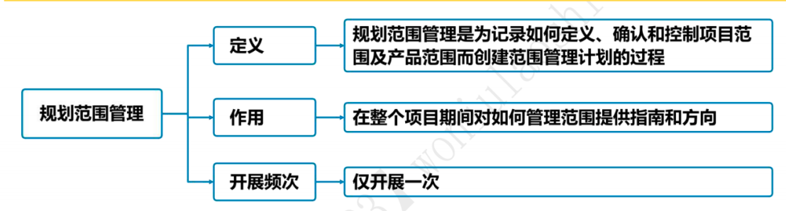
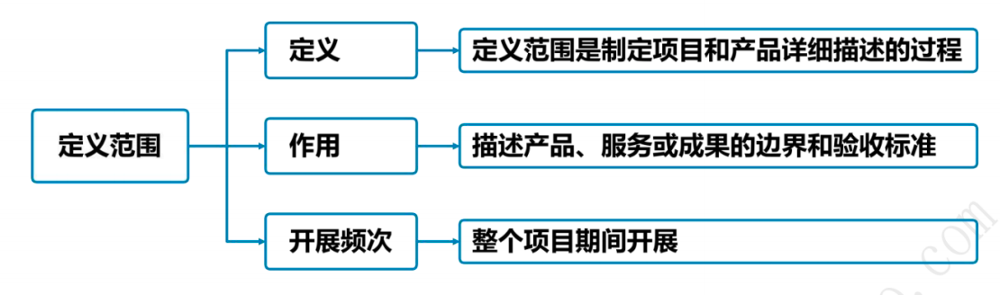
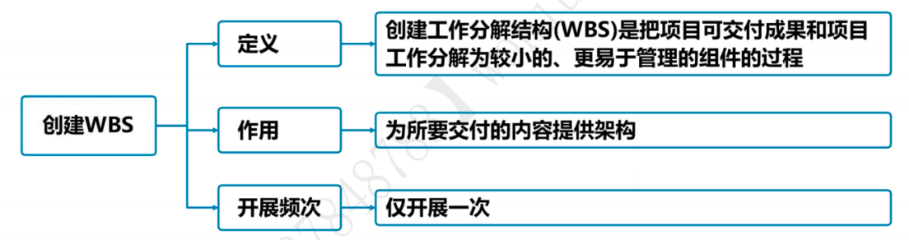
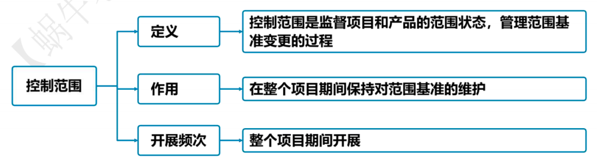

# 项目范围管理

## 9.1 管理基础

### 9.1.1 产品范围和项目范围

在项目环境中，“范围”这一术语有两种含义：
- **产品范围**：指某项产品、服务或成果所具有的特征和功能。**产品范围的完成情况是根据产品需求来衡量的**。“需求”是指根据特定协议或其他强制性规范，产品、服务或成果必须具备的条件或能力。
- **项目范围**：包括产品范围，是为交付具有规定特性与功能的产品、服务或成果而必须完成的工作。**项目范围的完成情况是根据项目管理计划来衡量的**。

### 9.1.2 管理新实践

需求一直是项目管理的关注重点，需求管理过程结束于需求关闭，即把产品、服务或成果移交给接收方，以便长期测量、监控、实现并维持收益。项目范围管理的新趋势和新兴实践更加注重与商业分析师一起合作。

## 9.2 项目范围管理过程

### 9.2.1 过程概述 :star::star::star::star::star:

项目范围管理过程:
1. 规划-规划范围管理：
   1. 定义：规划范围管理是为了记录如何定义、确认和控制项目范围及产品范围，而创建范围管理计划的过程。
   2. 作用：在整个项目期间对如何管理范围提供指南和方向。
   3. 开展次数：**仅开展一次**或仅在项目的预定义时开展。
2. 规划-收集需求：
   1. 定义：收集需求是为实现目标而确定，记录并管理干系人的需要和需求的过程。
   2. 作用：为定义产品范围和项目范围奠定基础。
   3. 开展次数：**仅开展一次**或仅在项目的预定义时开展
3. 规划-定义范围：
   1. 定义：定义范围是制定项目和产品详细描述的过程。
   2. 作用：描述产品、服务或成果的边界和验收标准。
   3. 开展次数：需要在整个项目期间**反复开展**。
4. 规划-创建WBS：
   1. 定义：创建工作分解结构（WBS）是把项目可交付成果和项目工作分解成较小、更易于管理的组件的过程。
   2. 作用：为所要交付的内容提供架构。
   3. 开展次数：**仅开展一次**或仅在项目的预定义时开展。
5. 监控-确认范围：
   1. 定义：确认范围是正式验收已完成的项目可交付成果的过程。
   2. 作用：
      1. **使验收过程具有客观性**；
      2. **通过确认每个可交付成果来提高最终产品、服务或成果获得验收的可能性**。
   3. 开展次数：需要在整个项目期间**定期开展**。
6. 监控-控制范围：
   1. 定义：控制范围是监督项目和产品的范围状态，管理范围基准变更的过程。
   2. 作用：在整个项目期间保持对范围基准的维护。
   3. 开展次数：需要在整个项目期间**反复开展**.

### 9.2.2 裁剪考虑因素 :star::star::star:

裁剪时应考虑的因素包括：**知识和需求管理，确认和控制，开发方法，需求的稳定性，治理**。

### 9.2.3 敏捷与适应方法 :star::star::star::star:

1. 敏捷或适应型：
   - 敏捷或适应型方法**特意在项且早期缩短定义和协商范围的时间，为后续细化范围、明确范围争取更多的时间**。敏捷方法有目的地构建和审查原型，并通过多次发布版本来明确需求，**范围会在整个项且期间被定义和再定义**。采用敏捷或适应型生命周期，**旨在应对大量变更，需要干系人持续参与项目。通过多次迭代来开发可交付成果**。
   - 规划阶段：每次迭代开始时定义和批准详细的范围。在每次迭代中，都会重复开展三个过程：①收集需求；②定义范围；③创建WBS。
   - 执行和控制阶段：在适应型或敏捷型生命周期中，发起人和客户代表应该持续参与项目。在每次迭代中，都会重复开展两个过程：①确认范围；②控制范围。
   - 控制基准：在开展确认范围、控制范围及其他控制过程时，使用未完成项反映当前需求。【敏捷用未完成项】
2. 预测型：
   - 在预测型项目中，经过**批准的项目范围说明书、工作分解结构（WBS）和相应的WBS词典构成项目范围基准**。只有通过正式变更控制程序，才能进行基准变更。
   - **控制基准**：在开展确认范围、控制范围及其他控制过程时，基准被用作比较的基础。【预测用基准】
3. **确认范围**是正式验收已完成的项目可交付成果的过程。**从控制质量过程输出的核实的可交付成果是确认范围过程的输入，而验收的可交付成果是确认范围过程的输出之一，由获得授权的干系人正式签字批准**。因此，干系人需要在规划阶段早期介入（有时需要在启动阶段就介入）,对可交付成果的质量提出意见，以便控制质量过程能够据此评估绩效并提出必要的变更建议。

## 9.3 规划范围管理 :star::star::star::star::star:

1. 规划范围管理【输入】详细解析：
   1. **项目章程**。项目章程记录了高层级的需求。
   2. 项目管理计划:
      - 质量管理计划：在项目中实施组织的质量政策、方法和标准的方式会影响管理项目和产品范围的方式。
      - 项目生命周期描述：定义了项目从开始到完成所经历的一系列阶段。
      - 开发方法：定义了项目是采用预测型、适应型还是混合型开发方法。
   3. **事业环境因素**。组织文化、基础设施、人事管理制度和市场条件等。  
   4. **组织过程资产**。政策和程序、历史信息和经验教训知识库等。
2. 规划范围管理【工具与技术】详细解析：
   1. **专家判断**。专家利用自身的技能或经验来做出判断。
   2. **数据分析**。适用于本过程的数据分析技术是备选方案分析。**备选方案分析技术用于评估、收集需求，详述项目和产品范围，创造产品，确认范围和控制范围的各种方法**。
   3. **会议**。参会者包括项目经理、项目发起人、选定的项目团队成员、选定的干系人、范围管理各过程的负责人以及其他必要人员。
3. 规划范围管理【输出】详细解析：
   1. **范围管理计划**：
      1. 范围管理计划是项目管理计划的组成部分，范围管理计划可以是正式或非正式的，非常详细或高度概括的。【所有计划都可以是概括的或详细的】
      2. 范围管理计划用于指导如下过程和相关工作：
         1. 制定项目范围说明书；
         2. 根据详细项目范围说明书创建WBS;
         3. 确定如何审批和维护范围基准；
         4. 正式验收已完成的项目可交付成果。
   2. **需求管理计划**：
      1. 项目管理计划的组成部分，描述将如何分析、记录和管理项目和产品需求。
      2. 需求管理计划的主要内容包括：
         1. 如何规划、跟踪和报告各种需求活动；
         2. 配置管理活动；
         3. 需求优先级排序过程；
         4. 测量指标及使用这些指标的理由；
         5. 反映哪些需求属性将被列入跟踪矩阵等。

## 9.4 收集需求 :star::star::star::star::star:

1. 需求是指根据特定协议或其他强制性规范，产品、服务或成果必须具备的条件或能力。
2. 让干系人积极参与需求的探索和分解工作（分解成项目和产品需求）,并仔细确定、记录和管理对产品、服务或成果的需求，能直接促进项目成功。
3. 需求将作为后续工作分解结构（WBS）的基础，也将作为成本、进度、质量和采购规划的基础。【需求是基础】
4. 收集需求【输入】详细解析：
   1. **立项管理文件**。商业论证描述为满足业务需要而应该达到的必要、期望及可选标准。
   2. **项目章程**。项目章程记录了项目概述以及将用于制定详细需求的高层级需求。
   3. **项目管理计划**：
      1. 范围管理计划：包含如何定义和制定项目范围的信息。
      2. 需求管理计划：包含如何收集、分析和记录项目需求的信息。
      3. 干系人参与计划：从干系人参与计划中了解干系人的沟通需求和参与程度，以便评估并适应干系人对需求活动的参与程度。
   4. **项目文件**：
      1. 假设日志：识别了影响需求的其他因素的假设条件。
      2. 干系人登记册：了解哪些干系人能够提供需求方面的信息，及记录干系人对项目的需求和期望。
      3. 经验教训登记册：提供了有效的需求收集技术，尤其针对使用敏捷或适应型产品开发方法的项目。
   5. **协议**。协议包含项目和产品需求。
   6. **事业环境因素**。组织文化、基础设施、人事管理制度、市场条件等。
   7. **组织过程资产**。政策和程序；包含以往项目信息的历史信息和经验教训知识库等。
5. 收集需求【工具与技术】详细解析：
   1. **专家判断**。专家利用自身的技能或经验来做出判断。
   2. 数据收集：
      1. 头脑风暴：头脑风暴是一种用来产生和收集对项目需求与产品需求的多种创意的技术。【大家一起想点子】
      2. 访谈：访谈是通过与干系人直接交谈来获取信息的正式或非正式的方法。访谈也可用于获取机密信息。【直接交谈】
      3. 焦点小组：焦点小组是召集预定的干系人和主题专家，了解他们对所讨论的产品、服务或成果的期望和态度。【焦点问题】
      4. 问券调查：问卷调查是指设计一系列书面问题，向众多受访者快速收集信息。问卷调查方法**非常适用于受众多样化、需要快速完成调查、受访者地理位置分散，并且适合开展统计分析的情况**。【腾讯问卷，金山问卷，问卷星】
      5. 标杆对照：标杆对照**将实际或计划的产品、过程和实践与其他可比组织的实践进行比较，以便识别最佳实践，形成改进意见，并为绩效考核提供依据**。**标杆对照所采用的可比组织可以是内部的，也可以是外部的**。【各家车企都喜欢将自家车和 BBA进行对比】
   3. 数据分析：文件分析，指审核和评估任何相关的文件信息。
   4. 决策：
      1. 投票：投票是一种为达成某种期望结果，而对未来多个行动方案进行评估的决策技术和过程。本技术用于生成、归类和排序产品需求。
      2. 独裁型决策制定：采用这种方法将**由一个人负责为整个集体制定决策**。
      3. 多标准决策分析：该技术借助**决策矩阵**，用系统分析方法建立诸如风险水平、不确定性和价值收益等多种标准，以对众多创意进行评估和排序。
   5. 数据表现：
      1. 亲和图：用来对大量创意进行**分组的技术**，以便进一步审查和分析。【先用头脑风暴收集创意，然后对收集的创意进行分类】
      2. 思维导图：把从头脑风暴中获得的**创意整合成一张图，用以反映创意之间的共性与差异**，激发新创意。【先用头脑风暴收集创意，然后将收集的创意整合成图】
   6. 人际关系与团队技能：
      1. 名义小组技术：名义小组技术是用于促进头脑风暴的一种技术，**通过投票排列最有用的创意，以便进一步开展头脑风暴或优先排序**。【头脑风暴是大家随便想，名义小组是给出一个方向，大家在这个方向上想】
      2. 观察和交谈：观察和交谈是指直接**查看个人在各自的环境中如何执行工作（或任务）和实施流程**。可以挖掘隐藏的需求。【实地现场考察】
      3. 引导：引导与主题研讨会结合使用，把主要干系人召集在一起定义产品需求。【主持人会引导大家朝一个话题发展】
   7. 系统交互图：**系统交互图是对产品范围的可视化描绘**，可以直观显示业务系统（过程、设备、计算机系统等）及其与人和其他系统（行动者）之间的交互方式。【只在收集需求里有】
   8. 原型法：
      1. 原型法是指在实际制造预期产品之前，先造出该产品的模型，并据此征求对需求的早期反馈。**原型法支持渐进明细的理念**，需要经历从模型创建、用户体验、反馈收集到原型修改的反复循环过程。【比如：售楼中心都会有一个沙盘】【只在收集需求里有】
      2. **故事板是一种原型技术**，通过一系列的图像或图示来展示顺序或导航路径。
6. 收集需求【输出】详细解析：
   1. 需求文件：
      1. **只有明确的（可测量和可测试的）、可跟踪的完整的、相互协调的，且主要干系人愿意认可的需求，才能作为基准**。
      2. **业务解决方案和技术解决方案。前者是干系人的需要，后者是指如何实现这些干系人需要的方案**。
      3. 需求的类别一般包括：
         - 业务需求：整个组织的高层级需要。
         - 干系人需求：干系人的需要。
         - 解决方案需求：解决方案需求又进一步分为功能需求和非功能需求：**①功能需求：描述产品应具备的功能；②非功能需求：对功能需求的补充，是产品正常运行所需的环境条件或质量要求**。 
         - 过渡和就绪需求：如数据转换和培训需求。这些需求描述了**从"当前状态"过渡到“将来状态”所需的临时能力**。
         - **项目需求**：项目需要满足的行动、过程或其他条件，例如里程碑日期、合同责任、制约因素等。
         - 质量需求：用于确认项目可交付成果的成功完成或其他项目需求的实现的任何条件或标准，例如，测试、认证、确认等。
   2. 需求跟踪矩阵：
      1. 需求跟踪矩阵是把产品需求从其来源连接到能满足需求的可交付成果的一种表格。
         - 正向跟踪：使用需求跟踪矩阵，把每个需求与业务目标或项目目标联系起来，有助于确保每个需求都具有业务价值。
         - 逆向跟踪：需求跟踪矩阵提供了在整个项目生命周期中跟踪需求的一种方法，有助于确保需求文件中被批准的每项需求在项目结束的时候都能实现并交付。
      2. 跟踪需求的内容包括：①业务需要、机会、目的和目标；②项目目标；③项目范围和WBS可交付成果；④产品设计；⑤产品开发；⑥测试策略和测试场景；⑦高层级需求到详细需求等。

## 9.5 定义范围 :star::star::star::star::star:

由于在收集需求过程中识别出的所有需求未必都包含在项目中，所以**定义范围过程需要从需求文件中选取最终的项目需求，然后制定出关于项目及其产品、服务或成果的详细描述**。

1. 定义范围【输入】详细解析：
   1. **项目章程**。项目章程中包含对项目的高层级描述、产品特征和审批要求。
   2. **项目管理计划**。范围管理计划：记录了如何定义、确认和控制项目范围。
   3. **项目文件**：
      - 假设日志：识别了有关产品、项目、环境、干系人以及会影响项目和产品范围的假设条件和制约因素。
      - 需求文件：识别了应纳入范围的需求。
      - 风险登记册：包含了可能影响项目范围的应对策略。
   4. **事业环境因素**。组织文化、基础设施、人事管理制度、市场条件等。 
   5. **组织过程资产**。用于制定项目范围说明书的政策、程序和模板；以往项目的项目档案；以往阶段或项目的经验教训等。
2. 定义范围【工具与技术】详细解析：
   1. **专家判断**。专家利用自身的技能或经验来做出判断。
   2. **数据分析**。可用于定义范围过程的数据分析技术是备选方案分析。
   3. **决策**。可用于定义范围过程的决策技术是多标准决策分析。多标准决策分析是一种借助**决策矩阵**来使用系统分析方法的技术，目的是建立诸如需求、进度、预算和资源等多种标准来完善项目和产品范围。
   4. **人际关系与团队技能**。人际关系与团队技能的一个典型示例是引导。
   5. **产品分析**。主要包括：产品分解、需求分析、系统分析、系统工程、价值分析、价值工程等。
3. 定义范围【输出】详细解析：
   1. 项目范围说明书：
      1. 项目范围说明书是对项目范围、主要可交付成果、假设条件和制约因素的描述。**它记录了整个范围（包括项目和产品范围）,详细描述了项目的可交付成果，代表项目干系人之间就项目范围所达成的共识**。
      2. **项目范围说明书描述要做和不要做的工作的详细程度**，决定着项目管理团队控制整个项目范围的有效程度。
      3. 详细的项目范围说明书包括的内容有**产品范围描述、可交付成果、验收标准、项目的除外责任**等。
         1. **产品范围描述**。逐步细化项目章程和需求文件中所述的产品、服务或成果特征。
         2. **可交付成果**。为完成某一过程、阶段或项目而必须产出的任何独特并可核实的产品、成果或服务能力，可交付成果也包括各种辅助成果，如项目管理报告和文件，对可交付成果的描述可略可详。
         3. **验收标准**。可交付成果通过验收前必须满足的一系列条件。
         4. **项目的除外责任**。识别排除在项目之外的内容。明确说明哪些内容不属于项目范围，有助于管理干系人的期望及减少范围蔓延。
      4. 虽然项目章程和项目范围说明书的内容存在一定程度的重叠，但它们的详细程度完全不同。**项目章程包含高层级的信息，而项目范围说明书则是对范围组成部分的详细描述**，这些组成部分需要在项目过程中渐进明细。
   2. **项目文件（更新）**。假设日志、需求文件、需求跟踪矩阵、干系人登记册。

## 9.6 创建WBS :star::star::star::star::star:

1. WBS是对项目团队为实现项目目标，创建所需可交付成果而需要实施的全部工作范围的层级分解。**WBS组织并定义了项目的总范围，代表着经批准的当前项目范围说明书中所规定的工作**。
2. **WBS最低层的组成部分称为工作包**，其中**包括计划的工作**。工作包对相关活动进行归类，以便对工作安排进度，进行估算，开展监督与控制。在“工作分解结构”这个词语中，**“工作”是指作为活动结果的工作产品或可交付成果，而不是活动本身**。【交付成果和活动有区别，比如：“XX论文”是可交付成果，“写论文”是活动】
3. 创建WBS【输入】详细解析：
   1. **项目管理计划**。范围管理计划：定义了如何根据项目范围说明书创建WBS。
   2. **项目文件**:
      - 需求文件：详细描述了各种单一需求如何满足项目的业务需要。
      - 目范围说明书：描述了需要实施的工作以及不包含在项目中的工作。
   3. **事业环境因素**
   4. **组织过程资产**
4. 创建WBS【工具与技术】详细解析：
   1. **专家判断**。创建WBS过程中，应征求具备类似项目知识或经验的个人或小组的意见。
   2. **分解**：
      1. **分解是一种把项目范围和项目可交付成果逐步划分为更小、更便于管理的组成部分的技术**。
      2. 创建WBS的方法多种多样，**常用的方法包括自上而下的方法、使用组织特定的指南和使用WBS模板**。自下而上的方法可用于归并较低层次的组件。
      3. **工作包是WBS最低层的工作**，可对其成本和持续时间进行估算和管理。
      4. 分解活动，要把整个项目工作分解为工作包，通常需要开展如下活动：【1识别，2确定，3分解，4编码，5核实】
         1. 识别和分析可交付成果及相关工作；
         2. 确定WBS的结构和编排方法：
         3. 自上而下逐层细化分解；
         4. 为WBS组成部分制定和分配标识编码；
         5. 核实可交付成果分解的程度是否恰当。
      5. WBS结构：
         1. WBS的结构可以采用多种形式：以项目生命周期的各阶段作为分解的第二层，把产品和项目可交付成果放在第三层。以主要可交付成果作为分解的第二层。
         2. 纳入由项目团队以外的组织开发的各种较低层次组件（如外包工作）。**作为外包工作的一部分，卖方须制定相应的合同WBS**。
         3. 对WBS较高层组件进行分解，就是要把每个可交付成果或组件分解为最基本的组成部分，即可核实的产品、服务或成果。
         4. 如果采用敏捷或适应型方法，可以将长篇故事分解成用户故事。WBS可以采用提纲式、组织结构图或能说明层级结构的其他形式。
         5. WBS可以采用**提纲式、组织结构图**或**能说明层级结构的**其他形式。
         6. **确认WBS较低层组件是完成上层相应可交付成果的必要且充分的工作，以此来核实分解的正确性**。
         7. 不同的可交付成果可以分解到不同的层次。某些可交付成果只需分解到下一层，即可到达工作包的层次，而另一些则须分解更多层。工作分解得越细致，对工作的规划、管理和控制就越有力。但是，**过细的分解会造成管理努力的无效耗费、资源使用效率低下、工作实施效率降低，同时造成WBS各层级的数据汇总困难**。
         8. 要在未来远期才完成的可交付成果或组件，当前可能无法分解。因而项目管理团队通常需要等待对该可交付成果或组成部分达成一致意见，才能够制定出WBS中的相应细节。这种技术又称为**滚动式规划**。
      6. WBS分解的注意事项：
         1. WBS必须是面向可交付成果的；
         2. WBS必须符合项目的范围，**WBS必须包括，也仅包括为了完成项目的可交付成果的活动。100%原则（包含原则）认为，在WBS中，所有下一级的元素之和必须100%表示上一级的元素**；
         3. **WBS的底层应该支持计划和控制**；
         4. **WBS中的元素必须有人负责，而且只有一个人负责，这个规定又称为独立责任原则**。
         5. **WBS应控制在4~6层，同一级元素的大小应该相似，一个工作单元只能从属于某个上层单元，避免交叉从属**。
         6. **WBS应包括项目管理工作，也要包括分包出去的工作**。
         7. **WBS的编制需要所有（主要）项目干系人的参与**。
         8. **WBS并非是一成不变的，在完成了WBS之后的工作中，仍然有可能需要对WBS进行修改**。
5. 创建WBS【输出】详细解析：
   1. **范围基准**：
      1. **范围基准是经过批准的范围说明书、WBS和相应的WBS词典**，只有通过正式的变更控制程序才能进行变更，它被用作比较的基础。
      2. 范围基准是项目管理计划的组成部分，包括**项目范围说明书、WBS、工作包、规划包和WBS字典**等。
         1. 项目范围说明书：**产品范围描述、可交付成果、验收标准、项目的除外责任**。
         2. WBS是对项目团队为实现项目目标、创建所需可交付成果而需要实施的全部工作范围的层级分解。
         3. 工作包：WBS的最低层是带有独特标识号的工作包。这些标识号为成本、进度和资源信息的逐层汇总提供了层级结构，即账户编码。**控制账户**则是一个管理控制点，控制账户包含两个或更多工作包，每个工作包只与一个控制账户关联。
         4. 规划包：规划包是一种低于控制账户而高于工作包的工作分解结构组件，工作内容已知，但详细的进度活动未知，一个控制账户可以包含一个或多个规划包。
         5. WBS字典：是针对WBS中的每个组件，详细描述可交付成果、活动和进度信息的文件。WBS字典中的内容一般包括：账户编码标识、工作描述、假设条件和制约因素、负责的组织、进度里程碑、相关的进度活动、所需资源、成本估算、质量要求、验收标准、技术参考文献、协议信息等。
   2. **项目文件（更新）**：
      - 假设日志：随着创建WBS过程识别出更多假设条件或制约因素而更新。
      - 需求文件：可以更新需求文件，以反映在创建WBS过程提出并已被批准的变更。

## 9.7 确认范围 :star::star::star::star::star:

由主要干系人，尤其是客户或发起人审查从控制质量过程输出的核实的可交付成果，确认这些可交付成果已经圆满完成并通过正式验收。

1. **确认范围的步骤**:
   1. **确认范围应该贯穿项目的始终。如果是在项目的各个阶段对项目的范围进行确认工作，则还要考虑如何通过项目协调来降低项目范围改变的频率，以保证项目范围的改变是有效率和适时的**。
   2. **确认范围的一般步骤包括：【1确认时间，2投入，3接受标准，4会议步骤，5组织会议】**
      1. 确定需要进行范围确认的时间；
      2. 识别范围确认需要哪些投入；
      3. 确定范围正式被接受的标准和要素；
      4. 确定范围确认会议的组织步骤；
      5. 组织范围确认会议。
   3. **在确认范围前，项且团队需要先进行质量控制工作**。
   4. **确认范围过程关注可交付成果的验收，控制质量过程关注可交付成果的正确性及是否满足质量要求。控制质量过程通常先于确认范围过程，但二者也可同时进行**。
2. **需要检查的问题**：
   1. 可交付成果是否是确定的、可确认的。
   2. 每个可交付成果是否有明确的里程碑，里程碑是否有明确的、可辨别的事件。
   3. 是否有明确的质量标准。
   4. 审核和承诺是否有清晰的表达。
   5. 项目范围是否覆盖了需要完成的产品或服务进行的所有活动。
   6. 项目范围的风险是否太高，管理层是否能够降低风险发生时对项目的影响。
3. **干系人关注点的不同**：确认范围主要是项目干系人（例如，客户、发起人等）对项目的范围进行确认和接受的工作，每个人对项目范围所关注的方面是不同的
   1. **管理层主要关注项目范围**：是指范围对项目的进度、资金和资源的影响，这些因素是否超过了组织承受范围，是否在投入产出上具有合理性。
   2. **客户主要关注产品范围**：关心项目的可交付成果是否足够完成产品或服务。
   3. **项且管理人员主要关注项目制约因素**：关心项目可交付成果是否足够和必须完成，时间、资金和资源是否足够，以及主要的潜在风险和预备解决的方法。
   4. **项目团队成员主要关注项目范围中自己参与的元素和负责的元素**。
4. 确认范围【输入】详细解析：
   1. **项目管理计划**：
      - 范围管理计划：定义了如何正式验收已经完成的可交付成果。
      - 需求管理计划：描述了如何确认项目需求。
      - 范围基准：用范围基准与实际结果比较，以决定是否有必要进行变更、采取纠正措施或预防措施。
   2. **项目文件**：
      - 项目文件：将需求与实际结果比较，以决定是否有必要进行变更，采取纠正措施或预防措施。
      - 需求跟踪矩阵：含有与需求相关的信息，包括如何确认需求。
      - 质量报告：该报告内容可包括由团队管理或需上报的全部质量保证事项、改进建议，以及在控制质量过程中发现的情况的概述。
      - 经验教训登记册：在项目早期获得的经验教训可以运用到后期阶段，以提高验收可交付成果的效率与效果。
   3. **工作绩效数据**：可能包括符合需求的程度、不一致的数量、不一致的严重性或在某时间段内开展确认的次数。 
   4. **核实的可交付成果**：**核实的可交付成果是指已经完成，并被控制质量过程检查为正确的可交付成果**。
5. 确认范围【工具与技术】详细解析：
   1. **检查**：是指开展测量、审查与确认等活动，来判断工作和可交付成果是否符合需求和产品验收标准。检查有时也被称为审查、产品审查和巡检等。
   2. **决策**。投票，一致同意、大多同意或相对多数原则。
6. 确认范围【输出】详细解析：
   1. **验收的可交付成果**：**符合验收标准的可交付成果应该由客户或发起人正式签字批准**。**应该从客户或发起人那里获得正式文件，证明干系人对项目可交付成果的正式验收**。**这些文件将提交给结束项目或阶段过程**。
   2. **变更请求**。对已经完成但未通过正式验收的可交付成果提出变更请求，开展相应的缺陷补救工作。
   3. **工作绩效信息**。工作绩效信息包括项目进展信息，例如，哪些可交付成果己经被验收，哪些未通过验收以及原因。这些信息应该被记录下来并传递给干系人。
   4. 项目文件（更新）：
      - 需求文件：记录实际的验收结果，更新需求文件。 
      - 需求跟踪矩阵：根据验收结果更新需求跟踪矩阵，包括所采用的验收方法及其使用结果。
      - 经验教训登记册：更新经验教训登记册。

## 9.8 控制范围 :star::star::star::star::star:

1. **控制范围过程应该与其他项目管理知识领域的控制过程协调开展**。
2. **未经控制的产品或项目范围的扩大（未对时间、成本和资源做相应调整）被称为范围蔓延**。【蔓延：外部人员搞事情，镀金：内部人员搞事情】
3. 控制范围【输入】详细解析：
   1. **项目管理计划**：
      - 范围管理计划：记录了如何控制项目和产品范围。 
      - 需求管理计划：记录了如何管理项目需求。
      - 变更管理计划：定义了管理项目变更的过程。
      - 配置管理计划：定义了哪些是配置项，哪些配置项需要正式变更控制，以及针对这些配置项的变更控制过程。
      - **范围基准**：**用范围基准与实际结果比较，以决定是否有必要进行变更、采取纠正措施或预防措施**。
      - **绩效测量基准**：使用挣值分析时，将绩效测量基准与实际结果比较，以决定是否有必要进行变更、采取纠正措施或预防措施。
   2. **项目文件**：
      - 需求文件：用于发现任何对商定的项目或产品范围的偏离。  
      - 需求跟踪矩阵：有助于探查任何变更或对范围基准的任何偏离对项目目标的影响，它还可以提供受控需求的状态。
      - 经验教训登记册：项目早期的经验教训可以运用到后期阶段，以改进范围控制。
   3. **工作绩效数据**：工作绩效数据**可能包括收到的变更请求的数量，接受的变更请求的数量或者核实、确认和完成的可交付成果的数量**。
   4. **组织过程资产**：现有的、正式的和非正式的与范围控制相关的政策、程序和指南；可用的监督和报告的方法与模板等。
4. 控制范围【工具与技术】详细解析：
   1. **数据分析**。可用于控制范围过程的数据分析技术主要包括：
      1. 偏差分析：**将基准与实际结果进行比较**，以确定偏差是否处于临界值区间内或是否有必要采取纠正或预防措施。
      2. 趋势分析：旨在审查项目绩效随时间的变化情况，**以判断绩效是正在改善还是正在恶化**。
5. 控制范围【输出】详细解析：
   1. **工作绩效信息**：**包括收到的变更的分类、识别的范围偏差和原因、偏差对进度和成本的影响，以及对将来范围绩效的预测**。
   2. **变更请求**：分析项目绩效后，可能会就范围基准和进度基准，或项目管理计划的其他组成部分提出变更请求。
   3. **项目管理计划（更新）**：
      - 范围管理计划：更新范围管理计划，以反映范围管理方式的变更。 
      - 范围基准：有时范围偏差太过严重，以至于需要修订范围基准，以便为绩效测量提供现实可行的依据。
      - 进度基准：有时进度偏差太过严重，以至于需要修订进度基准，以便为绩效测量提供现实可行的依据。
      - 成本基准：有时成本偏差太过严重，以至于需要修订成本基准，以便为绩效测量提供现实可行的依据。
      - 绩效测量基准：有时绩效偏差太过严重，需要提出变更请求来修订绩效测量基准，以便为绩效测量提供现实可行的依据。
   4. **项目文件（更新）**： 
      - 需求文件：可以通过增加或修改需求而更新需求文件。 
      - 需求跟踪矩阵：应该随同需求文件的更新而更新需求跟踪矩阵。
      - 经验教训登记册：更新经验教训登记册，以记录控制范围的有效技术，以及造成偏差的原因和选择的纠正措施。