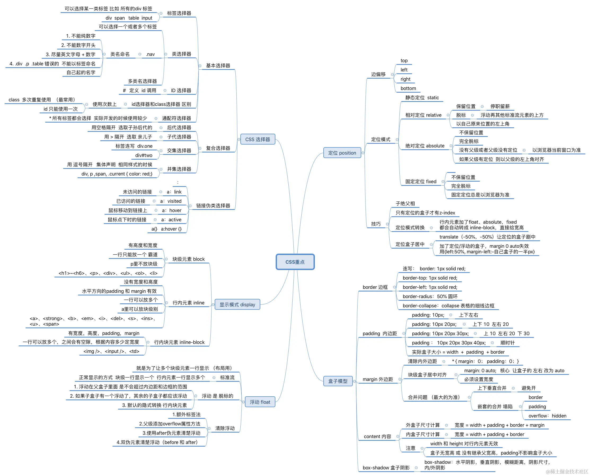

# CSS 面试题

## CSS 标准盒子模型

CSS 标准盒子模型（W3C 盒模型）中，元素的总宽度 = `width + padding + border + margin`。  
其中：

- `width` 仅指内容区宽度；
- `padding` 和 `border` 在 `width` 外；
- `margin` 不占元素尺寸，用于外边距。

可通过 `box-sizing: content-box`（默认）启用标准盒模型。

## CSS 怪异盒模型

怪异盒模型（IE 盒模型）中，`width` 包含 `content + padding + border`，即：

- 设置的 `width` 是元素总宽度；
- `padding` 和 `border` 向内挤压内容区；
- `margin` 仍在外。

通过 `box-sizing: border-box` 启用，常用于布局更直观。

## CSS所有选择器及其优先级、使用场景，哪些可以继承，如何运用at规则

### 一、CSS 选择器分类（常用）

| 类型           | 示例                                     | 说明                         |
| -------------- | ---------------------------------------- | ---------------------------- |
| **基本选择器** | `*`, `div`, `.class`, `#id`              | 通配、标签、类、ID           |
| **关系选择器** | `A B`, `A > B`, `A + B`, `A ~ B`         | 后代、子、相邻兄弟、通用兄弟 |
| **属性选择器** | `[type]`, `[type="text"]`, `[type^="t"]` | 匹配元素属性                 |
| **伪类**       | `:hover`, `:nth-child()`, `:not()`       | 表示状态或位置               |
| **伪元素**     | `::before`, `::after`, `::first-line`    | 创建虚拟内容或样式           |

---

### 二、优先级（从高到低）

1. **`!important`**（慎用）
2. **内联样式**（`style=""`） → 权重：1000
3. **ID 选择器**（`#id`） → 100
4. **类/属性/伪类**（`.class`, `[attr]`, `:hover`） → 10
5. **标签/伪元素**（`div`, `::before`） → 1
6. **通配符/继承/浏览器默认** → 0

> 优先级按 **四元组 (a,b,c,d)** 计算，依次为：`!important`、ID、类、标签。

---

### 三、可继承的属性（部分）

- 文本类：`color`, `font-*`, `text-*`, `line-height`
- 列表：`list-style`
- 白空格：`white-space`

> 大多数盒模型属性（如 `width`, `margin`, `padding`）**不可继承**。

---

### 四、@ 规则（At-rules）常见用法

| @规则        | 用途                                   |
| ------------ | -------------------------------------- |
| `@media`     | 响应式设计（媒体查询）                 |
| `@keyframes` | 定义动画关键帧                         |
| `@import`    | 导入 CSS 文件（性能差，不推荐）        |
| `@font-face` | 自定义字体                             |
| `@supports`  | 特性查询（检测浏览器支持）             |
| `@layer`     | 控制样式层叠顺序（CSS Cascade Layers） |

---

### 五、使用建议

- 优先使用 **类选择器**，避免过度依赖 ID；
- 用 `@media` 实现响应式，`@supports` 做渐进增强；
- 继承用于统一文本样式，减少重复代码；
- 避免 `!important`，靠结构和优先级管理样式。

## CSS伪类和伪元素有哪些，它们的区别和实际应用

### 一、区别（核心）

|              | **伪类（Pseudo-classes）**       | **伪元素（Pseudo-elements）**         |
| ------------ | -------------------------------- | ------------------------------------- |
| **作用**     | 选择元素的**特定状态或位置**     | 创建**不存在于 DOM 的虚拟元素**       |
| **语法**     | 单冒号 `:hover`（CSS3 兼容写法） | 双冒号 `::before`（标准）             |
| **数量限制** | 一个元素可匹配多个伪类           | 每个元素最多一个 `::before`/`::after` |

---

### 二、常见伪类（部分）

- **状态类**：`:hover`, `:focus`, `:active`, `:visited`
- **结构类**：`:first-child`, `:nth-child()`, `:not()`, `:empty`
- **表单类**：`:valid`, `:invalid`, `:checked`, `:disabled`

> ✅ 应用：交互反馈、表单验证、动态列表样式

---

### 三、常见伪元素（部分）

- `::before` / `::after`：插入内容（常配合 `content`）
- `::first-line` / `::first-letter`：段落首行/首字样式
- `::selection`：选中文本样式
- `::placeholder`：输入框占位符样式（部分浏览器需加前缀）

> ✅ 应用：图标插入、清除浮动、装饰性内容、无需额外 HTML

---

### 四、实际应用示例

```css
/* 伪类：按钮悬停效果 */
.btn:hover { color: red; }

/* 伪元素：添加图标 */
.icon::before {
  content: "★";
  margin-right: 4px;
}

/* 清除浮动（经典 clearfix） */
.clearfix::after {
  content: "";
  display: table;
  clear: both;
}
```

> 💡 原则：**伪类描述“何时”，伪元素描述“何物”**。

## CSS几种定位的规则、定位参照物、对文档流的影响，如何选择最好的定位方式

### 一、CSS 定位方式（`position`）

| 值               | 定位参照物                                   | 是否脱离文档流       | 典型用途                         |
| ---------------- | -------------------------------------------- | -------------------- | -------------------------------- |
| `static`（默认） | 无                                           | 否                   | 普通流布局                       |
| `relative`       | 自身原始位置                                 | **否**（保留原占位） | 微调位置、作为绝对定位祖先       |
| `absolute`       | 最近的 **非 static 祖先**（否则为 `<html>`） | **是**               | 弹窗、下拉菜单、脱离流的精确定位 |
| `fixed`          | **视口（viewport）**                         | **是**               | 固定头部、悬浮按钮               |
| `sticky`         | 视口 + 父容器（滚动到阈值时变为 fixed）      | **否**（初始在流中） | 粘性导航、表格表头               |

> ⚠️ 脱离文档流：元素不再占据原来的空间，可能覆盖其他内容。

---

### 二、如何选择最佳定位方式？

- **默认用普通流（`static`/`relative`）**，保持可维护性；
- **需要精确控制且不干扰布局** → `absolute` / `fixed`；
- **滚动粘附效果** → `sticky`（注意父容器不能有 `overflow: hidden` 等裁剪）；
- **微调位置但保留占位** → `relative`；
- **避免滥用 `fixed`/`absolute`**，易导致响应式问题。

## 雪碧图实现原理

**目的**：减少 HTTP 请求，提升性能（尤其小图标多时）。

**原理**：
1. 将多个小图标合并成一张大图；
2. 元素设为固定宽高 + `background-image`；
3. 通过 `background-position` 控制显示区域。

**示例**：
```css
.icon {
  width: 20px;
  height: 20px;
  background: url('sprite.png') no-repeat;
}
.icon-home { background-position: 0 0; }
.icon-user { background-position: -20px 0; }
```

> 📌 现代替代方案：SVG Sprite、Icon Font、CSS 内联 SVG（更灵活、支持 Retina）。

## 水平垂直居中的方案并对比它们的优缺点

以下是 **水平垂直居中** 的主流方案及对比（假设子元素宽高已知或未知）：

---

### 1. **Flexbox（推荐）**
```css
.parent {
  display: flex;
  justify-content: center; /* 水平 */
  align-items: center;     /* 垂直 */
}
```
- ✅ 优点：简洁、语义清晰、支持任意尺寸、响应式友好  
- ❌ 缺点：IE10+ 支持（现代项目基本无问题）

---

### 2. **Grid**
```css
.parent {
  display: grid;
  place-items: center;
}
```
- ✅ 优点：代码极简，强大布局能力  
- ❌ 缺点：IE 支持差（需 IE11+ 且部分特性不全）

---

### 3. **绝对定位 + Transform**
```css
.child {
  position: absolute;
  top: 50%;
  left: 50%;
  transform: translate(-50%, -50%);
}
```
- ✅ 优点：兼容性好（IE9+），无需知道子元素尺寸  
- ❌ 缺点：脱离文档流，可能影响其他布局；`transform` 可能导致模糊（非整数像素）

---

### 4. **绝对定位 + Margin（需宽高已知）**
```css
.child {
  position: absolute;
  top: 0; bottom: 0;
  left: 0; right: 0;
  margin: auto;
  width: 100px;
  height: 100px;
}
```
- ✅ 优点：居中精准，不依赖 `transform`  
- ❌ 缺点：必须指定宽高，灵活性差

---

### 5. **Table-cell（过时）**
```css
.parent {
  display: table-cell;
  vertical-align: middle;
  text-align: center;
}
```
- ✅ 优点：兼容老浏览器  
- ❌ 缺点：语义错误（非表格内容），布局能力弱，不推荐

---

### 对比总结

| 方案                 | 兼容性        | 是否需宽高 | 脱离文档流 | 推荐度 |
| -------------------- | ------------- | ---------- | ---------- | ------ |
| Flexbox              | IE10+         | 否         | 否         | ⭐⭐⭐⭐⭐  |
| Grid                 | IE11+（部分） | 否         | 否         | ⭐⭐⭐⭐   |
| Absolute + Transform | IE9+          | 否         | 是         | ⭐⭐⭐    |
| Absolute + Margin    | IE8+          | **是**     | 是         | ⭐⭐     |
| Table-cell           | IE8+          | 否         | 否         | ⭐      |

> 💡 **首选 Flexbox**；若需兼容 IE9/10，用 `absolute + transform`。

## BFC的布局规则，实现原理，可以解决的问题

### BFC（Block Formatting Context）—— 块级格式化上下文

---

### 一、**布局规则**

BFC 是一个独立的渲染区域，内部元素布局 **不受外部影响**，也 **不影响外部**。其核心规则：

1. **垂直排列**：内部块级元素从上到下依次排列；
2. **外边距折叠**：**只发生在 BFC 内部相邻元素之间**，不同 BFC 之间不折叠；
3. **左对齐**：每个元素的左边与包含块左边接触（`direction: ltr`）；
4. **不与 float 重叠**：BFC 区域不会与浮动元素重叠；
5. **包含浮动**：BFC 的高度会包含内部浮动元素（即清除浮动效果）。

---

### 二、**触发条件（创建 BFC）**

满足以下任一即可：
- 根元素（`<html>`）
- `float` ≠ `none`
- `position` = `absolute` / `fixed`
- `display` = `inline-block` / `table-cell` / `flex` / `grid` / `flow-root`
- `overflow` ≠ `visible`（常用：`overflow: hidden`）

> ✅ 最常用：`overflow: hidden` 或 `display: flow-root`（现代推荐）

---

### 三、**可解决的问题**

| 问题                | BFC 解法                                        |
| ------------------- | ----------------------------------------------- |
| **margin 垂直塌陷** | 父子/兄弟元素分别处于不同 BFC，阻止 margin 合并 |
| **浮动高度塌陷**    | 父容器创建 BFC，自动包裹浮动子元素              |
| **文字环绕 float**  | 非 BFC 元素文字会绕浮，BFC 元素整体避开浮动区   |

---

### 四、示例

```html
<!-- 清除浮动 -->
<div class="parent" style="overflow: hidden;">
  <div style="float: left;">Float</div>
</div>

<!-- 阻止 margin 塌陷 -->
<div style="overflow: hidden;">
  <p style="margin-top: 20px;">Child</p>
</div>
```

> 💡 **现代替代**：`display: flow-root` 是专为创建 BFC 而生的标准方式，无副作用。

## CSS函数有哪些

CSS 函数用于动态计算值，常见类别及函数如下（按用途分类）：

---

### 一、**数值/长度计算**
- `calc()`：动态计算长度/数值（如 `width: calc(100% - 20px)`）
- `min()` / `max()` / `clamp()`：响应式约束  
  - `clamp(1rem, 2.5vw, 2rem)` → 最小/首选/最大值

---

### 二、**颜色函数**
- `rgb()` / `rgba()`  
- `hsl()` / `hsla()`  
- `color-mix()`（新）：混合颜色  
- `color()`：使用自定义颜色空间（如 `color(display-p3 1 0 0)`）

---

### 三、**图像/背景**
- `url()`：引用资源（`background: url(img.png)`）
- `linear-gradient()` / `radial-gradient()` / `conic-gradient()`：渐变
- `element()`（实验性）：将 DOM 元素作为图像

---

### 四、**变换（Transform）**
- `translate()` / `rotate()` / `scale()` / `skew()`
- `matrix()` / `perspective()`

---

### 五、**滤镜（Filter）**
- `blur()` / `brightness()` / `contrast()` / `grayscale()`  
- `drop-shadow()` / `hue-rotate()` / `opacity()` / `saturate()` / `sepia()`

---

### 六、**动画/过渡**
- `cubic-bezier()`：自定义贝塞尔曲线  
- `steps()`：阶跃动画（如 `animation-timing-function: steps(4)`）

---

### 七、**变量与环境**
- `var()`：引用 CSS 自定义属性（`color: var(--main-color)`）
- `env()`：访问 UA 定义的环境变量（如 `env(safe-area-inset-top)`）

---

### 八、**其他**
- `attr()`：获取 HTML 属性值（常用于 `content: attr(data-label)`）
- `counter()` / `counters()`：生成计数器内容（配合 `::before`）

---

> 💡 **注意**：函数必须带括号调用，多数可嵌套（如 `calc(clamp(...))`）。现代布局推荐优先使用 `clamp()`、`var()`、`min/max` 提升响应式能力。

## PostCSS、Sass、Less的异同，以及使用配置，至少掌握一种

### 一、异同对比

| 特性               | **Sass**                       | **Less**                 | **PostCSS**                                               |
| ------------------ | ------------------------------ | ------------------------ | --------------------------------------------------------- |
| **类型**           | CSS 预处理器（扩展语法）       | CSS 预处理器（扩展语法） | **工具平台**（通过插件处理 CSS）                          |
| **语言**           | Ruby（旧）/ Dart（新，推荐）   | JavaScript（Node.js）    | JavaScript（Node.js）                                     |
| **核心能力**       | 变量、嵌套、混合、函数、继承等 | 类似 Sass，但功能略少    | **无内置功能**，靠插件实现（如 Autoprefixer、Preset Env） |
| **编译方式**       | 需编译成 CSS                   | 需编译成 CSS             | 转换/增强现有 CSS（可配合预处理器使用）                   |
| **浏览器兼容处理** | 不直接支持                     | 不直接支持               | ✅ **强项**（如 `autoprefixer` 自动加前缀）                |
| **生态**           | 成熟，社区大                   | 较成熟                   | 极灵活，现代构建标配                                      |

> ✅ **关键区别**：  
> - Sass/Less 是 **写法增强**（新语法 → CSS）；  
> - PostCSS 是 **CSS 后处理**（CSS → 增强 CSS）。

---

### 二、使用配置（以 **Sass + PostCSS** 为例）

#### 1. 安装
```bash
npm install sass postcss postcss-cli autoprefixer --save-dev
```

#### 2. `postcss.config.js`
```js
module.exports = {
  plugins: [
    require('autoprefixer'),        // 自动加浏览器前缀
    require('postcss-preset-env')   // 使用现代 CSS 特性（如 :root 变量降级）
  ]
}
```

#### 3. 编译命令
```bash
# 先编译 Sass → CSS，再用 PostCSS 处理
npx sass src/style.scss dist/style.css --watch
npx postcss dist/style.css --replace --use autoprefixer
```

或集成到构建工具（如 Webpack/Vite）：

#### Webpack 示例
```js
// webpack.config.js
module.exports = {
  module: {
    rules: [
      {
        test: /\.scss$/,
        use: [
          'style-loader',
          'css-loader',
          'postcss-loader',   // ← PostCSS 在此介入
          'sass-loader'
        ]
      }
    ]
  }
}
```

---

### 三、掌握建议

- **至少掌握 Sass**：语法强大（如 `@use` 模块化、函数、控制指令），行业主流；
- **必会 PostCSS**：现代项目标配，用于兼容性、代码优化；
- Less 逐渐被 Sass/PostCSS 取代，了解即可。

> 💡 **最佳实践**：`Sass（开发） → PostCSS（构建时增强）` 组合使用。

## CSS模块化方案有哪些

CSS 模块化方案旨在解决 **全局污染**、**命名冲突** 和 **依赖管理** 问题，主流方案如下：

---

### 1. **CSS Modules（推荐）**
- **原理**：在构建时将类名编译为**唯一哈希值**（如 `.button → .button__3kLm9`），实现局部作用域。
- **使用**：
  ```js
  // React 示例
  import styles from './Button.module.css';
  <button className={styles.button}>Click</button>
  ```
- ✅ 优点：零运行时、与框架无关、天然隔离  
- ❌ 缺点：动态类名需用 `:global()`，调试需 source map

---

### 2. **Scoped CSS（Vue 特有）**
- **原理**：Vue 单文件组件中 `<style scoped>` 自动为元素加 `data-v-xxx` 属性选择器。
- **使用**：
  ```vue
  <style scoped>
  .button { color: red; }
  </style>
  ```
- ✅ 优点：开箱即用、无需配置  
- ❌ 缺点：仅限 Vue，深度选择器需 `::v-deep`

---

### 3. **CSS-in-JS（如 styled-components、Emotion）**
- **原理**：用 JS 动态生成 `<style>` 标签，类名自动哈希，支持 props 传参。
- **使用**：
  ```js
  const Button = styled.button`
    color: ${props => props.theme.color};
  `;
  ```
- ✅ 优点：动态样式强、自动作用域、无 class 命名  
- ❌ 缺点：运行时开销、SEO/SSR 需额外处理

---

### 4. **BEM 命名规范（非工具，靠约定）**
- **原理**：通过命名约定避免冲突（`.block__element--modifier`）
- **示例**：
  ```css
  .card {}
  .card__title {}
  .card__title--large {}
  ```
- ✅ 优点：零构建成本、兼容所有环境  
- ❌ 缺点：依赖团队纪律，无法彻底防冲突

---

### 5. **Shadow DOM（Web Components）**
- **原理**：浏览器原生隔离样式，内部 CSS 不影响外部。
- **使用**：
  ```js
  element.attachShadow({ mode: 'open' }).innerHTML = `
    <style>.local { color: blue; }</style>
    <div class="local">Scoped</div>
  `;
  ```
- ✅ 优点：完全隔离、标准 API  
- ❌ 缺点：兼容性有限（IE 不支持），生态较小

---

### 对比总结

| 方案        | 作用域隔离  | 动态能力 | 构建依赖            | 适用场景                 |
| ----------- | ----------- | -------- | ------------------- | ------------------------ |
| CSS Modules | ✅           | 中       | 需构建工具          | 通用（React/Vue 等）     |
| Scoped CSS  | ✅           | 弱       | Vue 内置            | Vue 项目                 |
| CSS-in-JS   | ✅           | ⭐⭐⭐      | 需 Babel/插件       | 高动态需求（如主题切换） |
| BEM         | ❌（靠约定） | 无       | 无                  | 老项目/无构建环境        |
| Shadow DOM  | ✅（原生）   | 中       | 无（但需 polyfill） | Web Components           |

> 💡 **推荐**：  
> - 通用项目 → **CSS Modules**  
> - Vue 项目 → **Scoped CSS**  
> - 高度动态/主题化 → **CSS-in-JS**

## CSS如何配置按需加载

CSS 本身不支持“按需加载”语义，但可通过以下 **工程化方案** 实现 **按路由/组件粒度动态加载 CSS**，减少首屏体积：

---

### 一、核心思路
将 CSS 拆分为多个文件（或内联到 JS），在需要时通过 JS 动态插入 `<link>` 或 `<style>`。

---

### 二、主流实现方式

#### 1. **基于构建工具的代码分割（推荐）**
- **Webpack / Vite / Rollup** 支持将 CSS 与异步 JS chunk 绑定，自动按需加载。

✅ **示例（React + Webpack）**：
```js
// 动态导入组件（含其 CSS）
const LazyComponent = React.lazy(() =>
  import('./LazyComponent') // 其内部 import './style.css'
);

// 使用时自动加载对应 CSS
<Suspense><LazyComponent /></Suspense>
```
- 构建时：`style.css` 会被打包进 `LazyComponent` 的 chunk；
- 运行时：加载组件时自动注入 CSS。

> ✅ 优点：零配置（现代脚手架默认支持），自动去重。

---

#### 2. **手动动态插入 `<link>`**
适用于非模块化场景或微前端：
```js
function loadCSS(url) {
  if (document.querySelector(`link[href="${url}"]`)) return;
  const link = document.createElement('link');
  link.rel = 'stylesheet';
  link.href = url;
  document.head.appendChild(link);
}

// 按需调用
loadCSS('/path/to/feature.css');
```
> ⚠️ 注意：需自行管理重复加载和卸载。

---

#### 3. **CSS-in-JS（自动按需）**
如 `styled-components`、`Emotion`：
- 样式随组件 JS 加载，天然按需；
- 未渲染的组件样式不会注入页面。

---

#### 4. **Tailwind CSS 等原子化框架的 Purge（编译时按需）**
- 通过分析模板文件，**编译时** 删除未使用的 CSS；
- 虽非运行时按需，但大幅减小最终 CSS 体积。

```js
// tailwind.config.js
module.exports = {
  content: ['./src/**/*.{js,jsx,html}'], // 扫描用到的类名
}
```

---

### 三、选择建议

| 场景                      | 推荐方案                                           |
| ------------------------- | -------------------------------------------------- |
| SPA（React/Vue）          | 利用 **路由级代码分割 + 异步组件**（自动加载 CSS） |
| 微前端/多页应用           | **手动动态插入 `<link>`**                          |
| 高动态主题/组件库         | **CSS-in-JS**                                      |
| 原子化 CSS（如 Tailwind） | **编译时 Purge + 构建分割**                        |

> 💡 **关键原则**：  
> - 优先依赖 **构建工具自动化**（如 Webpack 的 `mini-css-extract-plugin`）；  
> - 避免全量引入 UI 库 CSS，使用其提供的 **按需引入插件**（如 `babel-plugin-import` for Ant Design）。

## CSS 实现常见动画，如渐变、移动、旋转、缩放等等

CSS 动画主要通过 **`transition`（过渡）** 和 **`animation`（关键帧动画）** 实现。以下是常见效果的简洁实现：

---

### 一、基础属性（配合 `transform`）

| 效果 | CSS 属性                     |
| ---- | ---------------------------- |
| 移动 | `transform: translate(x, y)` |
| 旋转 | `transform: rotate(45deg)`   |
| 缩放 | `transform: scale(1.2)`      |
| 倾斜 | `transform: skew(10deg)`     |

> 所有 `transform` 操作默认以元素中心为原点，可用 `transform-origin` 调整。

---

### 二、过渡动画（`transition`）—— 状态变化时触发动画

```css
.box {
  transition: all 0.3s ease; /* 简写：property duration timing-function */
}
.box:hover {
  transform: translateX(20px) rotate(10deg) scale(1.1);
  background: #61dafb;
}
```

✅ 适用：悬停、激活等简单交互  
❌ 不支持复杂路径或多步骤

---

### 三、关键帧动画（`animation`）—— 自主循环/多步骤

```css
@keyframes bounce {
  0%, 100% { transform: translateY(0); }
  50%      { transform: translateY(-20px); }
}

.ball {
  animation: bounce 1s infinite ease-in-out;
}
```

常用属性：
- `animation-name`: 动画名（如 `bounce`）
- `animation-duration`: 持续时间
- `animation-timing-function`: 贝塞尔曲线（`ease`, `linear`, `cubic-bezier(...)`）
- `animation-iteration-count`: 循环次数（`infinite`）
- `animation-direction`: 方向（`alternate` 往返）

---

### 四、常见动画示例

#### 1. **淡入淡出**
```css
.fade {
  opacity: 0;
  transition: opacity 0.5s;
}
.fade.show { opacity: 1; }
```

#### 2. **滑入（从左侧）**
```css
.slide-in {
  transform: translateX(-100%);
  transition: transform 0.4s ease-out;
}
.slide-in.visible { transform: translateX(0); }
```

#### 3. **旋转加载器**
```css
.spinner {
  animation: spin 1s linear infinite;
}
@keyframes spin {
  to { transform: rotate(360deg); }
}
```

#### 4. **弹性缩放（Hover）**
```css
.icon {
  transition: transform 0.2s;
}
.icon:hover {
  transform: scale(1.3);
}
```

---

### 五、性能提示

- 优先使用 `transform` 和 `opacity`（可启用 GPU 加速，不触发重排）；
- 避免动画 `width`/`height`/`top`/`left`（引发 layout）；
- 复杂动画用 `will-change: transform` 提示浏览器优化（慎用）。

> 💡 **原则**：简单交互用 `transition`，复杂/自动播放用 `animation`。

## CSS浏览器兼容性写法

CSS 浏览器兼容性写法的核心是：**优雅降级 + 特性检测 + 自动前缀 + 合理放弃旧浏览器**。以下是关键实践：

---

### 一、自动加浏览器前缀（推荐）
使用 **PostCSS + Autoprefixer**，根据目标浏览器自动添加 `-webkit-`、`-moz-` 等前缀。

```js
// postcss.config.js
module.exports = {
  plugins: [
    require('autoprefixer')({
      overrideBrowserslist: ['> 1%', 'last 2 versions']
    })
  ]
}
```
✅ 覆盖 `flex`、`grid`、`transform`、`animation` 等需前缀的属性。

---

### 二、常见需手动处理的兼容写法

#### 1. **Flex 布局（IE10+）**
```css
.container {
  display: -webkit-box;      /* 老 Safari */
  display: -ms-flexbox;      /* IE10 */
  display: flex;
}
```

#### 2. **CSS Grid（IE11 使用 `-ms-` 语法）**
> ⚠️ IE11 的 Grid 是旧规范，建议用 `@supports` 降级：
```css
.grid {
  display: flex; /* 降级方案 */
}
@supports (display: grid) {
  .grid {
    display: grid;
    grid-template-columns: repeat(3, 1fr);
  }
}
```

#### 3. **自定义属性（CSS Variables）**
IE 不支持，用 `:root` + 降级：
```css
:root {
  --main-color: #333;
}
.btn {
  color: #333;           /* 降级 */
  color: var(--main-color); /* 现代浏览器 */
}
```

#### 4. **Placeholder 样式**
```css
input::placeholder { color: #999; }          /* 标准 */
input::-webkit-input-placeholder { color: #999; } /* Webkit */
input::-moz-placeholder { color: #999; }     /* Firefox 19+ */
```

---

### 三、特性查询（安全使用新特性）
```css
/* 仅当浏览器支持 grid 时应用 */
@supports (display: grid) {
  .layout { display: grid; }
}

/* 否则用 float 或 flex 降级 */
.layout { overflow: hidden; }
.layout-item { float: left; width: 33.3%; }
```

---

### 四、条件加载（针对 IE）
```html
<!-- IE <= 9 加载兼容样式 -->
<!--[if lt IE 10]>
  <link rel="stylesheet" href="ie-fix.css">
<![endif]-->
```
> 💡 现代项目通常直接放弃 IE，无需此写法。

---

### 五、工具推荐

| 工具                   | 作用                                                 |
| ---------------------- | ---------------------------------------------------- |
| **Autoprefixer**       | 自动加前缀                                           |
| **postcss-preset-env** | 将新 CSS 转为兼容写法（如 `:focus-visible` 降级）    |
| **Can I Use**          | 查询属性兼容性（[caniuse.com](https://caniuse.com)） |
| **Browserslist**       | 统一配置目标浏览器（被 Autoprefixer / Babel 共享）   |

---

### 六、原则总结

1. **不手写前缀** → 交给 Autoprefixer；
2. **新特性用 `@supports` 包裹**；
3. **关键布局提供降级方案**（如 Grid → Flex → Float）；
4. **明确放弃老旧浏览器**（如 IE11 以下）；
5. **测试真机/模拟器**，尤其 Safari 和移动端 WebView。

> ✅ 现代开发：聚焦 **Chrome/Firefox/Safari/Edge 最新 2 版 + iOS/Android 主流机型**。

## 最后

