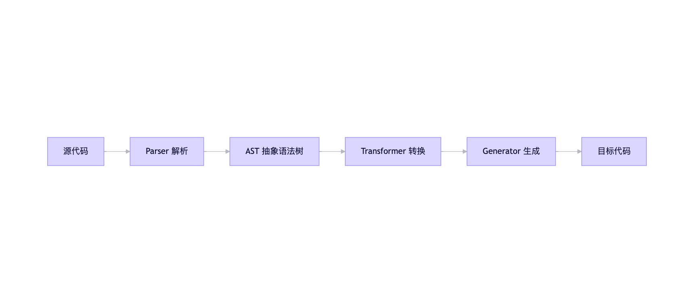

# 前端工程化

## webpack 配置有哪些?

Webpack 是一个强大的前端模块打包工具，其核心能力通过 **配置文件 `webpack.config.js`** 进行定制。以下是 **常用且关键的 Webpack 配置项详解**（基于 Webpack 5）：

---

### 一、基础结构
```js
// webpack.config.js
module.exports = {
  mode: 'development', // 'production' | 'none'
  entry: './src/index.js',
  output: { /* ... */ },
  module: { /* ... */ },
  plugins: [ /* ... */ ],
  resolve: { /* ... */ },
  devServer: { /* ... */ },
  optimization: { /* ... */ }
};
```

---

### 二、核心配置项详解

#### 1. **`mode`（模式）**
- **作用**：设置打包环境，自动启用内置优化。
- **选项**：
  - `'development'`：启用 `NamedChunksPlugin`、`EvalSourceMapDevToolPlugin`（快速构建 + source map）
  - `'production'`：启用代码压缩、作用域提升、Tree Shaking 等
- **建议**：始终显式指定。

#### 2. **`entry`（入口）**
- **作用**：指定打包起点。
- **用法**：
  ```js
  entry: './src/index.js', // 单入口
  entry: {
    app: './src/app.js',
    vendor: './src/vendor.js' // 多入口（用于代码分割）
  }
  ```

#### 3. **`output`（输出）**
- **作用**：配置打包结果。
- **关键属性**：
  ```js
  output: {
    path: path.resolve(__dirname, 'dist'), // 输出目录
    filename: '[name].[contenthash].js',   // 文件名（[name]=入口名，[contenthash]=内容哈希）
    publicPath: '/',                       // 资源引用前缀（CDN 场景）
    clean: true                            // 构建前清空 output 目录（Webpack 5+）
  }
  ```

#### 4. **`module.rules`（模块规则）**
- **作用**：定义如何处理不同类型的模块（如 JS、CSS、图片）。
- **核心概念**：**Loader**（转换器）
- **常用规则**：
  ```js
  module: {
    rules: [
      // 处理 JS/JSX（Babel）
      {
        test: /\.jsx?$/,
        exclude: /node_modules/,
        use: {
          loader: 'babel-loader',
          options: { presets: ['@babel/preset-env'] }
        }
      },
      // 处理 CSS
      {
        test: /\.css$/,
        use: ['style-loader', 'css-loader', 'postcss-loader']
      },
      // 处理图片/字体
      {
        test: /\.(png|jpg|gif|woff2)$/,
        type: 'asset', // Webpack 5 内置资源模块
        parser: {
          dataUrlCondition: { maxSize: 8 * 1024 } // 小于 8KB 转 base64
        },
        generator: {
          filename: 'assets/[name].[hash][ext]'
        }
      }
    ]
  }
  ```

#### 5. **`plugins`（插件）**
- **作用**：执行范围更广的任务（如优化、压缩、注入变量）。
- **常用插件**：
  ```js
  const HtmlWebpackPlugin = require('html-webpack-plugin');
  const MiniCssExtractPlugin = require('mini-css-extract-plugin');
  const DefinePlugin = require('webpack').DefinePlugin;

  plugins: [
    // 自动生成 HTML 并注入 bundle
    new HtmlWebpackPlugin({ template: './public/index.html' }),
    
    // 提取 CSS 到单独文件
    new MiniCssExtractPlugin({ filename: '[name].[contenthash].css' }),
    
    // 定义全局常量（如 process.env.NODE_ENV）
    new DefinePlugin({
      'process.env.API_URL': JSON.stringify('https://api.example.com')
    })
  ]
  ```

#### 6. **`resolve`（解析）**
- **作用**：配置模块解析规则。
- **常用配置**：
  ```js
  resolve: {
    extensions: ['.js', '.jsx', '.json'], // 导入时省略后缀
    alias: {
      '@': path.resolve(__dirname, 'src'), // 路径别名
      'react': 'preact/compat' // 替换依赖（Preact 代替 React）
    },
    modules: ['node_modules', 'src'] // 模块查找目录
  }
  ```

#### 7. **`devServer`（开发服务器）**
- **作用**：本地开发服务（仅开发环境有效）。
- **关键配置**：
  ```js
  devServer: {
    static: './public',       // 静态资源目录
    hot: true,                // 模块热替换（HMR）
    open: true,               // 启动后自动打开浏览器
    port: 3000,
    proxy: {                  // 代理 API 请求
      '/api': 'http://localhost:8080'
    }
  }
  ```

#### 8. **`optimization`（优化）**
- **作用**：生产环境性能优化。
- **关键配置**：
  ```js
  optimization: {
    splitChunks: {
      chunks: 'all', // 代码分割（提取公共代码）
      cacheGroups: {
        vendor: {
          test: /[\\/]node_modules[\\/]/,
          name: 'vendors',
          chunks: 'all'
        }
      }
    },
    minimize: true, // 是否压缩（production 模式默认 true）
    minimizer: [new CssMinimizerPlugin(), '...'] // 自定义压缩器
  }
  ```

---

### 三、环境区分配置
避免在单个配置文件中混杂开发/生产逻辑：
```js
// webpack.config.js
module.exports = (env, argv) => {
  const isProd = argv.mode === 'production';
  
  return {
    mode: argv.mode,
    devtool: isProd ? 'source-map' : 'eval-cheap-module-source-map',
    plugins: [
      new HtmlWebpackPlugin({
        template: './public/index.html',
        minify: isProd // 生产环境压缩 HTML
      })
    ]
  };
};
```

> ✅ **更佳实践**：使用 `webpack-merge` 拆分配置文件：
> ```
> config/
>   ├── webpack.common.js
>   ├── webpack.dev.js
>   └── webpack.prod.js
> ```

---

### 四、常用 Loader & Plugin 速查表

| 类型     | 名称                                                         | 用途                      |
| -------- | ------------------------------------------------------------ | ------------------------- |
| **JS**   | `babel-loader`                                               | 转译 ES6+ / JSX           |
| **CSS**  | `css-loader` + `MiniCssExtractPlugin`                        | 处理 CSS 模块化 & 提取    |
| **资源** | `file-loader` / `url-loader`（Webpack 5 用 `asset modules`） | 处理图片/字体             |
| **HTML** | `html-webpack-plugin`                                        | 生成 HTML 模板            |
| **优化** | `terser-webpack-plugin`                                      | JS 压缩（Webpack 5 内置） |
| **分析** | `webpack-bundle-analyzer`                                    | 可视化 bundle 体积        |

---

### 五、一句话总结
> **Webpack 配置 = 入口 → 加载器（Loader）处理模块 → 插件（Plugin）增强功能 → 输出优化结果**。  
> 掌握 `module.rules`、`plugins`、`optimization.splitChunks` 三大核心，即可应对 90% 场景。

## 有哪些常见的 Loader 和 Plugin？

在 Webpack 生态中，**Loader** 用于**转换模块内容**（如将 TypeScript 编译为 JavaScript），**Plugin** 用于**扩展构建流程能力**（如压缩代码、生成 HTML）。以下是 **最常用且实用的 Loader 和 Plugin 列表**（基于 Webpack 5）：

---

### 一、常见 Loader（按功能分类）

#### ✅ **JavaScript / TypeScript**
| Loader         | 作用                                               | 安装命令                                  |
| -------------- | -------------------------------------------------- | ----------------------------------------- |
| `babel-loader` | 转译 ES6+/JSX/TypeScript（需配合 Babel 配置）      | `npm install -D babel-loader @babel/core` |
| `ts-loader`    | 直接编译 TypeScript（比 Babel 更完整支持 TS 类型） | `npm install -D ts-loader typescript`     |

> 💡 推荐：用 `babel-loader` + `@babel/preset-typescript` 处理 TS（更快，适合 React 项目）。

---

#### ✅ **CSS / 预处理器**
| Loader                        | 作用                                      | 说明                             |
| ----------------------------- | ----------------------------------------- | -------------------------------- |
| `css-loader`                  | 解析 CSS 中的 `@import` 和 `url()`        | 必须配合其他 loader 使用         |
| `style-loader`                | 将 CSS 注入 `<style>` 标签（开发环境）    | 不适合生产环境                   |
| `MiniCssExtractPlugin.loader` | **提取 CSS 为独立文件**（生产环境必备）   | 需搭配 `mini-css-extract-plugin` |
| `sass-loader`                 | 编译 Sass/SCSS                            | 依赖 `node-sass` 或 `sass`       |
| `less-loader`                 | 编译 Less                                 | 依赖 `less`                      |
| `postcss-loader`              | 自动添加浏览器前缀（配合 `autoprefixer`） | 需配置 `postcss.config.js`       |

> 📌 **典型 CSS 链**：  
> ```js
> // 开发环境
> use: ['style-loader', 'css-loader', 'postcss-loader']
> // 生产环境
> use: [MiniCssExtractPlugin.loader, 'css-loader', 'postcss-loader']
> ```

---

#### ✅ **资源文件（图片/字体/媒体）**
Webpack 5 **内置 Asset Modules**，无需额外 loader：
```js
// webpack.config.js
module.exports = {
  module: {
    rules: [
      {
        test: /\.(png|jpg|gif|svg)$/,
        type: 'asset', // 自动选择 asset/resource 或 asset/inline
        parser: {
          dataUrlCondition: { maxSize: 8 * 1024 } // <8KB 转 base64
        },
        generator: {
          filename: 'images/[name].[hash][ext]'
        }
      },
      {
        test: /\.(woff|woff2|eot|ttf|otf)$/,
        type: 'asset/resource', // 强制输出为文件
        generator: { filename: 'fonts/[name][ext]' }
      }
    ]
  }
};
```

> ⚠️ Webpack 4 用户需用 `file-loader` / `url-loader`。

---

#### ✅ **其他**
| Loader          | 作用                                        |
| --------------- | ------------------------------------------- |
| `html-loader`   | 处理 HTML 中的 `` 等资源引用 |
| `vue-loader`    | 编译 Vue 单文件组件（`.vue`）               |
| `worker-loader` | 将 JS 文件作为 Web Worker 加载              |

---

### 二、常见 Plugin（按功能分类）

#### ✅ **核心功能**
| Plugin              | 作用                                      | 安装命令                             |
| ------------------- | ----------------------------------------- | ------------------------------------ |
| `HtmlWebpackPlugin` | 自动生成 HTML 并自动注入 bundle           | `npm install -D html-webpack-plugin` |
| `DefinePlugin`      | 定义全局常量（如 `process.env.NODE_ENV`） | **Webpack 内置**                     |
| `ProvidePlugin`     | 自动加载模块（如 `$` → `jquery`）         | **Webpack 内置**                     |

> **HtmlWebpackPlugin 示例**：
> ```js
> new HtmlWebpackPlugin({
>   template: './public/index.html',
>   minify: true // 生产环境压缩 HTML
> })
> ```

---

#### ✅ **代码优化**
| Plugin                 | 作用                                           |
| ---------------------- | ---------------------------------------------- |
| `MiniCssExtractPlugin` | **提取 CSS 到独立文件**（替代 `style-loader`） |
| `CssMinimizerPlugin`   | 压缩 CSS（Webpack 5 需手动配置）               |
| `TerserWebpackPlugin`  | 压缩 JS（Webpack 5 生产模式默认启用）          |
| `CompressionPlugin`    | 生成 gzip/brotli 压缩文件                      |

> **MiniCssExtractPlugin 示例**：
> ```js
> const MiniCssExtractPlugin = require('mini-css-extract-plugin');
> 
> plugins: [new MiniCssExtractAssistantPlugin()],
> module: {
>   rules: [{
>     use: [MiniCssExtractPlugin.loader, 'css-loader']
>   }]
> }
> ```

---

#### ✅ **性能分析 & 调试**
| Plugin                    | 作用                               |
| ------------------------- | ---------------------------------- |
| `webpack-bundle-analyzer` | 可视化 bundle 体积（排查过大依赖） |
| `SpeedMeasurePlugin`      | 分析各 loader/plugin 耗时          |

> **Bundle Analyzer 使用**：
> ```js
> const BundleAnalyzerPlugin = require('webpack-bundle-analyzer').BundleAnalyzerPlugin;
> 
> plugins: [new BundleAnalyzerPlugin()] // 构建后自动打开分析页面
> ```

---

#### ✅ **高级功能**
| Plugin                       | 作用                                                     |
| ---------------------------- | -------------------------------------------------------- |
| `CopyWebpackPlugin`          | 复制静态资源到输出目录（如 `public` 文件夹）             |
| `CleanWebpackPlugin`         | 清空输出目录（Webpack 5 可用 `output.clean: true` 替代） |
| `HotModuleReplacementPlugin` | 启用模块热更新（HMR）（Webpack 5 开发服务器默认启用）    |

---

### 三、快速参考表

| 场景                | 推荐组合                                                                     |
| ------------------- | ---------------------------------------------------------------------------- |
| **React 项目**      | `babel-loader` + `HtmlWebpackPlugin` + `MiniCssExtractPlugin`                |
| **Vue 项目**        | `vue-loader` + `vue-style-loader`                                            |
| **TypeScript 项目** | `ts-loader` 或 `babel-loader` + `fork-ts-checker-webpack-plugin`（类型检查） |
| **生产环境 CSS**    | `MiniCssExtractPlugin.loader` + `CssMinimizerPlugin`                         |
| **性能分析**        | `webpack-bundle-analyzer`                                                    |

---

### 一句话总结：
> **Loader 负责“翻译”文件（如 JS→JS、Sass→CSS），Plugin 负责“加工”构建流程（如压缩、生成文件）——二者协同完成从源码到生产包的转化。**

## Loader和Plugin的区别

`Loader` 和 `Plugin` 是 Webpack 中两个核心扩展机制，**职责不同、运行时机不同、使用方式也不同**。理解它们的区别是掌握 Webpack 配置的关键。

---

### 一、核心区别概览

| 特性          | **Loader**                                           | **Plugin**                                                   |
| ------------- | ---------------------------------------------------- | ------------------------------------------------------------ |
| **作用**      | **转换模块内容**（如把 Sass 编译成 CSS）             | **扩展 Webpack 构建流程能力**（如压缩代码、生成 HTML）       |
| **工作阶段**  | **模块加载时**（module resolution & transformation） | **整个构建生命周期**（从开始到结束的任意钩子）               |
| **配置位置**  | `module.rules` 数组中                                | `plugins` 数组中                                             |
| **输入/输出** | 接收**文件内容**（字符串/Buffer），返回**新内容**    | 接收 **Webpack 编译器（compiler）或编译对象（compilation）** |
| **粒度**      | **单个模块级别**                                     | **整个构建过程级别**                                         |

---

### 二、形象比喻

- **Loader 像“翻译官”**：  
  当 Webpack 遇到一个它不认识的文件（比如 `.scss`），就找对应的 Loader（`sass-loader`）把它“翻译”成 Webpack 能处理的 JavaScript 模块。

- **Plugin 像“项目经理”**：  
  它不关心具体某个文件怎么处理，而是监控整个打包流程，在合适时机介入——比如打包完成后自动生成 HTML 文件（`HtmlWebpackPlugin`），或在代码压缩前做性能分析。

---

### 三、代码示例对比

#### ✅ Loader 示例：处理 CSS
```js
// webpack.config.js
module.exports = {
  module: {
    rules: [
      {
        test: /\.css$/,
        use: ['style-loader', 'css-loader'] // ← 这是 Loader
      }
    ]
  }
};
```
- **作用**：将 `import './style.css'` 转换为 JS 代码，动态插入 `<style>` 标签。

#### ✅ Plugin 示例：生成 HTML
```js
// webpack.config.js
const HtmlWebpackPlugin = require('html-webpack-plugin');

module.exports = {
  plugins: [
    new HtmlWebpackPlugin({ template: './src/index.html' }) // ← 这是 Plugin
  ]
};
```
- **作用**：在打包结束后，自动生成一个引用了 bundle 的 `index.html`。

---

### 四、运行时机差异（关键！）

Webpack 构建流程简化如下：

```
启动 → 解析入口 → 
  ┌─ 遇到 import 模块 → 调用对应 Loader 转换内容 → 
  └─ 所有模块处理完 → 触发 Plugin 的各种钩子（emit, done...）→ 输出文件
```

- **Loader** 只在 **模块被加载时触发**（每个匹配的文件都会调用）；
- **Plugin** 可以在 **任何生命周期钩子** 中执行（如 `compile`, `emit`, `done`）。

> 💡 例如：`HtmlWebpackPlugin` 在 `emit` 阶段生成 HTML；`TerserWebpackPlugin` 在 `optimize-chunk-assets` 阶段压缩代码。

---

### 五、常见误区

#### ❌ 误区1：Plugin 也能处理文件？
- **部分正确**：有些 Plugin 会操作文件（如 `CopyWebpackPlugin`），但它**不是转换模块内容**，而是**在构建后复制静态资源**，和 Loader 的“按需转换”本质不同。

#### ❌ 误区2：Loader 能做优化？
- **不能**：Loader 只负责“翻译”，代码压缩、Tree Shaking 等优化必须由 Plugin 或 Webpack 内置机制完成。

---

### 六、一句话总结
> **Loader 负责“读懂”各种文件（转换模块），Plugin 负责“掌控”整个打包流程（增强功能）——前者是“翻译器”，后者是“指挥官”。**

## webpack 的构建流程

Webpack 的构建流程是一个高度模块化、基于事件驱动的编译过程。理解其内部机制，有助于优化配置、调试问题和开发自定义插件。以下是 **Webpack 5 的完整构建流程详解**：

---

### 一、整体流程概览（7 个核心阶段）


---

### 二、详细阶段解析

#### 1. **初始化参数（Initialization）**
- 合并命令行参数（`webpack --mode production`）与配置文件（`webpack.config.js`）；
- 得到最终配置对象。

#### 2. **创建 Compiler 对象**
- `Compiler` 是 Webpack 的**全局单例**，负责：
  - 管理配置；
  - 注册插件（通过 `compiler.hooks`）；
  - 控制整个生命周期。
- 此时触发 `compiler.hooks.initialize` 钩子。

#### 3. **确定入口（Entry）**
- 根据 `entry` 配置找到所有入口文件（如 `./src/index.js`）；
- 为每个入口创建一个 **依赖（Dependency）** 对象。

#### 4. **编译模块（Compilation）**
> ⚠️ **核心阶段！** 每次构建都会创建一个新的 `Compilation` 对象（包含当前构建的所有模块信息）。

##### 子流程：
1. **开始编译**  
   - 触发 `compiler.hooks.make` 钩子；
   - 从入口开始递归解析依赖。

2. **模块解析（Resolve）**  
   - 调用 `enhanced-resolve` 库，根据 `resolve` 配置查找文件；
   - 例如：`import _ from 'lodash'` → 定位到 `node_modules/lodash/index.js`。

3. **模块加载（Load）**  
   - 根据文件类型匹配 `module.rules` 中的 Loader；
   - **Loader 链式调用**（从右到左）：
     ```js
     use: ['style-loader', 'css-loader'] 
     // 实际执行：css-loader → style-loader
     ```

4. **模块构建（Build）**  
   - 将 Loader 处理后的内容转换为 **AST（抽象语法树）**；
   - 分析 `import`/`require` 语句，收集依赖。

5. **依赖收集（Dependency）**  
   - 递归处理所有依赖模块（深度优先）；
   - 构建完整的 **模块依赖图（Module Graph）**。

#### 5. **完成模块依赖图**
- 所有模块构建完成后，触发 `compilation.hooks.finishModules`；
- 执行 **代码分割（SplitChunks）** 和 **Tree Shaking**（基于 ES Module 静态分析）。

#### 6. **优化与生成资源（Seal & Optimize）**
- **Seal（封装）**：  
  - 将模块按 Chunk 分组（如 `main.js`, `vendor.js`）；
  - 触发 `compilation.hooks.seal`。
- **优化阶段**：  
  - 压缩代码（`TerserPlugin`）；
  - 提取 CSS（`MiniCssExtractPlugin`）；
  - 生成哈希值（`[contenthash]`）。
- **生成资源**：  
  - 将 Chunk 转换为最终 assets（如 `main.a1b2c3.js`）；
  - 触发 `compilation.hooks.processAssets`。

#### 7. **输出文件（Emit）**
- 触发 `compiler.hhooks.emit` 钩子（**Plugin 常在此阶段生成额外文件**，如 `HtmlWebpackPlugin`）；
- 将 assets 写入 `output.path` 目录；
- 触发 `compiler.hooks.done`，构建结束。

---

### 三、关键对象关系

| 对象              | 作用                               | 生命周期                                |
| ----------------- | ---------------------------------- | --------------------------------------- |
| **`Compiler`**    | 全局构建管理器                     | **单例**，贯穿整个 Webpack 运行时       |
| **`Compilation`** | 单次构建的上下文                   | **每次构建新建**，包含模块/Chunk/assets |
| **`Module`**      | 表示一个源文件（如 JS/CSS）        | 在 Compilation 中创建                   |
| **`Chunk`**       | 代码分割后的代码块                 | 由多个 Module 组成                      |
| **`Asset`**       | 最终输出的文件（如 `.js`, `.css`） | 由 Chunk 生成                           |

---

### 四、Plugin 如何介入流程？
Plugin 通过 **Tapable 钩子** 监听 Compiler/Compilation 事件：

```js
class MyPlugin {
  apply(compiler) {
    // 监听编译开始
    compiler.hooks.run.tap('MyPlugin', () => {
      console.log('构建开始');
    });
    
    // 监听文件输出前
    compiler.hooks.emit.tapAsync('MyPlugin', (compilation, callback) => {
      compilation.assets['hello.txt'] = { // 添加新文件
        source: () => 'Hello World',
        size: () => 11
      };
      callback();
    });
  }
}
```

> 🔑 **核心钩子**：  
> - `make`：开始解析模块；  
> - `emit`：输出文件前；  
> - `done`：构建完成。

---

### 五、Loader 的执行时机
- **仅在模块构建阶段（Step 4.3）触发**；
- 每个匹配的文件独立调用 Loader 链；
- Loader 本质是 **同步/异步函数**，接收文件内容并返回新内容。

---

### 六、一句话总结
> **Webpack 构建 = 初始化 → 创建 Compiler → 递归解析模块（Loader 转换）→ 生成依赖图 → 优化分块（Plugin 介入）→ 输出文件**，  
> 其中 **Compiler 管全局，Compilation 管单次构建，Loader 转模块，Plugin 控流程**。

## 什么是Webpack的热更新（Hot Module Replacement）？原理是什么？

Webpack 的 **热更新（Hot Module Replacement, HMR）** 是一种在**不刷新整个页面**的情况下，**实时替换、添加或删除模块**的开发功能。它极大提升了开发体验——修改代码后，只更新受影响的部分，状态（如 React 组件 state、Vuex 数据）得以保留。

---

### 一、HMR vs Live Reload
| 特性         | Live Reload    | HMR                    |
| ------------ | -------------- | ---------------------- |
| **页面刷新** | ✅ 整页刷新     | ❌ 不刷新               |
| **状态保留** | ❌ 丢失所有状态 | ✅ 保留运行时状态       |
| **更新粒度** | 整个页面       | 单个模块（如一个组件） |
| **适用场景** | 简单静态页     | 复杂 SPA（React/Vue）  |

> 💡 **HMR 是 Live Reload 的超集**：当 HMR 无法处理时，会降级为页面刷新。

---

### 二、HMR 工作原理（核心流程）


#### 详细步骤：
1. **建立连接**  
   - 启动 `webpack-dev-server` 时，自动注入 HMR 客户端代码；
   - 浏览器与 Dev Server 通过 **WebSocket** 建立长连接。

2. **文件变更检测**  
   - Dev Server 监听文件系统变化（如保存 `Button.jsx`）；
   - 触发 Webpack **增量编译**，生成：
     - `hash.hot-update.json`：描述变更的模块列表；
     - `hash.hot-update.js`：包含新模块代码的 JS 文件。

3. **推送更新**  
   - Dev Server 通过 WebSocket 将 **hash 值** 推送给浏览器；
   - 浏览器发起 AJAX 请求获取 `hot-update.json` 和 `hot-update.js`。

4. **应用更新**  
   - Webpack 运行时（Runtime）接收新模块；
   - **关键**：检查模块是否声明了 `module.hot.accept()`：
     - ✅ 若有：执行自定义更新逻辑（如 React 替换组件）；
     - ❌ 若无：触发 **页面刷新**（降级行为）。

---

### 三、HMR 的两种实现方式

#### 1. **手动编写 `accept` 逻辑（底层）**
```js
// button.js
export const Button = () => <button>Click me</button>;

// index.js
import { Button } from './button';

// 声明接受 button 模块的更新
if (module.hot) {
  module.hot.accept('./button', () => {
    // 重新渲染按钮（保留父组件状态）
    render(<App newButton={Button} />);
  });
}
```

#### 2. **框架集成（推荐）**
- **React**：通过 `react-refresh` + `@pmmmwh/react-refresh-webpack-plugin`  
  → 自动 patch 组件，无需手动写 `accept`。
- **Vue**：Vue Loader 内置 HMR 支持  
  → 单文件组件修改后自动更新。
- **其他**：Svelte、Angular 等均有官方 HMR 方案。

> ✅ **现代开发中，99% 场景无需手动配置 HMR**，框架脚手架已集成。

---

### 四、HMR 的局限性
- **仅限开发环境**：生产环境需关闭（`hot: false`）；
- **状态保留有条件**：
  - React：函数组件状态可保留，类组件需配合 `react-hot-loader`（已废弃，改用 Fast Refresh）；
  - 全局变量/模块级状态（如 Redux store）需额外配置（如 `redux-hmr`）；
- **无法处理**：
  - 入口文件（entry）修改；
  - 依赖树根节点变更；
  - CSS 默认支持 HMR（无需配置），但 JS 需框架支持。

---

### 五、如何启用 HMR？
#### 方法 1：`webpack-dev-server`（最常用）
```js
// webpack.config.js
module.exports = {
  devServer: {
    hot: true // 启用 HMR
  }
};
```

#### 方法 2：Node.js API
```js
const webpack = require('webpack');
const compiler = webpack(config);
const server = new WebpackDevServer(compiler, { hot: true });
```

> ⚠️ **注意**：  
> - Webpack 5 中 `HotModuleReplacementPlugin` **默认启用**（当 `hot: true` 时）；  
> - 无需手动添加该插件！

---

### 六、一句话总结
> **HMR 通过 WebSocket 监听文件变化，增量编译并推送新模块，结合 `module.hot.accept()` 实现页面局部更新——它是现代前端开发“秒级反馈”体验的核心技术。**

## 什么是Code Splitting

**Code Splitting（代码分割）** 是 Webpack 提供的一种优化技术，用于将**庞大的 JavaScript bundle 拆分成多个较小的 chunk（代码块）**，实现**按需加载（Lazy Loading）** 或 **并行加载**，从而显著提升应用的**首屏加载速度**和**运行时性能**。

---

### 一、为什么需要 Code Splitting？

- **问题**：单个 bundle 文件过大（如 2MB），用户需等待全部下载、解析后才能交互；
- **解决方案**：
  - 首屏只加载必要代码；
  - 其他功能代码在需要时再加载（如路由切换、模态框打开）；
  - 利用浏览器缓存：公共代码单独打包，更新时仅变动业务代码。

> ✅ **核心目标**：减少初始加载体积，提升用户体验（尤其移动端/弱网环境）。

---

### 二、Code Splitting 的三种主要方式

#### 1. **入口起点（Entry Points）** —— 手动分割
- **原理**：配置多个 `entry`，生成多个 bundle。
- **缺点**：无法自动提取公共依赖，易导致重复代码。
```js
// webpack.config.js
module.exports = {
  entry: {
    app: './src/app.js',
    vendor: './src/vendor.js' // 手动分离第三方库
  }
};
```

#### 2. **SplitChunksPlugin（推荐）** —— 自动分割
- **原理**：Webpack 5 内置插件，**自动提取公共代码**（如 node_modules）。
- **默认行为**（`optimization.splitChunks`）：
  - 分离 `node_modules` 中的代码；
  - 大于 20KB 的 chunk；
  - 并行请求 ≤ 30 个。
- **自定义配置**：
```js
// webpack.config.js
module.exports = {
  optimization: {
    splitChunks: {
      chunks: 'all', // 对所有 chunk 生效（async / initial）
      cacheGroups: {
        // 提取第三方库
        vendor: {
          test: /[\\/]node_modules[\\/]/,
          name: 'vendors',
          chunks: 'all'
        },
        // 提取公共业务代码
        common: {
          minChunks: 2, // 被至少 2 个 chunk 引用
          name: 'common',
          chunks: 'all'
        }
      }
    }
  }
};
```
> 💡 **结果**：生成 `app.js` + `vendors.js` + `common.js`，避免重复打包。

#### 3. **动态导入（Dynamic Imports）** —— 按需加载
- **原理**：使用 `import()` 语法（符合 ECMAScript 提案），**运行时动态加载模块**。
- **适用场景**：
  - 路由懒加载（React/Vue）；
  - 功能性组件（如“导出为 PDF”按钮点击后加载库）。
- **示例**：
```js
// 路由懒加载（React）
const Home = React.lazy(() => import('./Home'));
const About = React.lazy(() => import('./About'));

// 功能性模块
document.getElementById('btn').addEventListener('click', async () => {
  const { exportPDF } = await import('./pdfUtils');
  exportPDF();
});
```
> ✅ **Webpack 自动为每个 `import()` 创建独立 chunk**，命名默认为 `[id].[contenthash].js`。

---

### 三、实际效果对比

| 方案           | 初始加载体积             | 首屏速度 | 缓存效率                  |
| -------------- | ------------------------ | -------- | ------------------------- |
| 单 Bundle      | 2.0 MB                   | 慢       | 低（任何改动全失效）      |
| Code Splitting | 400 KB (首屏) + 按需加载 | 快       | 高（vendors.js 长期缓存） |

---

### 四、最佳实践

1. **优先使用 `SplitChunksPlugin`**  
   → 自动优化公共代码，无需手动维护。

2. **路由级懒加载**  
   ```js
   // Vue 3
   const Home = () => import('./views/Home.vue');
   
   // React + Suspense
   const Profile = React.lazy(() => import('./Profile'));
   ```

3. **避免过度分割**  
   - 过多小 chunk 会增加 HTTP 请求（HTTP/1.1 下影响大，HTTP/2 影响小）；
   - Webpack 默认限制：最小 chunk 20KB，最多并行请求 30 个。

4. **预加载关键资源（可选）**  
   ```js
   // 预加载（浏览器空闲时加载）
   import(/* webpackPreload: true */ './critical-component');
   ```

---

### 五、一句话总结
> **Code Splitting 通过“拆包 + 按需加载”，让应用首屏更快、缓存更高效——它是现代前端性能优化的基石技术。**

## Webpack的Source Map是什么？如何配置生成Source Map？

**Source Map（源映射）** 是 Webpack 提供的一种调试工具，用于将**压缩/编译后的代码**（如 bundle.js）**映射回原始源代码**（如 src/index.js），使开发者能在浏览器中直接调试未压缩、未转换的源码。

---

### 一、为什么需要 Source Map？

- **问题**：Webpack 打包后代码被压缩、混淆、合并（如 ES6 → ES5、TypeScript → JS），错误堆栈难以定位；
- **解决方案**：Source Map 生成一个 `.map` 文件，记录**转换后代码 ↔ 原始代码**的映射关系；
- **效果**：在浏览器 DevTools 中：
  - 断点可打在原始 `.ts`/`.jsx` 文件上；
  - 错误堆栈显示原始文件行号。

> ✅ **核心价值**：提升开发调试效率，尤其在生产环境排查问题时至关重要。

---

### 二、如何配置 Source Map？

通过 `devtool` 配置项控制生成方式（**不同值影响构建速度 & 调试体验**）：

#### 1. **开发环境推荐**
| 配置值                           | 特点                                         | 适用场景                 |
| -------------------------------- | -------------------------------------------- | ------------------------ |
| `'eval'`                         | 每个模块用 `eval()` 执行，最快但功能弱       | 快速迭代（不支持列映射） |
| `'cheap-module-eval-source-map'` | **最佳平衡**：包含 loader 转换前的源码，较快 | React/Vue 开发           |
| `'eval-cheap-module-source-map'` | 同上，但仅行映射（无列映射）                 | 对速度要求极高           |

```js
// webpack.config.js (开发环境)
module.exports = {
  mode: 'development',
  devtool: 'cheap-module-eval-source-map', // 推荐
};
```

#### 2. **生产环境推荐**
| 配置值                | 特点                                      | 适用场景               |
| --------------------- | ----------------------------------------- | ---------------------- |
| `'source-map'`        | 生成独立 `.map` 文件，最完整但最慢        | 需要精确错误追踪       |
| `'hidden-source-map'` | 生成 `.map` 但不关联 bundle（需手动加载） | 安全敏感项目           |
| **不生成**            | 无 `.map` 文件                            | 追求极致体积（不推荐） |

```js
// webpack.config.js (生产环境)
module.exports = {
  mode: 'production',
  devtool: 'source-map', // 推荐（配合错误监控系统）
};
```

> ⚠️ **生产环境注意**：  
> - 避免使用 `inline`（如 `inline-source-map`），会增大 bundle 体积；  
> - 敏感项目可上传 `.map` 到私有服务器，不公开暴露。

---

### 三、Source Map 类型详解

| 配置值                    | 是否生成 `.map` 文件 | 是否内联到 bundle | 包含 loader 转换前源码 | 性能          |
| ------------------------- | -------------------- | ----------------- | ---------------------- | ------------- |
| `eval`                    | ❌                    | ✅（`eval` 中）    | ❌                      | ⚡️ 极快        |
| `cheap-source-map`        | ✅                    | ❌                 | ❌                      | 快            |
| `cheap-module-source-map` | ✅                    | ❌                 | ✅                      | 中            |
| `source-map`              | ✅                    | ❌                 | ✅                      | 🐢 慢          |
| `inline-source-map`       | ❌                    | ✅（Base64）       | ✅                      | 慢 + 增大体积 |

> 🔑 **关键术语**：  
> - **`cheap`**：只映射**行号**（无列号），速度更快；  
> - **`module`**：包含 **loader 转换前的源码**（如 TypeScript/JSX 原始代码）；  
> - **`eval`**：用 `eval()` 执行代码，附加 `//# sourceURL` 实现映射。

---

### 四、实际效果演示

#### 1. **未启用 Source Map**
- 错误堆栈：
  ```js
  bundle.js:1 Uncaught ReferenceError: x is not defined
  ```
- DevTools 只能查看压缩后的 `bundle.js`。

#### 2. **启用 Source Map 后**
- 错误堆栈：
  ```js
  src/utils.js:15 Uncaught ReferenceError: x is not defined
  ```
- DevTools 直接显示 `src/utils.js` 原始代码，可打断点调试。

---

### 五、高级配置（按需生成）

#### 1. **仅对特定文件生成 Source Map**
```js
// 在 loader 中覆盖全局 devtool
module.exports = {
  module: {
    rules: [
      {
        test: /\.js$/,
        use: [
          {
            loader: 'babel-loader',
            options: {
              sourceMaps: true // 强制 Babel 生成 Source Map
            }
          }
        ]
      }
    ]
  }
};
```

#### 2. **Nginx 配置生产环境 Source Map**
```nginx
# 仅允许内部 IP 访问 .map 文件
location ~ \.map$ {
  allow 192.168.0.0/16;
  deny all;
}
```

---

### 六、一句话总结
> **Source Map 是开发者的“时光机”——它让压缩混淆的生产代码“还原”为可读的源码。开发环境用 `cheap-module-eval-source-map` 平衡速度与体验，生产环境用 `source-map` 精准定位错误。**

## Webpack的Tree Shaking原理

**Tree Shaking（摇树优化）** 是 Webpack 提供的一种**死代码消除（Dead Code Elimination）** 技术，用于在构建过程中**自动移除未被使用的 JavaScript 代码**，从而减小最终 bundle 体积。它的名字来源于“摇晃一棵树，枯叶（无用代码）自然掉落”。

---

### 一、核心前提：必须使用 ES Module（ESM）

Tree Shaking **仅对 ES6 模块（`import`/`export`）生效**，原因如下：

| 模块系统             | 特性                       | 是否支持 Tree Shaking |
| -------------------- | -------------------------- | --------------------- |
| **ES Module (ESM)**  | 静态结构（编译时确定依赖） | ✅ 支持                |
| CommonJS (`require`) | 动态结构（运行时确定依赖） | ❌ 不支持              |

> 💡 **关键区别**：  
> - ESM 的 `import` 必须在顶层静态声明，Webpack 能在**编译时分析依赖关系**；  
> - CommonJS 的 `require()` 可在函数内动态调用，Webpack 无法确定是否会被执行。

#### 示例：可被 Tree Shaking 的代码
```js
// math.js
export const add = (a, b) => a + b;
export const multiply = (a, b) => a * b;

// index.js
import { add } from './math.js'; // 只引入 add
console.log(add(1, 2)); // multiply 会被移除！
```

#### 反例：无法 Tree Shaking
```js
// 使用 CommonJS
const { add } = require('./math.js'); // Webpack 无法确定是否用到 multiply

// 动态导入
if (condition) {
  import('./math.js').then(...); // 运行时加载，无法分析
}
```

---

### 二、Tree Shaking 工作原理（Webpack 5）

#### 步骤 1：构建模块依赖图（Module Graph）
- Webpack 解析所有 `import`/`export`，建立模块间的引用关系；
- 标记每个导出项（如 `add`, `multiply`）的**使用情况**。

#### 步骤 2：标记未使用导出（Unused Exports）
- 从入口文件开始，递归遍历所有**被引用的导出**；
- 未被任何模块引用的导出标记为 **"unused harmony export"**。

#### 步骤 3：压缩阶段移除死代码
- Webpack 本身只做**标记**，实际删除由 **Terser（JS 压缩器）** 完成；
- Terser 根据标记移除未使用的函数/变量。

> 🔑 **关键点**：  
> - Webpack 负责**依赖分析**；  
> - Terser 负责**代码删除**（需启用 `minimize: true`）。

---

### 三、如何确保 Tree Shaking 生效？

#### 1. **使用 ES6 模块语法**
```js
// ✅ 正确
import { debounce } from 'lodash-es'; // 注意是 lodash-es！

// ❌ 错误（CommonJS）
const { debounce } = require('lodash');
```

> ⚠️ **第三方库注意**：  
> - 优先选择提供 ESM 版本的库（如 `lodash-es` 而非 `lodash`）；  
> - 若库只有 CommonJS，可通过 `babel-plugin-transform-imports` 转换。

#### 2. **避免副作用（Side Effects）**
- 如果模块有**副作用**（如直接修改全局变量），Webpack 会保守保留整个模块；
- **解决方案**：在 `package.json` 中声明无副作用：
  ```json
  {
    "name": "my-lib",
    "sideEffects": false
  }
  ```
  或指定有副作用的文件：
  ```json
  {
    "sideEffects": [
      "./src/polyfill.js", // 保留此文件
      "*.css"              // 保留 CSS 文件
    ]
  }
  ```

#### 3. **生产模式自动启用**
- Webpack 的 `mode: 'production'` 会自动：
  - 启用 `optimization.usedExports`（标记未使用导出）；
  - 启用 Terser 压缩（删除死代码）。

> ✅ **无需额外配置**，但需确保代码符合 ESM 规范。

---

### 四、验证 Tree Shaking 是否生效

#### 方法 1：查看打包后的代码
- 未被使用的函数**完全消失**（而非注释掉）。

#### 方法 2：使用 `webpack-bundle-analyzer`
```bash
npx webpack-bundle-analyzer dist/main.js
```
- 对比开启/关闭 Tree Shaking 的 bundle 体积。

#### 方法 3：Webpack 日志
- 添加 `--stats-verbose` 查看标记信息：
  ```bash
  webpack --mode=production --stats-verbose
  ```
  输出示例：
  ```
  [./src/math.js] 120 bytes {0} [built]
      harmony export [used] add
      harmony export [unused] multiply  // ← 明确标记 unused
  ```

---

### 五、常见陷阱与解决方案

| 问题                 | 原因                | 解决方案                                      |
| -------------------- | ------------------- | --------------------------------------------- |
| **整个库被打包**     | 库使用 CommonJS     | 改用 ESM 版本（如 `lodash-es`）               |
| **未使用函数仍存在** | 模块有副作用        | 在 `package.json` 设置 `"sideEffects": false` |
| **开发环境未生效**   | 未压缩代码          | Tree Shaking 仅在生产模式生效（需 Terser）    |
| **动态访问导出**     | `obj[methodName]()` | 避免动态调用，改用静态引用                    |

---

### 六、一句话总结
> **Tree Shaking 依赖 ES Module 的静态分析能力，在生产构建中自动移除未引用的代码——它是现代前端应用“瘦身”的关键技术，但需开发者规范使用 ESM 并声明无副作用。**

## 如何提高webpack的打包速度

提高 Webpack 打包速度是前端工程化中的核心优化点。以下从 **配置优化、工具升级、缓存策略、架构调整** 四个维度，提供 **10+ 项实战有效的提速方案**（基于 Webpack 5）：

---

### 一、基础配置优化（立竿见影）

#### 1. **升级到 Webpack 5 + Node.js 16+**
- Webpack 5 内置：
  - **持久化缓存**（`cache: { type: 'filesystem' }`）；
  - **更好的 Tree Shaking**；
  - **Asset Modules** 替代 `file-loader` 等。
- Node.js 16+ V8 引擎性能提升显著。

#### 2. **启用持久化缓存**
```js
// webpack.config.js
module.exports = {
  cache: {
    type: 'filesystem', // 将缓存存储到 node_modules/.cache/webpack
    buildDependencies: {
      config: [__filename] // 配置变更时失效缓存
    }
  }
};
```
> ✅ **效果**：二次构建速度提升 **50%~90%**（尤其大型项目）。

#### 3. **缩小文件搜索范围**
```js
module.exports = {
  resolve: {
    modules: [path.resolve(__dirname, 'src'), 'node_modules'], // 优先查 src
    extensions: ['.js', '.jsx'] // 减少后缀尝试
  },
  module: {
    rules: [
      {
        test: /\.js$/,
        include: path.resolve(__dirname, 'src'), // 只编译 src
        exclude: /node_modules/ // 跳过 node_modules
      }
    ]
  }
};
```

#### 4. **使用更快的 Source Map（开发环境）**
```js
// 开发环境
devtool: 'eval-cheap-module-source-map' // 比 source-map 快 60%
```

---

### 二、Loader 与 Plugin 优化

#### 5. **多进程处理 JS（Thread Loader）**
```bash
npm install -D thread-loader
```
```js
module.exports = {
  module: {
    rules: [
      {
        test: /\.js$/,
        use: [
          'thread-loader', // 开启多进程
          'babel-loader'
        ]
      }
    ]
  }
};
```
> ⚠️ **注意**：小项目可能因进程开销反而变慢，建议 > 50 个文件再启用。

#### 6. **优化 Babel 编译**
- **仅编译必要代码**：
  ```js
  // babel.config.js
  module.exports = {
    presets: [
      ['@babel/preset-env', {
        targets: '> 0.25%, not dead', // 按需 polyfill
        useBuiltIns: 'usage',
        corejs: 3
      }]
    ]
  };
  ```
- **启用缓存**：
  ```js
  // webpack.config.js
  {
    loader: 'babel-loader',
    options: { cacheDirectory: true } // 缓存编译结果
  }
  ```

#### 7. **避免重复 Plugin**
- 移除 `HotModuleReplacementPlugin`（Webpack 5 Dev Server 已内置）；
- 合并功能重叠的插件（如 `MiniCssExtractPlugin` 已包含 CSS 提取）。

---

### 三、高级优化策略

#### 8. **DLL（动态链接库）预构建（适用于稳定依赖）**
- **原理**：将 `react`, `lodash` 等不常变动的库**提前打包**，后续构建跳过。
- **步骤**：
  1. 创建 `webpack.dll.js` 预构建 vendor；
  2. 主配置通过 `DllReferencePlugin` 引用。
- **效果**：大型项目构建时间减少 **30%~50%**。
> 💡 **现代替代方案**：Webpack 5 的 `cache` + `SplitChunks` 已大幅降低 DLL 必要性。

#### 9. **按需加载第三方库**
- **问题**：`import _ from 'lodash'` 会打包整个库；
- **解决方案**：
  ```js
  // 改为按需引入
  import debounce from 'lodash/debounce';
  
  // 或使用 babel-plugin-lodash 自动转换
  ```

#### 10. **监控与分析**
- **定位瓶颈**：
  ```bash
  # 输出各阶段耗时
  webpack --profile --json > stats.json
  
  # 可视化分析
  npx webpack-bundle-analyzer stats.json
  npx speed-measure-webpack-plugin
  ```
- **关键指标**：
  - `resolve` 耗时 → 优化 `resolve.modules`；
  - `build` 耗时 → 优化 Loader；
  - `seal` 耶时 → 优化 SplitChunks。

---

### 四、架构级优化（长期收益）

| 方案                        | 说明                                              |
| --------------------------- | ------------------------------------------------- |
| **微前端拆分**              | 将巨型应用拆分为独立子应用，各自构建              |
| **Monorepo + Nx/Turborepo** | 利用任务管道和缓存加速多包项目                    |
| **Vite/Rollup 替代**        | 开发环境用 Vite（ESM 原生加载），生产仍用 Webpack |

---

### 五、避坑指南

- ❌ **不要过度分割 Chunk**：HTTP/2 下过多小文件反而增加调度开销；
- ❌ **避免 inline Source Map**：`inline-source-map` 会增大 bundle 体积；
- ✅ **开发/生产配置分离**：用 `webpack-merge` 拆分配置，避免冗余逻辑。

---

### 六、效果对比（典型项目）

| 优化前        | 优化后        | 提升  |
| ------------- | ------------- | ----- |
| 首次构建：45s | 首次构建：30s | ↓ 33% |
| 二次构建：22s | 二次构建：3s  | ↓ 86% |

---

### 一句话总结
> **提速核心 = 缓存（持久化） + 并行（多进程） + 精简（缩小范围） + 监控（精准优化）——优先启用 Webpack 5 缓存，再针对性优化 Loader 和依赖。**

## 如何减少打包后的代码体积

减少 Webpack 打包后的代码体积（Bundle Size）是提升 Web 应用**加载速度、用户体验和 SEO 表现**的关键。以下是 **系统化、可落地的优化策略**，涵盖配置、代码、依赖和架构层面：

---

### 一、启用生产模式（基础但关键）
```js
// webpack.config.js
module.exports = {
  mode: 'production' // 自动启用：代码压缩、Tree Shaking、作用域提升
};
```
> ✅ **效果**：默认开启 Terser 压缩 + 移除 `process.env.NODE_ENV !== 'production'` 的代码。

---

### 二、代码分割（Code Splitting）

#### 1. **自动分割公共代码**
```js
// webpack.config.js
optimization: {
  splitChunks: {
    chunks: 'all',
    cacheGroups: {
      vendor: {
        test: /[\\/]node_modules[\\/]/,
        name: 'vendors',
        chunks: 'all'
      }
    }
  }
}
```
> ✅ **效果**：分离第三方库（如 React），利用长期缓存。

#### 2. **路由/组件懒加载**
```js
// React
const Home = React.lazy(() => import('./Home'));

// Vue
const About = () => import('./About.vue');
```
> ✅ **效果**：首屏仅加载必要代码，体积减少 30%~70%。

---

### 三、Tree Shaking（移除死代码）

#### 关键前提：
- 使用 **ES6 模块**（`import`/`export`）；
- 第三方库提供 **ESM 版本**（如 `lodash-es` 而非 `lodash`）；
- 在 `package.json` 声明无副作用：
  ```json
  {
    "sideEffects": false
  }
  ```

> ✅ **效果**：未使用的函数/组件彻底从 bundle 中移除。

---

### 四、优化第三方依赖

#### 1. **按需引入**
```js
// ❌ 全量引入（打包整个库）
import { debounce } from 'lodash';

// ✅ 按需引入（仅打包 debounce）
import debounce from 'lodash/debounce';
```

#### 2. **替换轻量级替代品**
| 原库               | 轻量替代                            |
| ------------------ | ----------------------------------- |
| `moment.js` (70KB) | `date-fns` (模块化) / `dayjs` (2KB) |
| `lodash` (24KB)    | `lodash-es` + 按需引入 / `radash`   |
| `axios` (13KB)     | 原生 `fetch` + 封装                 |

#### 3. **分析依赖体积**
```bash
# 安装分析工具
npm install -D webpack-bundle-analyzer

# 生成可视化报告
npx webpack-bundle-analyzer dist/main.js
```
> 🔍 **定位问题**：发现意外打包的大依赖（如 `@babel/polyfill`）。

---

### 五、资源优化

#### 1. **压缩图片/字体**
```js
// webpack.config.js
module.exports = {
  module: {
    rules: [
      {
        test: /\.(png|jpg|svg)$/,
        type: 'asset',
        parser: {
          dataUrlCondition: { maxSize: 8 * 1024 } // <8KB 转 base64
        }
      }
    ]
  }
};
```
> ✅ **配合工具**：`imagemin-webpack-plugin` 进一步压缩图片。

#### 2. **移除未使用 CSS**
- 使用 `PurgeCSS`（配合 `mini-css-extract-plugin`）：
  ```js
  // postcss.config.js
  module.exports = {
    plugins: [
      require('purgecss')({
        content: ['./src/**/*.html', './src/**/*.{js,jsx}']
      })
    ]
  };
  ```
> ✅ **效果**：Tailwind CSS 项目体积减少 90%。

---

### 六、高级技巧

#### 1. **动态 Polyfill**
- 避免全量引入 `core-js`：
  ```js
  // babel.config.js
  presets: [
    ['@babel/preset-env', {
      useBuiltIns: 'usage', // 按需注入 polyfill
      corejs: 3
    }]
  ]
  ```
- 或使用 [Polyfill.io](https://polyfill.io/) 按浏览器需求加载。

#### 2. **Gzip/Brotli 压缩**
- Webpack 生成文件后，通过服务器或插件压缩：
  ```js
  // webpack.config.js
  const CompressionPlugin = require('compression-webpack-plugin');
  
  plugins: [
    new CompressionPlugin({ algorithm: 'gzip' })
  ]
  ```
> ✅ **效果**：文本资源体积减少 70%（需 Nginx/Apache 启用 gzip）。

#### 3. **代码拆分 + 预加载**
```js
// 关键路由预加载（空闲时加载）
const Profile = React.lazy(() => 
  import(/* webpackPreload: true */ './Profile')
);
```

---

### 七、避坑指南

| 陷阱                        | 解决方案                                             |
| --------------------------- | ---------------------------------------------------- |
| **开发环境未 Tree Shaking** | 确保生产构建（`mode: 'production'`）                 |
| **CSS 未提取**              | 用 `MiniCssExtractPlugin` 替代 `style-loader`        |
| **Source Map 泄露**         | 生产环境移除 `.map` 文件或设为 `hidden-source-map`   |
| **重复依赖**                | 用 `npm ls lodash` 检查多版本，用 `resolutions` 锁定 |

---

### 八、效果验证
1. **量化指标**：
   - 首屏 JS 体积 < 200KB（压缩后）；
   - Lighthouse Performance Score > 90。
2. **监控工具**：
   - Webpack Bundle Analyzer；
   - Chrome DevTools Coverage Tab（检测未执行代码）。

---

### 一句话总结
> **减小 bundle 体积 = 分割（Code Splitting） + 清理（Tree Shaking + PurgeCSS） + 替换（轻量依赖） + 压缩（Terser + Gzip）——先分析，再精准优化。**

## vite 比 webpack 快在哪里

Vite 之所以比 Webpack **快一个数量级**（尤其在大型项目中），核心在于它**彻底重构了开发服务器的构建模型**，从“打包后运行”变为“按需编译 + 原生 ESM 加载”。以下是关键差异和原理详解：

---

### 一、根本区别：开发模式架构

| 特性               | **Webpack (传统)**                   | **Vite (现代)**                                |
| ------------------ | ------------------------------------ | ---------------------------------------------- |
| **开发服务器启动** | 先全量打包 → 再启动服务              | **秒级启动**（无需打包）                       |
| **模块加载方式**   | 打包成单个/多个 bundle               | **原生浏览器 ESM**（`<script type="module">`） |
| **代码更新**       | 整体重编译 + HMR                     | **按需编译 + 精准 HMR**                        |
| **依赖处理**       | 所有代码（含 node_modules）走 Loader | **预构建依赖**（ESM 兼容化）                   |

> ✅ **Vite 的核心思想**：  
> **“开发环境不打包，利用浏览器原生 ESM 能力；仅对源码做按需转换。”**

---

### 二、Vite 快的三大核心技术

#### 1. **秒级冷启动：跳过打包**
- **Webpack**：  
  启动时需递归解析所有模块 → 调用 Babel/TypeScript 编译 → 生成 bundle → 启动 Dev Server（大型项目耗时 30s+）。
  
- **Vite**：  
  - 启动时**只扫描 `index.html` 和直接依赖**；
  - 浏览器请求 `/src/main.js` 时，Vite **实时编译该文件**并返回；
  - **无全量构建过程** → 启动速度与项目大小**几乎无关**（通常 < 500ms）。

#### 2. **原生 ESM：零打包依赖**
- **浏览器直接加载**：
  ```html
  <!-- Vite 生成的 index.html -->
  <script type="module" src="/src/main.js"></script>
  ```
- 当浏览器遇到 `import { foo } from './utils.js'`：
  - 自动发起 HTTP 请求 `/src/utils.js`；
  - Vite 拦截请求 → 实时编译 TS/JSX → 返回合法 ESM。
- **优势**：  
  - 无需合并模块；
  - 无作用域提升、模块包装等开销。

#### 3. **智能依赖预构建（Pre-bundling）**
- **问题**：  
  `node_modules` 中的库多为 CommonJS 或非 ESM 格式，浏览器无法直接运行。
  
- **Vite 解决方案**：  
  1. 启动时用 **esbuild**（Go 编写，比 JS 快 10~100 倍）扫描依赖；
  2. 将 CommonJS / UMD 库转换为 **单个 ESM 文件**（如 `vue.js` → `vue.esm-browser.js`）；
  3. 缓存结果（`node_modules/.vite/deps`），后续启动直接复用。
  
- **效果**：  
  - 首次启动稍慢（因预构建），但后续启动极快；
  - 运行时依赖通过单个 HTTP 请求加载（而非数百个）。

> 🔑 **esbuild 的威力**：  
> Vite 用 esbuild 预构建依赖（快），而 Webpack 用 JS 编写的 Babel/Terser 处理所有代码（慢）。

---

### 三、HMR（热更新）性能碾压

| 场景             | Webpack                                        | Vite                                              |
| ---------------- | ---------------------------------------------- | ------------------------------------------------- |
| **更新一个组件** | 1. 重新编译整个依赖链<br>2. 通知客户端重载模块 | 1. **仅编译该文件**<br>2. 通过 WebSocket 精准更新 |
| **更新时间**     | 500ms ~ 2s（随项目增大）                       | **< 50ms**（恒定）                                |
| **状态保留**     | 需框架插件支持                                 | 原生支持（ESM 模块可精确替换）                    |

> 💡 **原因**：  
> Webpack 的 HMR 需遍历模块依赖图确定影响范围；  
> Vite 直接映射文件路径到浏览器模块，更新路径唯一。

---

### 四、生产构建：Vite 也不弱

- **开发用 Vite，生产用 Rollup**：  
  Vite 生产构建基于 **Rollup**（更简洁的打包器），默认开启：
  - Code Splitting
  - Tree Shaking
  - 压缩（terser）
- **结果**：生产包体积与 Webpack 相当，甚至更优（Rollup 的 Tree Shaking 更激进）。

---

### 五、对比总结表

| 维度             | Webpack                  | Vite                         |
| ---------------- | ------------------------ | ---------------------------- |
| **开发启动速度** | 慢（O(n)）               | 极快（O(1)）                 |
| **HMR 速度**     | 随项目增大变慢           | 恒定快速                     |
| **配置复杂度**   | 高（Loader/Plugin 体系） | 低（约定优于配置）           |
| **适用场景**     | 复杂定制需求、旧项目     | 新项目、追求开发体验         |
| **生态**         | 插件丰富（10年积累）     | 快速追赶（兼容 Rollup 插件） |

---

### 六、何时仍选 Webpack？
- 需要深度定制构建流程（如微前端沙箱）；
- 项目重度依赖 Webpack 特有插件（如 `Module Federation`）；
- 必须支持 IE11（Vite 不支持）。

---

### 一句话总结
> **Vite 快在“不打包”——利用浏览器原生 ESM 能力，按需编译源码 + esbuild 预构建依赖，彻底绕过传统打包器的性能瓶颈。**

## 说一下你对 Monorepo 的理解

**Monorepo（单体仓库）** 是一种软件开发的源码管理策略：**将多个相关项目（如多个包、应用、服务）放在同一个代码仓库中进行统一管理**，而不是为每个项目单独创建一个仓库（即 Multirepo / Polyrepo）。

---

### 一、核心思想
> **“逻辑分离，物理集中”**  
> 虽然代码在同一个 Git 仓库里，但通过工具和规范保持各子项目的**独立性、可复用性和可发布性**。

#### 典型结构示例：
```bash
my-monorepo/
├── packages/
│   ├── shared-utils/      # 共享工具库（可独立发布）
│   ├── ui-components/     # React 组件库
│   ├── web-app/           # 主 Web 应用
│   └── mobile-app/        # React Native 应用
├── tools/                 # 构建/部署脚本
├── package.json
└── pnpm-workspace.yaml    # 或 lerna.json, nx.json
```

---

### 二、Monorepo 的核心优势

#### ✅ 1. **跨项目协作更高效**
- 修改 `shared-utils` 后，**立即在 `web-app` 和 `mobile-app` 中验证效果**；
- 避免 Multirepo 中“改 A → 发版 → 升级 B → 测试 → 发现问题 → 回滚”的繁琐流程。

#### ✅ 2. **原子化提交（Atomic Commits）**
- 一次提交可同时修改多个包（如接口变更 + 前端调用 + 后端实现）；
- 保证系统整体一致性，避免版本错配。

#### ✅ 3. **统一技术栈与规范**
- 共享 ESLint、TypeScript、Babel、测试配置；
- 强制代码风格、依赖版本一致（通过 `pnpm overrides` 或 `yarn resolutions`）。

#### ✅ 4. **依赖管理优化**
- **单一 `node_modules`**（使用 pnpm / Yarn Workspaces）：
  - 减少磁盘占用（相同依赖只安装一次）；
  - 消除“依赖地狱”（不同包依赖同一库的不同版本）。

#### ✅ 5. **简化 CI/CD 与自动化**
- 一次 PR 可触发所有受影响项目的测试；
- 工具（如 Nx、Turborepo）能**智能计算影响范围**，只构建/测试变更相关的包。

---

### 三、Monorepo 的挑战与应对

| 挑战              | 解决方案                                  |
| ----------------- | ----------------------------------------- |
| **仓库体积膨胀**  | 使用 `.gitignore` + 工具（如 Nx）按需克隆 |
| **权限控制困难**  | Git 子目录权限（GitHub CODEOWNERS）       |
| **构建/测试变慢** | **增量构建**（Nx/Turborepo 缓存）         |
| **发布流程复杂**  | 自动化语义化发布（Changesets, Lerna）     |
| **团队认知负担**  | 清晰文档 + 目录规范 + 工具脚手架          |

---

### 四、主流 Monorepo 工具对比

| 工具                  | 特点                             | 适用场景                              |
| --------------------- | -------------------------------- | ------------------------------------- |
| **pnpm + Workspaces** | 轻量、原生支持、依赖扁平化       | 简单共享依赖                          |
| **Yarn Workspaces**   | 生态成熟、与 Yarn 深度集成       | 已使用 Yarn 的项目                    |
| **Lerna**             | 专注包管理（发布/版本）          | 多 npm 包维护                         |
| **Nx**                | 智能任务调度、远程缓存、插件生态 | 大型全栈项目（React + Node + NestJS） |
| **Turborepo**         | 极速增量构建、云缓存、简单配置   | Vite/Next.js 等现代框架               |

> 💡 **趋势**：  
> 新项目推荐 **pnpm + Turborepo/Nx** —— pnpm 解决依赖，Turborepo/Nx 解决任务编排。

---

### 五、典型应用场景

1. **组件库 + 应用**  
   - 如：`@myorg/ui` 组件库 + `dashboard` 后台系统。
2. **微前端架构**  
   - 主应用 + 多个子应用（`app1`, `app2`）共享工具函数。
3. **全栈项目**  
   - 前端（React）、后端（NestJS）、CLI 工具共用类型定义和工具函数。
4. **多端应用**  
   - Web + Mobile (React Native) + Desktop (Electron) 共享业务逻辑。

---

### 六、一句话总结
> **Monorepo 不是“把所有代码塞进一个仓库”，而是通过工具链实现“高内聚、低耦合”的协同开发模式——它用工程化手段解决了跨项目协作的摩擦，是大型前端团队提升交付效率的关键实践。**

## 你在项目是怎么做 Monorepo？

在实际项目中，我采用 **“pnpm + Turborepo + Changesets”** 的组合来搭建和维护 Monorepo，兼顾**开发体验、构建性能、依赖管理和发布流程**。以下是我落地 Monorepo 的完整实践方案：

---

### 一、项目结构设计（清晰分层）

```bash
my-project/
├── apps/                  # 应用层（可独立部署）
│   ├── web/               # Next.js 前端应用
│   └── api/               # NestJS 后端服务
├── packages/              # 共享包（可独立发布）
│   ├── ui/                # React 组件库（含 Storybook）
│   ├── types/             # 全局 TypeScript 类型定义
│   ├── config/            # ESLint / TypeScript / Babel 共享配置
│   └── utils/             # 工具函数（如日期处理、API 客户端）
├── tools/                 # 自定义脚本（如代码生成器）
├── package.json           # 根工作区声明
├── pnpm-workspace.yaml    # pnpm 工作区配置
├── turbo.json             # Turborepo 任务编排
└── .changeset/            # Changesets 发布配置
```

> ✅ **原则**：  
> - `apps/` 只包含可运行的应用；  
> - `packages/` 必须是**无副作用、可独立测试、可发布**的模块。

---

### 二、核心工具链选型与配置

#### 1. **依赖管理：pnpm Workspaces**
- **优势**：硬链接 + 符号链接，节省磁盘空间，避免依赖冲突。
- **配置**：
  ```yaml
  # pnpm-workspace.yaml
  packages:
    - "apps/*"
    - "packages/*"
    - "tools/*"
  ```

- **使用**：
  ```bash
  # 在 web 应用中添加对 ui 包的依赖
  pnpm add @myorg/ui --filter ./apps/web
  ```

#### 2. **任务编排：Turborepo（关键提速）**
- **作用**：智能并行执行任务 + 远程缓存。
- **配置**：
  ```json
  // turbo.json
  {
    "pipeline": {
      "build": {
        "dependsOn": ["^build"], // 依赖其他包的 build
        "outputs": [".next/**", "dist/**"]
      },
      "test": {
        "dependsOn": ["build"],
        "outputs": []
      },
      "dev": {
        "cache": false, // 开发命令不缓存
        "persistent": true // 持久化运行（如 dev server）
      }
    }
  }
  ```

- **效果**：
  ```bash
  # 只构建受影响的包（利用缓存）
  pnpm turbo run build
  
  # 并行启动所有应用的开发服务器
  pnpm turbo run dev --parallel
  ```

#### 3. **版本发布：Changesets（自动化语义化发布）**
- **流程**：
  1. 开发者提交 PR 时，运行 `pnpm changeset` 生成变更记录；
  2. CI 合并 PR 后，自动创建版本发布 PR；
  3. 合并发布 PR → 自动打 tag + 发布 npm 包。
- **优势**：  
  - 精确控制每个包的版本（major/minor/patch）；  
  - 自动生成 CHANGELOG。

---

### 三、关键实践细节

#### ✅ 1. **共享配置（避免重复）**
- 将 ESLint、TypeScript、Jest 配置抽离到 `packages/config`：
  ```js
  // apps/web/eslint.config.js
  const baseConfig = require('@myorg/config/eslint');
  module.exports = [...baseConfig, /* 项目特有规则 */];
  ```

#### ✅ 2. **类型安全跨包引用**
- `packages/types` 导出全局类型：
  ```ts
  // packages/types/src/user.ts
  export interface User { id: string; name: string; }
  
  // apps/web/src/pages/profile.tsx
  import type { User } from '@myorg/types'; // 类型安全！
  ```

#### ✅ 3. **本地开发联动**
- 修改 `packages/ui` 后，`apps/web` **实时热更新**（无需重新安装）；
- 通过 `pnpm link` 或 Turborepo 的 `--continue` 保证一致性。

#### ✅ 4. **CI 优化（只跑受影响的任务）**
- GitHub Actions 示例：
  ```yaml
  - name: Run affected tests
    run: |
      TURBO_TOKEN=${{ secrets.TURBO_TOKEN }}
      TURBO_TEAM=${{ vars.TURBO_TEAM }}
      pnpm turbo run test --filter=...
  ```
- 利用 Turborepo **远程缓存**，跳过已构建的包。

---

### 四、避坑经验

| 问题         | 解决方案                                           |
| ------------ | -------------------------------------------------- |
| **循环依赖** | 用 `madge` 扫描依赖图，禁止 `packages/` 间循环引用 |
| **发布混乱** | 强制 PR 关联 Changeset 文件，否则 CI 失败          |
| **构建缓慢** | 启用 Turborepo 远程缓存（Vercel 提供免费额度）     |
| **IDE 卡顿** | 在 VS Code 中排除 `node_modules` 和构建产物目录    |

---

### 五、效果对比（真实项目数据）

| 指标         | Multirepo        | Monorepo (pnpm+Turborepo)     |
| ------------ | ---------------- | ----------------------------- |
| 首次安装依赖 | 8 分钟           | 2 分钟（硬链接复用）          |
| 全量构建     | 120s             | 45s（缓存 + 并行）            |
| 跨包修改验证 | 需手动 link/发版 | 保存即生效                    |
| 新成员上手   | 需配置多个仓库   | 克隆一个仓库 + `pnpm install` |

---

### 一句话总结
> **我的 Monorepo 实践 = pnpm（依赖） + Turborepo（构建） + Changesets（发布） + 严格分层（架构），目标是让跨项目协作像单体应用一样简单，同时保留微包的灵活性。**

## 为什么 pnpm 比 npm 快？

`pnpm` 比 `npm` 快，**核心原因在于其独特的依赖存储和安装机制**——它通过 **硬链接（hard links） + 符号链接（symlinks） + 内容可寻址存储（Content-Addressable Store）**，避免了重复下载和复制文件，大幅提升了安装速度、节省磁盘空间，并保证了依赖一致性。

---

### 一、根本区别：依赖存储模型

| 包管理器 | 依赖存储方式                              | 磁盘占用                 | 安装速度           |
| -------- | ----------------------------------------- | ------------------------ | ------------------ |
| **npm**  | 每个项目独立 `node_modules`（嵌套或扁平） | 高（重复依赖多次存储）   | 慢（大量文件复制） |
| **pnpm** | 全局内容可寻址存储 + 硬链接               | 极低（相同依赖只存一份） | 极快（无文件复制） |

---

### 二、pnpm 的三大核心技术

#### 1. **全局内容可寻址存储（Store）**
- 所有依赖包被解压并存储在 **全局唯一位置**（如 `~/.pnpm-store`）；
- 路径按 **包名 + 版本 + 完整依赖树哈希** 生成，确保**完全确定性**：
  ```
  ~/.pnpm-store/v3/files/
  └── abc123.../         # 文件内容的哈希
      └── index.js       # 实际文件内容
  ```

#### 2. **硬链接（Hard Links）复用文件**
- 当项目需要某个依赖时，pnpm **不在 `node_modules` 中复制文件**，而是创建**硬链接**指向全局 Store 中的文件；
- **硬链接特点**：
  - 多个路径指向同一份物理数据；
  - 修改任一链接 = 修改所有（但依赖是只读的，安全）；
  - 几乎零磁盘开销 & 零复制时间。

> 💡 **对比 npm**：  
> npm 会将每个依赖完整复制到 `node_modules`，10 个项目用同一个 lodash → 磁盘存 10 份。

#### 3. **符号链接（Symlinks）构建依赖树**
- pnpm 在项目 `node_modules` 中只创建**符号链接**，形成符合 Node.js 解析规则的目录结构：
  ```bash
  my-project/
  └── node_modules/
      ├── .pnpm/                 # 真实依赖存储区（扁平化）
      │   ├── lodash@4.17.21 -> ~/.pnpm-store/...
      │   └── react@18.2.0 -> ~/.pnpm-store/...
      ├── lodash -> .pnpm/lodash@4.17.21/node_modules/lodash
      └── react -> .pnpm/react@18.2.0/node_modules/react
  ```
- **优势**：
  - 避免 npm/yarn 的“幽灵依赖”（phantom dependencies）；
  - 严格遵循 `package.json` 声明的依赖关系。

---

### 三、性能对比（实测数据）

| 场景                          | npm (v9)          | pnpm (v8)          | 提升        |
| ----------------------------- | ----------------- | ------------------ | ----------- |
| **首次安装**（大型项目）      | 45s               | 22s                | ≈2x         |
| **二次安装**（缓存命中）      | 30s               | **3s**             | **10x**     |
| **磁盘占用**（10 个相似项目） | 1.2 GB            | **200 MB**         | **6x 节省** |
| **CI 环境安装**               | 慢（需下载+解压） | 极快（复用 Store） | 显著提速    |

> 🔍 **关键**：pnpm 的 Store 可跨项目、跨 CI Job 复用（配合缓存策略）。

---

### 四、额外优势（不仅是快）

#### ✅ 1. **杜绝“幽灵依赖”**
- npm/yarn 允许代码直接引用未声明的依赖（因 `node_modules` 扁平化）；
- pnpm 的严格符号链接结构**强制显式声明依赖**，提升项目健壮性。

#### ✅ 2. **Monorepo 友好**
- 在 Monorepo 中，所有子项目共享同一个 Store；
- `pnpm install` 一次安装所有 workspace 依赖，无重复。

#### ✅ 3. **离线模式更强**
- 全局 Store 相当于本地缓存，即使断网也能安装已下载过的依赖。

---

### 五、为什么 npm 不这么设计？
- **历史包袱**：npm 早期为简单性采用直接复制；
- **兼容性**：部分工具假设 `node_modules` 是真实文件（pnpm 通过 `--shamefully-hoist` 兼容）；
- **生态惯性**：改变底层模型风险高。

> 💡 **现状**：Yarn v2+（PnP）也采用类似思路，但 pnpm 因**兼容传统 `node_modules` 结构**更易迁移。

---

### 六、一句话总结
> **pnpm 快在“不复制”——用硬链接共享全局存储的依赖文件，用符号链接构建精准依赖树，既省空间又提速，还顺手解决了 npm 的依赖隐患。**

## ESLint 概念及原理

**ESLint** 是一个**可插件化、高度可配置的 JavaScript/TypeScript 代码检查工具**，用于在开发阶段**静态分析代码**，发现潜在错误、风格问题和不规范写法，从而提升代码质量和团队协作一致性。

---

### 一、核心概念

#### 1. **Linter（代码检查器）**
- 静态分析源码（无需运行），检查：
  - 语法错误（如未定义变量）；
  - 潜在 bug（如 `==` vs `===`）；
  - 代码风格（缩进、引号、分号等）；
  - 最佳实践（如避免 `console.log` 上线）。

#### 2. **规则（Rules）**
- ESLint 的最小检查单元，每条规则独立开关；
- 示例：
  ```js
  "no-console": "warn",      // 禁止 console（警告）
  "semi": ["error", "always"] // 必须加分号（报错）
  ```

#### 3. **配置文件（Configuration）**
- 支持多种格式：`.eslintrc.js`、`.eslintrc.json`、`package.json` 中的 `eslintConfig`；
- 可继承共享配置（如 `eslint:recommended`、`@typescript-eslint/recommended`）。

#### 4. **解析器（Parser）**
- 默认使用 Espree（基于 Acorn），支持 ES5~ES2023；
- 扩展场景：
  - TypeScript → `@typescript-eslint/parser`；
  - Vue → `vue-eslint-parser`。

#### 5. **插件（Plugins）**
- 扩展 ESLint 能力，提供**自定义规则/解析器**；
- 命名规范：`eslint-plugin-xxx`（使用时省略前缀）；
- 示例：
  ```js
  plugins: ['react', '@typescript-eslint']
  ```

#### 6. **可共享配置（Shareable Configs）**
- 封装常用规则集，便于团队复用；
- 命名规范：`eslint-config-xxx`（使用时加 `xxx`）；
- 示例：
  ```js
  extends: ['airbnb', 'plugin:react/recommended']
  ```

---

### 二、工作原理（四步流程）


#### 1. **解析代码 → 生成 AST**
- ESLint 调用配置的 **Parser**（如 `@typescript-eslint/parser`）；
- 将源码转换为 **AST（Abstract Syntax Tree）**，结构化表示代码逻辑。

#### 2. **遍历 AST → 触发规则**
- ESLint 使用 **深度优先遍历** AST；
- 每遇到一个节点（如 `VariableDeclaration`, `CallExpression`），触发注册的规则监听器。

#### 3. **规则执行 → 检查逻辑**
- 每条规则是一个函数，接收 AST 节点并判断是否违规；
- 示例：`no-var` 规则会检查是否存在 `VariableDeclaration` 且 `kind === 'var'`。

#### 4. **生成报告 → 输出结果**
- 汇总所有违规项，按配置输出：
  - 终端高亮显示；
  - IDE 实时标红（通过 ESLint 插件）；
  - CI 失败（若设为 `error`）。

---

### 三、关键特性

#### ✅ 1. **可插拔架构**
- 解析器、规则、插件均可替换，支持任意语言扩展（TS/JSX/Vue）。

#### ✅ 2. **自动修复（--fix）**
- 部分规则支持自动修复（如格式问题）：
  ```bash
  eslint --fix src/
  ```

#### ✅ 3. **作用域分析（Scope Analysis）**
- 内置作用域管理器，精准判断变量声明/引用关系；
- 例如：检测“变量未定义”时，会检查当前作用域链。

#### ✅ 4. **配置级联与覆盖**
- 支持目录级 `.eslintrc`，子目录自动继承父级配置；
- 可通过 `overrides` 对特定文件（如 `*.test.js`）定制规则。

---

### 四、典型配置示例

```js
// .eslintrc.js
module.exports = {
  // 指定环境（注入全局变量）
  env: {
    browser: true,
    es2021: true,
    node: true
  },
  
  // 继承推荐规则
  extends: [
    'eslint:recommended',
    '@typescript-eslint/recommended'
  ],
  
  // 指定解析器
  parser: '@typescript-eslint/parser',
  
  // 加载插件
  plugins: ['@typescript-eslint'],
  
  // 自定义规则
  rules: {
    'no-console': 'warn',
    '@typescript-eslint/no-explicit-any': 'error'
  },
  
  // 指定文件类型
  overrides: [
    {
      files: ['*.test.ts'],
      rules: { 'no-unused-expressions': 'off' }
    }
  ]
};
```

---

### 五、ESLint vs 其他工具

| 工具           | 定位               | 互补性                                                          |
| -------------- | ------------------ | --------------------------------------------------------------- |
| **Prettier**   | 代码格式化（美观） | ✅ 与 ESLint 分工：ESLint 管逻辑，Prettier 管风格                |
| **TypeScript** | 类型检查           | ✅ ESLint 补充 TS 无法覆盖的运行时问题（如 `no-param-reassign`） |
| **JSHint**     | 老一代 Linter      | ❌ 功能弱于 ESLint，已基本淘汰                                   |

> 💡 **最佳实践**：  
> ESLint + Prettier + TypeScript = 现代前端代码质量铁三角。

---

### 六、一句话总结
> **ESLint 通过解析代码为 AST，遍历节点触发规则检查，在编码阶段拦截问题——它是 JavaScript 生态中不可或缺的“代码守门员”。**

## Babel 概念及原理

**Babel** 是一个 **JavaScript 编译器（Compiler）**，核心功能是将**新版或实验性 JavaScript 代码**（如 ES2023、TypeScript、JSX）**转换为向后兼容的旧版 JavaScript**（如 ES5），以确保代码能在不支持新特性的浏览器或环境中运行。

> 📌 **定位**：不是打包工具（如 Webpack），而是**源码转换工具**（Transpiler）。

---

### 一、核心概念

#### 1. **转译（Transpilation）**
- 将一种 JavaScript 语法（高版本/扩展语法） → 转换为另一种等效的低版本语法；
- 示例：
  ```js
  // 输入（ES2020）
  const add = (a, b) => a + b;
  
  // Babel 输出（ES5）
  var add = function(a, b) {
    return a + b;
  };
  ```

#### 2. **预设（Presets）**
- 一组**插件的集合**，用于处理特定场景；
- 常用预设：
  - `@babel/preset-env`：智能转换 ES6+ 语法（按目标环境）；
  - `@babel/preset-react`：转换 JSX；
  - `@babel/preset-typescript`：移除 TypeScript 类型注解。

#### 3. **插件（Plugins）**
- 执行**单一转换任务**的模块；
- 示例：
  - `@babel/plugin-transform-arrow-functions`：转换箭头函数；
  - `@babel/plugin-proposal-class-properties`：支持 class 字段（`class A { x = 1 }`）。

#### 4. **Polyfill（垫片）**
- Babel **只转换语法**，不提供新 API（如 `Promise`, `Array.from`）；
- 需配合 `core-js` 等 Polyfill 库补充缺失的全局对象/方法。

---

### 二、工作原理（三步编译流程）



#### 1. **解析（Parsing）**
- 使用 **解析器**（默认 `@babel/parser`，原名 Babylon）将源码转换为 **AST（Abstract Syntax Tree）**；
- AST 是代码的结构化表示，便于分析和修改。

#### 2. **转换（Transformation）**
- 遍历 AST，应用配置的 **插件/预设** 对节点进行增删改；
- 每个插件通过 **访问者模式（Visitor Pattern）** 监听特定 AST 节点：
  ```js
  // 插件示例：将 console.log 替换为 alert
  export default function() {
    return {
      visitor: {
        CallExpression(path) {
          if (path.node.callee.object?.name === 'console' && 
              path.node.callee.property?.name === 'log') {
            path.replaceWith(
              t.callExpression(t.identifier('alert'), path.node.arguments)
            );
          }
        }
      }
    };
  }
  ```

#### 3. **生成（Code Generation）**
- 使用 **代码生成器**（`@babel/generator`）将修改后的 AST 转回字符串形式的 JavaScript 代码。

---

### 三、关键特性

#### ✅ 1. **按需转换（@babel/preset-env）**
- 通过 `browserslist` 配置目标环境，**只转换不支持的语法**：
  ```js
  // .browserslistrc
  > 1%,
  not dead
  
  // babel.config.js
  presets: [
    ['@babel/preset-env', { targets: 'defaults' }]
  ]
  ```
- 结合 `useBuiltIns: 'usage'` 实现**按需注入 Polyfill**。

#### ✅ 2. **支持扩展语法**
- JSX → React.createElement()
- TypeScript → 移除类型注解（保留运行时逻辑）
- Flow → 类型擦除

#### ✅ 3. **插件化架构**
- 社区提供数千插件，支持实验性提案（如装饰器、管道操作符）；
- 可自定义插件实现代码优化、埋点注入等。

---

### 四、典型配置示例

```js
// babel.config.js
module.exports = {
  presets: [
    // 智能转换 ES6+
    ['@babel/preset-env', {
      targets: { browsers: ['> 1%', 'not ie <= 11'] },
      useBuiltIns: 'usage', // 按需引入 core-js
      corejs: 3
    }],
    // 转换 JSX
    ['@babel/preset-react', { runtime: 'automatic' }],
    // 移除 TS 类型
    '@babel/preset-typescript'
  ],
  plugins: [
    // 支持 class 属性
    '@babel/plugin-proposal-class-properties',
    // 自动引入 Polyfill（已由 preset-env 处理）
  ]
};
```

---

### 五、Babel vs 其他工具

| 工具                          | 定位            | 与 Babel 关系                                                                 |
| ----------------------------- | --------------- | ----------------------------------------------------------------------------- |
| **TypeScript Compiler (tsc)** | 类型检查 + 转译 | Babel **不检查类型**，仅擦除 TS 语法；常搭配使用（tsc 类型检查 + Babel 转译） |
| **SWC / esbuild**             | 超快 JS 转译器  | Babel 的高性能替代品（Rust/Go 编写），但插件生态较弱                          |
| **Webpack**                   | 模块打包器      | Webpack 通过 `babel-loader` 调用 Babel 转译模块                               |

> 💡 **现代趋势**：  
> 开发环境用 **esbuild/SWC** 提速，生产环境用 **Babel** 保证兼容性。

---

### 六、一句话总结
> **Babel 是 JavaScript 的“语法翻译官”——它通过解析→转换→生成三步，将前沿代码安全降级为广泛兼容的版本，是现代前端工程化的基石工具。**

## npm install 的执行过程

`npm install` 的执行过程是一个**多阶段、高度协同的依赖解析与安装流程**，其核心目标是：**根据 `package.json` 和 `package-lock.json`，在本地构建出一个符合语义化版本规则（SemVer）且可复现的 `node_modules` 目录结构**。

以下是 `npm install`（以 npm v7+ 为例）的详细执行步骤：

---

### 一、整体流程概览


---

### 二、详细执行步骤

#### 1. **读取配置与清单文件**
- 读取当前目录的 `package.json`，获取：
  - `dependencies`
  - `devDependencies`
  - `optionalDependencies`
  - `engines`（Node/npm 版本要求）
- 读取 `.npmrc` 配置（如 registry 源、缓存路径）。

#### 2. **加载或生成依赖树（Arborist 算法）**
- npm v7+ 使用 **Arborist**（“园丁”）引擎进行依赖解析；
- **关键逻辑**：
  - 若存在 `package-lock.json` 且与 `package.json` 兼容 → **直接使用 lock 文件中的精确版本**；
  - 若 lock 文件缺失/过期 → **重新计算依赖树**，遵循 SemVer 规则（如 `^1.2.3` 允许 `1.x.x` 最新）。

> 🔑 **SemVer 规则示例**：
> - `^1.2.3` → 允许 `1.2.4`, `1.3.0`，但不允许 `2.0.0`
> - `~1.2.3` → 允许 `1.2.4`，但不允许 `1.3.0`

#### 3. **依赖去重与扁平化（npm v2 vs v3+）**
- **npm v2**：嵌套安装（`node_modules/a/node_modules/b`），导致重复依赖、路径过长；
- **npm v3+**：**扁平化策略**（尽可能将依赖提升到顶层）：
  ```bash
  node_modules/
  ├── lodash@4.17.21      # 被多个包依赖，只安装一份
  ├── react@18.2.0
  └── react-dom@18.2.0
      └── node_modules/
          └── react@18.2.0  # 若版本冲突，才嵌套
  ```
- **目的**：减少磁盘占用，避免“依赖地狱”。

#### 4. **从缓存或网络获取包**
- **优先使用本地缓存**（`~/.npm` 或项目级缓存）；
- 若缓存未命中：
  - 从配置的 registry（如 `https://registry.npmjs.org`）下载 tarball；
  - 验证包完整性（通过 `integrity` 字段的 SHA 哈希）。

#### 5. **解压并构建 `node_modules`**
- 将 tarball 解压到 `node_modules` 对应位置；
- 执行包的 **`preinstall` / `install` / `postinstall` 脚本**（如 `node-gyp` 编译原生模块）。

#### 6. **更新或生成 `package-lock.json`**
- **lock 文件作用**：
  - 锁定所有依赖的**精确版本 + 完整依赖树 + integrity 哈希**；
  - 确保团队成员和 CI 环境安装**完全一致**的依赖。
- 若 `package.json` 有变更 → 生成新 lock 文件；
- 若无变更 → 仅验证 lock 文件有效性。

#### 7. **运行项目生命周期脚本**
- 执行 `package.json` 中定义的：
  - `prepare`（在打包前运行）
  - `prepublishOnly`（仅发布时运行）

---

### 三、关键机制解析

#### ✅ 1. **确定性安装（Deterministic Install）**
- `package-lock.json` 确保：  
  **无论何时、何地执行 `npm install`，结果都完全一致**。  
  （对比：`yarn` 用 `yarn.lock`，`pnpm` 用 `pnpm-lock.yaml`）

#### ✅ 2. **缓存机制**
- **HTTP 缓存**：避免重复请求 registry；
- **内容缓存**：相同 integrity 的包只存储一份；
- **CI 优化**：可缓存 `~/.npm` 目录加速后续构建。

#### ✅ 3. **安全校验**
- 每个包的 `integrity` 字段（SHA-512）用于验证下载内容未被篡改；
- 若校验失败，安装中止。

---

### 四、常见问题与行为

| 场景                               | npm 行为                                                      |
| ---------------------------------- | ------------------------------------------------------------- |
| **`npm install`（无参数）**        | 按 `package-lock.json` 安装，忽略 `package.json` 中的版本范围 |
| **`npm install pkg`**              | 更新 `package.json` + `package-lock.json`，安装最新兼容版本   |
| **删除 `node_modules` 后重装**     | 结果与之前完全一致（因 lock 文件存在）                        |
| **修改 `package.json` 后 install** | 重新计算受影响子树，更新 lock 文件                            |

---

### 五、与其他包管理器对比

| 特性          | npm                 | Yarn           | pnpm                            |
| ------------- | ------------------- | -------------- | ------------------------------- |
| **依赖结构**  | 扁平化（可能重复）  | 扁平化         | **硬链接 + 符号链接**（无重复） |
| **lock 文件** | `package-lock.json` | `yarn.lock`    | `pnpm-lock.yaml`                |
| **安装速度**  | 中等                | 快（并行下载） | **极快**（无文件复制）          |
| **磁盘占用**  | 高                  | 中             | **极低**                        |

---

### 六、一句话总结
> **`npm install` 的本质是一次“依赖决议 + 安全分发 + 状态固化”的过程——它通过 lock 文件确保可复现性，通过扁平化减少冗余，通过缓存和校验平衡速度与安全。**

## npm run start 的整个过程？

`npm run start` 的执行过程，本质上是 **Node.js 调用 npm CLI，解析并运行 `package.json` 中定义的 `start` 脚本命令**。整个流程涉及 **Shell 环境、脚本执行、进程管理** 等多个环节。以下是详细分解：

---

### 一、整体执行流程


---

### 二、详细步骤解析

#### 1. **解析命令**
- 终端（如 Bash、Zsh、PowerShell）将 `npm run start` 交给 **npm CLI**（全局安装的 `npm` 命令）；
- `run` 是 npm 的子命令，`start` 是传递给它的参数。

#### 2. **定位项目根目录**
- npm 从当前目录向上递归查找 **`package.json` 文件**，确定项目根路径；
- 若找不到 → 报错：`No package.json found`。

#### 3. **读取 `scripts` 配置**
- 解析 `package.json` 中的 `scripts` 字段：
  ```json
  {
    "scripts": {
      "start": "vite"  // 或 "react-scripts start", "node server.js" 等
    }
  }
  ```
- 如果 `scripts.start` 不存在，npm **不会报错**（特殊行为！），而是尝试运行默认命令：
  - **Node.js 项目**：`node server.js`
  - **但现代项目通常显式定义 `start`，避免歧义**。

> ⚠️ 注意：  
> `npm start` 是 `npm run start` 的简写，两者等价。

#### 4. **准备执行环境**
npm 会为脚本设置以下环境变量（供脚本内部使用）：
- `npm_config_*`：npm 配置项（如 `npm_config_registry`）
- `npm_package_*`：`package.json` 中的字段（如 `npm_package_name`）
- `PATH`：自动加入 `node_modules/.bin`，使本地安装的 CLI（如 `vite`, `webpack`）可直接调用。

> ✅ 例如：即使未全局安装 `vite`，也能在脚本中直接写 `vite`。

#### 5. **在子 Shell 中执行命令**
- npm 启动一个 **新的子进程（child process）**，通过系统 Shell（如 `/bin/sh`）执行脚本内容；
- 示例：
  ```bash
  # 实际执行的命令（伪代码）
  /bin/sh -c 'vite'
  ```
- 脚本中的多个命令可用 `&&`、`||`、`&` 连接（如 `"start": "npm run clean && vite"`）。

#### 6. **进程生命周期管理**
- 子进程（如 Vite 开发服务器）接管终端输入/输出；
- **Ctrl+C** 会向子进程发送 `SIGINT` 信号，触发优雅关闭；
- 若脚本退出码非 `0`，npm 会认为执行失败（CI 中会导致 pipeline 中断）。

---

### 三、典型 `start` 脚本示例

| 项目类型             | `start` 脚本                     | 实际启动进程                                          |
| -------------------- | -------------------------------- | ----------------------------------------------------- |
| **Vite**             | `"start": "vite"`                | 启动基于 ESBuild 的开发服务器                         |
| **Create React App** | `"start": "react-scripts start"` | 启动 Webpack Dev Server                               |
| **Next.js**          | `"start": "next start"`          | 启动生产服务器（需先 build）<br>（开发用 `dev` 脚本） |
| **自定义 Node 服务** | `"start": "node src/server.js"`  | 直接运行 Node.js 应用                                 |

> 💡 注意：  
> - **开发服务器通常用 `dev` 脚本**（如 `"dev": "vite"`），而 `start` 多用于**生产启动**；  
> - 但 CRA 等工具链将 `start` 用于开发，属历史约定。

---

### 四、关键特性与注意事项

#### ✅ 1. **自动注入 `node_modules/.bin` 到 PATH**
- 无需写完整路径：  
  ❌ `"start": "./node_modules/.bin/vite"`  
  ✅ `"start": "vite"`

#### ✅ 2. **支持跨平台脚本（谨慎）**
- 简单命令（如 `vite`）跨平台；
- 复杂 Shell 操作（如 `rm -rf`）需用跨平台库（如 `rimraf`）：
  ```json
  "scripts": {
    "clean": "rimraf dist"
  }
  ```

#### ✅ 3. **环境变量传递**
- 可在命令前加环境变量（Unix-like）：
  ```json
  "start": "NODE_ENV=production node server.js"
  ```
- Windows 需用 `cross-env`：
  ```json
  "start": "cross-env NODE_ENV=production node server.js"
  ```

#### ❌ 4. **不要在 `start` 中运行长时间后台任务**
- `npm run start` 会**阻塞终端**，适合前台服务（如 Web 服务器）；
- 后台任务应使用 `pm2` 或系统服务管理。

---

### 五、调试技巧

#### 1. **查看实际执行命令**
```bash
npm run start --dry-run
# 或启用 verbose 日志
npm run start --loglevel=silly
```

#### 2. **检查 PATH 是否包含 .bin**
```json
"scripts": {
  "debug-path": "echo $PATH"
}
```

#### 3. **手动模拟执行**
```bash
# 进入项目目录后
npx vite  # 等价于 npm run start（若 start=vite）
```

---

### 六、一句话总结
> **`npm run start` 是 npm 根据 `package.json` 启动一个子进程来运行开发或生产服务器——它自动配置环境、注入本地 CLI，并将控制权交给实际的构建工具（如 Vite/Webpack），是前端项目启动的标准入口。**

## 对 CSS 工程化的理解

**CSS 工程化**是指将 CSS 代码纳入现代软件工程体系，通过**模块化、自动化、可维护性设计和工具链支持**，解决传统 CSS 在大型项目中面临的**全局污染、命名冲突、复用困难、维护成本高**等问题，使其具备与 JavaScript 相同的工程能力。

---

### 一、传统 CSS 的痛点（为什么需要工程化？）

| 问题           | 表现                               |
| -------------- | ---------------------------------- |
| **全局作用域** | `.button { ... }` 会污染整个页面   |
| **命名冲突**   | 多人协作时类名重复覆盖             |
| **复用困难**   | 相同样式需复制粘贴（违反 DRY）     |
| **无逻辑能力** | 无法使用变量、函数、条件等编程特性 |
| **依赖不明确** | 不清楚某个 CSS 文件被哪些组件使用  |

---

### 二、CSS 工程化的核心目标

1. **局部作用域（Scoped Styles）**  
   → 样式只作用于当前组件，避免全局污染。
2. **模块化与复用**  
   → 像 JS 模块一样导入/导出样式。
3. **提升开发体验**  
   → 支持变量、嵌套、函数等编程特性。
4. **可维护性与可扩展性**  
   → 结构清晰，易于团队协作。
5. **性能优化**  
   → 自动压缩、提取关键 CSS、按需加载。

---

### 三、主流 CSS 工程化方案

#### ✅ 1. **CSS Modules（基于文件的局部作用域）**
- **原理**：构建时将类名哈希化，生成唯一标识。
  ```css
  /* button.module.css */
  .primary { color: blue; }
  ```
  ```js
  import styles from './button.module.css';
  // 实际类名 → primary__aB3cD
  <button className={styles.primary}>Click</button>
  ```
- **优点**：简单、兼容所有框架；
- **缺点**：动态类名处理麻烦，调试时类名不可读。

#### ✅ 2. **CSS-in-JS（样式写在 JS 中）**
- **代表库**：styled-components（React）、Emotion；
- **示例**：
  ```jsx
  const Button = styled.button`
    color: ${props => props.primary ? 'blue' : 'gray'};
    padding: 8px 16px;
  `;
  ```
- **优点**：
  - 完全局部作用域；
  - 支持 JS 逻辑（props、状态）；
  - 自动 vendor prefix、主题切换。
- **缺点**：
  - 运行时开销；
  - SSR 需额外处理；
  - 学习成本高。

#### ✅ 3. **Scoped CSS（单文件组件方案）**
- **代表**：Vue SFC、Svelte；
- **原理**：编译时为组件内 CSS 添加属性选择器。
  ```vue
  <style scoped>
  .button { color: blue; }
  </style>
  <!-- 编译后 -->
  <button class="button" data-v-f3f3eg9>Click</button>
  <style>.button[data-v-f3f3eg9] { color: blue; }</style>
  ```
- **优点**：开发体验无缝，零配置；
- **缺点**：仅限特定框架。

#### ✅ 4. **原子化 CSS（Utility-First）**
- **代表**：Tailwind CSS、Windi CSS；
- **思想**：用原子类组合样式，而非语义化类名。
  ```html
  <button class="text-blue-500 px-4 py-2 rounded">Click</button>
  ```
- **优点**：
  - 极致复用，无冗余 CSS；
  - 设计系统一致性高；
  - Tree Shaking 移除未用样式。
- **缺点**：
  - HTML 可读性下降；
  - 需要学习新语义。

---

### 四、配套工程化能力

#### 🔧 1. **预处理器（Preprocessors）**
- **Sass/Less/Stylus**：提供变量、嵌套、混合（mixin）等；
  ```scss
  $primary: #007bff;
  .btn {
    color: $primary;
    &:hover { opacity: 0.8; }
  }
  ```

#### 🔧 2. **PostCSS（CSS 后处理）**
- **作用**：对编译后的 CSS 进行转换；
- **常用插件**：
  - `autoprefixer`：自动加浏览器前缀；
  - `postcss-preset-env`：使用未来 CSS 语法；
  - `cssnano`：压缩 CSS。

#### 🔧 3. **构建集成**
- Webpack / Vite 通过 loader/plugin 处理 CSS：
  - `css-loader`：解析 `@import` 和 `url()`；
  - `MiniCssExtractPlugin`：提取 CSS 到独立文件；
  - `PurgeCSS`：移除未使用的 CSS（配合 Tailwind）。

#### 🔧 4. **设计系统与主题**
- 通过 CSS Variables 实现动态主题：
  ```css
  :root {
    --color-primary: #007bff;
  }
  .dark {
    --color-primary: #4da6ff;
  }
  .button { color: var(--color-primary); }
  ```

---

### 五、选型建议

| 项目类型           | 推荐方案                                 |
| ------------------ | ---------------------------------------- |
| **React 新项目**   | Tailwind CSS + CSS Modules（或 Emotion） |
| **Vue 项目**       | Scoped CSS + Sass                        |
| **设计驱动产品**   | Tailwind CSS（快速实现 UI 一致性）       |
| **高定制化组件库** | CSS Modules + PostCSS                    |
| **追求极致性能**   | 原子化 CSS + PurgeCSS                    |

---

### 六、一句话总结
> **CSS 工程化不是“用什么工具”，而是“如何让样式具备模块化、可维护、可协作的工程属性”——它通过作用域隔离、编程能力增强和自动化工具链，将 CSS 从“全局脚本”升级为“一等公民模块”。**
