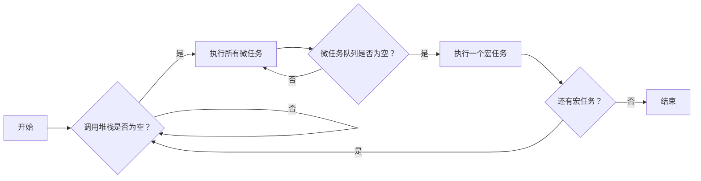

# JS 面试题

## js基本数据类型有哪些及它们的区别

JavaScript 有 **7 种基本（原始）数据类型**（ES2022 起）：

---

### 一、基本数据类型（Primitive Types）

| 类型        | 示例                            | 特点                                      |
| ----------- | ------------------------------- | ----------------------------------------- |
| `number`    | `42`, `3.14`, `NaN`, `Infinity` | 所有数字（含浮点），IEEE 754 双精度       |
| `string`    | `'hello'`, `"world"`            | 不可变，UTF-16 编码                       |
| `boolean`   | `true`, `false`                 | 逻辑值                                    |
| `undefined` | `let a;` → `a` 为 `undefined`   | 声明未赋值                                |
| `null`      | `let b = null;`                 | 表示“空值”，**是对象引用的有意缺失**      |
| `bigint`    | `123n`, `-456n`                 | 任意精度整数（ES2020+）                   |
| `symbol`    | `Symbol('id')`                  | 唯一且不可变，常用于对象属性键（ES2015+） |

> ✅ **共性**：按值存储、不可变、直接操作值。

---

### 二、关键区别

| 对比项   | `null` vs `undefined`                                                        | `number` vs `bigint`                                          | `symbol` 特性                          |
| -------- | ---------------------------------------------------------------------------- | ------------------------------------------------------------- | -------------------------------------- |
| **含义** | `null` 是赋值的空；`undefined` 是未初始化                                    | `number` 有精度限制（`Number.MAX_SAFE_INTEGER`）；`bigint` 无 | 每次 `Symbol()` 都唯一，即使描述相同   |
| **类型** | `typeof null` → `'object'`（历史 bug）<br>`typeof undefined` → `'undefined'` | `typeof 123` → `'number'`<br>`typeof 123n` → `'bigint'`       | `typeof Symbol()` → `'symbol'`         |
| **转换** | `null == undefined` → `true`<br>`null === undefined` → `false`               | 不能直接运算：`1n + 1` ❌，需显式转换                          | 不能自动转为字符串（避免意外属性访问） |

---

### 三、如何判断？

- **`typeof`**：可区分除 `null` 外的所有基本类型  
  ```js
  typeof null        // 'object' ❌
  typeof undefined   // 'undefined' ✅
  ```
- **`Object.prototype.toString.call()`**：精准判断
  ```js
  toString.call(null)        // '[object Null]'
  toString.call(undefined)   // '[object Undefined]'
  ```

---

### 四、注意

- **基本类型 ≠ 对象**：但可通过“装箱”临时转为对象（如 `'hello'.toUpperCase()`）；
- **`NaN` 属于 `number`**，且 `NaN !== NaN`，用 `Number.isNaN()` 判断。

> 💡 记住：JS 中只有这 7 种原始类型，其余（如数组、函数、日期）都是 `object`。

## 数据类型检测的方式有哪些

JavaScript 中检测数据类型主要有以下 **5 种方式**，各有适用场景和局限：

---

### 1. **`typeof`**（适合基本类型）
```js
typeof 42        // 'number'
typeof 'hello'   // 'string'
typeof true      // 'boolean'
typeof undefined // 'undefined'
typeof Symbol()  // 'symbol'
typeof 123n      // 'bigint'（ES2020+）
typeof {}        // 'object'
typeof []        // 'object' ❌
typeof null      // 'object' ❌（历史 bug）
typeof function(){} // 'function' ✅
```
✅ 优点：快速判断基本类型 + 函数  
❌ 缺点：无法区分 `null`、数组、普通对象

---

### 2. **`instanceof`**（判断引用类型构造函数）
```js
[] instanceof Array     // true
new Date() instanceof Date // true
/abc/ instanceof RegExp // true
```
✅ 优点：可识别自定义类、内置引用类型  
❌ 缺点：
- 跨 iframe/window 失效（不同全局环境）；
- 无法用于基本类型（如 `42 instanceof Number` → false）

---

### 3. **`Object.prototype.toString.call()`**（最准确通用）
```js
toString.call(42)        // '[object Number]'
toString.call('hi')      // '[object String]'
toString.call(null)      // '[object Null]' ✅
toString.call(undefined) // '[object Undefined]'
toString.call([])        // '[object Array]' ✅
toString.call(new Date())// '[object Date]'
```
✅ 优点：**唯一能准确区分所有内置类型**的方法  
❌ 缺点：写法略长，需调用 `call`

> 📌 推荐封装：
> ```js
> const toType = obj => Object.prototype.toString.call(obj).slice(8, -1).toLowerCase();
> ```

---

### 4. **`Array.isArray()`**（专用于数组）
```js
Array.isArray([])      // true
Array.isArray({})      // false
```
✅ 优点：可靠、简洁、跨 frame 安全  
❌ 缺点：仅限数组

---

### 5. **`constructor` 属性**（不推荐）
```js
[1,2].constructor === Array  // true
(42).constructor === Number  // true
```
❌ 缺点：
- 可被篡改（`obj.constructor = AnotherClass`）；
- 原型链断裂时失效；
- `null`/`undefined` 无 `constructor`

---

### 总结：如何选择？

| 场景                                                 | 推荐方法                           |
| ---------------------------------------------------- | ---------------------------------- |
| 判断基本类型（除 `null`）                            | `typeof`                           |
| 判断是否为数组                                       | `Array.isArray()`                  |
| 精确判断任意类型（包括 `null`、`Date`、`RegExp` 等） | `Object.prototype.toString.call()` |
| 判断自定义类实例（同窗口）                           | `instanceof`                       |

> 💡 **黄金组合**：  
> - 基本类型 → `typeof`  
> - 数组 → `Array.isArray()`  
> - 其他对象 → `toString.call()`

## 请简述 JS 中的 `this`

`this` 是 JavaScript 中的**运行时上下文对象**，其值由**函数调用方式**决定，而非定义位置。

---

### 一、绑定规则（优先级从高到低）

1. **new 绑定**  
   使用 `new` 调用构造函数时，`this` 指向新创建的实例。  
   ```js
   function Foo() { this.a = 1; }
   const obj = new Foo(); // this → obj
   ```

2. **显式绑定**（`call` / `apply` / `bind`）  
   强制指定 `this`：  
   ```js
   fn.call(obj); // this → obj
   ```

3. **隐式绑定**（对象方法调用）  
   函数作为对象属性被调用时，`this` 指向该对象：  
   ```js
   obj.method(); // this → obj
   ```
   ⚠️ 注意“隐式丢失”：`const fn = obj.method; fn();` → `this` 变为全局或 `undefined`（严格模式）

4. **默认绑定**  
   - 非严格模式：`this` → 全局对象（浏览器中是 `window`）  
   - 严格模式：`this` → `undefined`

---

### 二、特殊场景

- **箭头函数**：没有自己的 `this`，继承**外层作用域的 `this`**（定义时确定，不可改变）  
  ```js
  const obj = {
    fn: () => console.log(this) // this 不是 obj，而是外层（如 window）
  };
  ```

- **事件回调**：`this` 指向触发事件的 DOM 元素  
- **定时器回调**（`setTimeout`）：`this` 指向全局对象（非严格模式）

---

### 三、总结口诀

> **谁调用，this 就是谁；  
> 箭头函数看外层；  
> new 出来是实例；  
> 显式绑定最优先。**

> 💡 实践建议：避免依赖动态 `this`，可用箭头函数或 `.bind()` 固化上下文。

## `new` 操作符做了什么

`new` 操作符用于创建一个**用户定义对象类型**或**内置对象类型**的实例，其内部执行以下 **4 个步骤**：

---

### 1. **创建一个新空对象**
```js
const obj = {};
```

### 2. **链接原型（设置 `__proto__`）**
将新对象的 `[[Prototype]]`（即 `__proto__`）指向构造函数的 `prototype` 属性：
```js
obj.__proto__ = Constructor.prototype;
```

### 3. **绑定 `this` 并执行构造函数**
将构造函数内的 `this` 指向新对象，并执行函数体（可给新对象添加属性/方法）：
```js
Constructor.call(obj, ...args);
```

### 4. **返回新对象（除非构造函数显式返回引用类型）**
- 如果构造函数 **返回基本类型**（或无 `return`），则返回新创建的对象；
- 如果 **返回对象/函数等引用类型**，则返回该引用值（覆盖默认实例）。

---

### 示例
```js
function Person(name) {
  this.name = name;
  // return {}; // 若取消注释，则 new Person() 返回 {} 而非实例
}

const p = new Person('Alice');
// 等价于：
// 1. const p = {}
// 2. p.__proto__ = Person.prototype
// 3. Person.call(p, 'Alice')
// 4. return p
```

> 💡 **关键点**：`new` 的核心是 **建立原型链 + 绑定 this**，实现面向对象的实例化。

## AMD 和 CommonJS 的区别

AMD（Asynchronous Module Definition）和 CommonJS 是两种 **JavaScript 模块规范**，主要区别如下：

---

### 一、核心差异

| 特性             | **AMD**                                  | **CommonJS**                                            |
| ---------------- | ---------------------------------------- | ------------------------------------------------------- |
| **加载方式**     | **异步加载**（适合浏览器）               | **同步加载**（适合服务端）                              |
| **语法**         | `define(['dep'], function(dep) { ... })` | `const dep = require('dep');`<br>`module.exports = ...` |
| **执行时机**     | 依赖加载完后**回调执行**                 | **顺序执行**，遇 `require` 立即加载                     |
| **适用环境**     | 浏览器（如 RequireJS）                   | Node.js（原生支持）                                     |
| **动态 require** | 不支持（依赖需前置声明）                 | 支持（可在函数内 `require`）                            |

---

### 二、代码示例

#### AMD（RequireJS）
```js
// 定义模块
define(['./math'], function(math) {
  return {
    add: math.add
  };
});

// 使用模块
require(['myModule'], function(myModule) {
  myModule.add(1, 2);
});
```

#### CommonJS（Node.js）
```js
// math.js
exports.add = (a, b) => a + b;

// main.js
const math = require('./math');
console.log(math.add(1, 2));
```

---

### 三、为什么有这种区别？

- **浏览器环境**：JS 文件通过 `<script>` 加载，**网络 I/O 慢** → 需异步避免阻塞；
- **服务端环境**：文件在本地磁盘，**读取快** → 同步更简单直观。

---

### 四、现代替代方案

- **ES Modules（ESM）**：  
  - 标准化（`import` / `export`）  
  - 浏览器原生支持（`<script type="module">`）  
  - Node.js 也已支持（`.mjs` 或 `package.json` 中设 `"type": "module"`）

> 💡 **现状**：AMD 已基本淘汰；CommonJS 仍在 Node.js 广泛使用；**新项目优先用 ESM**。

## ES6 模块与 CommonJS 模块有什么异同？

ES6 模块（ESM）和 CommonJS（CJS）是两种主流的 JavaScript 模块系统，核心异同如下：

---

### 一、**相同点**
- 都用于**组织代码**、**管理依赖**、**避免全局污染**；
- 都支持**导出/导入**值（变量、函数、类等）。

---

### 二、**核心区别**

| 特性         | **ES6 模块（ESM）**                                          | **CommonJS（CJS）**                                |
| ------------ | ------------------------------------------------------------ | -------------------------------------------------- |
| **加载方式** | **编译时静态分析**（`import` 必须在顶层）                    | **运行时动态加载**（`require()` 可在任意位置）     |
| **导出本质** | **值的实时只读引用**（live binding）                         | **值的浅拷贝**（导出时即固定）                     |
| **语法**     | `import ... from ...`<br>`export default / {}`               | `const x = require('x')`<br>`module.exports = ...` |
| **异步支持** | 原生支持 Top-level `await`（ES2022）                         | 需在 async 函数内使用 `await`                      |
| **循环依赖** | 更安全（因 live binding）                                    | 容易出错（可能拿到未初始化的值）                   |
| **适用环境** | 浏览器原生支持<br>Node.js（需 `.mjs` 或 `"type": "module"`） | Node.js 原生支持<br>浏览器需打包工具               |

---

### 三、关键行为对比

#### 1. **导出是引用 vs 拷贝**
```js
// counter.js (ESM)
export let count = 0;
export const inc = () => count++;

// main.js (ESM)
import { count, inc } from './counter.js';
inc();
console.log(count); // 1 → 实时反映变化

// CJS 等效：main.js 中 count 始终为 0（拷贝）
```

#### 2. **静态 vs 动态**
```js
// ESM ❌ 报错：import 必须在顶层
if (condition) import foo from 'foo';

// CJS ✅ 合法
if (condition) const foo = require('foo');
```

#### 3. **默认导出**
```js
// ESM
export default function() {} // 可匿名
import myFunc from './mod';   // 名字可自定义

// CJS
module.exports = function() {}
const myFunc = require('./mod'); // 引用整个导出对象
```

---

### 四、互操作（Node.js 中）

- **ESM 导入 CJS**：✅ 支持（`import fs from 'fs'`）
- **CJS 导入 ESM**：❌ 不支持（`require()` 无法加载 ESM）

> ⚠️ 混用需谨慎，建议项目统一模块规范。

---

### 五、总结

| 场景                | 推荐                                         |
| ------------------- | -------------------------------------------- |
| 新项目（前端/全栈） | **ESM**（标准、静态分析、Tree-shaking 友好） |
| Node.js 老项目      | **CommonJS**                                 |
| 需动态加载          | CJS（或 ESM 的 `import()` 动态导入）         |

> 💡 **趋势**：ESM 是 JS 官方标准，未来主流；现代构建工具（Vite、Webpack）均优先支持 ESM。

## let、const、var的区别

`let`、`const` 和 `var` 是 JavaScript 中声明变量的三种方式，核心区别如下：

---

### 一、作用域（Scope）

| 声明方式        | 作用域                                                  |
| --------------- | ------------------------------------------------------- |
| `var`           | **函数作用域**（function-scoped）                       |
| `let` / `const` | **块级作用域**（block-scoped，如 `{}`、`if`、`for` 内） |

```js
if (true) {
  var a = 1;
  let b = 2;
}
console.log(a); // 1 ✅
console.log(b); // ReferenceError ❌
```

---

### 二、变量提升（Hoisting）

| 声明方式        | 提升行为                                                |
| --------------- | ------------------------------------------------------- |
| `var`           | 声明和初始化都被提升（初始值为 `undefined`）            |
| `let` / `const` | **仅声明提升**，但存在**暂时性死区（TDZ）**，访问会报错 |

```js
console.log(x); // undefined
var x = 10;

console.log(y); // ReferenceError（TDZ）
let y = 20;
```

---

### 三、重复声明

| 声明方式        | 能否重复声明               |
| --------------- | -------------------------- |
| `var`           | ✅ 允许（覆盖）             |
| `let` / `const` | ❌ 同一作用域内禁止重复声明 |

```js
var a = 1; var a = 2; // OK
let b = 1; let b = 2; // SyntaxError
```

---

### 四、赋值与可变性

| 声明方式      | 是否可重新赋值                            |
| ------------- | ----------------------------------------- |
| `var` / `let` | ✅ 可重新赋值                              |
| `const`       | ❌ **不能重新赋值**（但对象/数组内容可变） |

```js
const obj = { name: 'Alice' };
obj.name = 'Bob'; // ✅ 允许（修改属性）
obj = {};         // ❌ TypeError（不能重新赋值）
```

---

### 五、全局对象绑定

- `var` 在全局作用域中声明的变量会**挂载到全局对象**（浏览器中是 `window`）；
- `let` / `const` **不会**挂载。

```js
var a = 1;
let b = 2;
console.log(window.a); // 1
console.log(window.b); // undefined
```

---

### 总结建议

| 场景               | 推荐                            |
| ------------------ | ------------------------------- |
| 常量（不重新赋值） | `const`（优先）                 |
| 变量（需重新赋值） | `let`                           |
| 避免使用           | `var`（易引发作用域和提升问题） |

> 💡 **原则**：默认用 `const`，需要重赋值时改用 `let`，**永远不用 `var`**。

## TDZ 暂时性死区

---

### 一、定义
**TDZ 是指在代码块中，从作用域开始到变量实际声明（初始化）之间的区域**。  
在此区域内访问 `let` / `const` 声明的变量会抛出 **`ReferenceError`**。

---

### 二、为什么存在 TDZ？
- `let` / `const` 虽然存在**变量提升**（hoisting），但**不会像 `var` 那样初始化为 `undefined`**；
- 引擎在进入作用域时就“预留”了变量名，但在执行到声明语句前禁止访问，以防止意外使用未初始化的值。

---

### 三、示例

```js
console.log(a); // ReferenceError: Cannot access 'a' before initialization
let a = 10;

// TDZ 范围：从块开始 → 到 let/const 声明处
{
  console.log(b); // TDZ 中，报错
  const b = 20;
}
```

> ✅ 对比 `var`：
> ```js
> console.log(c); // undefined（无 TDZ）
> var c = 30;
> ```

---

### 四、TDZ 的边界

| 场景       | TDZ 起止位置                             |
| ---------- | ---------------------------------------- |
| 块级作用域 | `{` 开始 → `let/const` 声明处            |
| 函数参数   | 默认值表达式中，后续参数对前面参数有 TDZ |
| 全局作用域 | 脚本开始 → `let/const` 声明处            |

#### 参数 TDZ 示例：
```js
function fn(a = b, b) { } // ❌ 报错！a 的默认值中 b 处于 TDZ
function fn(b, a = b) { } // ✅ 合法
```

---

### 五、如何避免 TDZ 错误？
1. **始终先声明再使用**；
2. **避免在声明前通过函数间接访问**：
   ```js
   function foo() { console.log(x); }
   foo(); // ❌ 即使 x 在后面声明，调用时仍在 TDZ
   let x = 1;
   ```

---

### 六、一句话总结
> **TDZ 是 `let`/`const` 的安全机制：禁止在声明前访问变量，避免 `undefined` 意外污染逻辑。**

## 数组有哪些原生方法？

JavaScript 数组的原生方法可分为 **7 大类**，共 **30+ 个常用方法**。以下是核心方法分类与用途（ES5+）：

---

### 一、**增删改（会改变原数组）**
| 方法                                   | 作用           | 返回值       |
| -------------------------------------- | -------------- | ------------ |
| `push()`                               | 末尾添加元素   | 新长度       |
| `pop()`                                | 删除末尾元素   | 被删元素     |
| `unshift()`                            | 开头添加元素   | 新长度       |
| `shift()`                              | 删除开头元素   | 被删元素     |
| `splice(start, deleteCount, ...items)` | 删除/插入/替换 | 被删元素数组 |

---

### 二、**查找与判断**
| 方法                          | 作用                   | 返回值                   |
| ----------------------------- | ---------------------- | ------------------------ |
| `indexOf()` / `lastIndexOf()` | 查找元素索引           | 索引（-1 未找到）        |
| `includes()`                  | 判断是否包含           | `true`/`false`           |
| `find()`                      | 找第一个满足条件的元素 | 元素（undefined 未找到） |
| `findIndex()`                 | 找第一个满足条件的索引 | 索引（-1 未找到）        |
| `some()`                      | 是否有元素满足条件     | `true`/`false`           |
| `every()`                     | 是否所有元素满足条件   | `true`/`false`           |

---

### 三、**遍历**
| 方法                         | 作用       | 回调参数 `(item, index, arr)` |
| ---------------------------- | ---------- | ----------------------------- |
| `forEach()`                  | 遍历执行   | 无返回值                      |
| `map()`                      | 映射新数组 | **新数组**                    |
| `filter()`                   | 过滤元素   | **新数组**                    |
| `reduce()` / `reduceRight()` | 累计计算   | 累计结果                      |

---

### 四、**排序与反转**
| 方法              | 作用                 | 是否改变原数组 |
| ----------------- | -------------------- | -------------- |
| `sort(compareFn)` | 排序（默认转字符串） | ✅              |
| `reverse()`       | 反转数组             | ✅              |

> ⚠️ `sort()` 默认按 Unicode 排，数字需传比较函数：  
> ```js
> arr.sort((a, b) => a - b); // 升序
> ```

---

### 五、**连接与截取（不改变原数组）**
| 方法                | 作用         | 返回值 |
| ------------------- | ------------ | ------ |
| `concat()`          | 合并数组     | 新数组 |
| `slice(start, end)` | 截取片段     | 新数组 |
| `join(separator)`   | 拼接为字符串 | 字符串 |

---

### 六、**转换**
| 方法           | 作用                                               |
| -------------- | -------------------------------------------------- |
| `Array.from()` | 类数组 → 真数组                                    |
| `Array.of()`   | 创建含指定元素的数组（避免 `new Array(3)` 的陷阱） |
| `flat(depth)`  | 扁平化嵌套数组（ES2019）                           |
| `flatMap()`    | `map` + `flat(1)`（ES2019）                        |

---

### 七、**其他**
| 方法                              | 作用                                      |
| --------------------------------- | ----------------------------------------- |
| `toString()` / `toLocaleString()` | 转字符串                                  |
| `at(index)`                       | 支持负索引取值（ES2022，如 `arr.at(-1)`） |
| `copyWithin(target, start, end)`  | 浅复制部分到自身（改变原数组）            |
| `fill(value, start, end)`         | 填充固定值（改变原数组）                  |

---

### ✅ 使用建议：
- **不可变操作**（如 `map`, `filter`, `slice`）优先用于函数式编程；
- **可变操作**（如 `push`, `splice`, `sort`）注意副作用；
- **性能敏感场景**：避免在循环中用 `forEach`（可用 `for` 循环替代）。

> 💡 记住：**除了 `map`/`filter`/`slice`/`concat` 等少数方法，大多数数组方法会修改原数组！**

## `for in` 和 `for of` 的区别

`for...in` 和 `for...of` 是 JavaScript 中两种不同的遍历语法，核心区别如下：

---

### 一、遍历目标不同

| 语法       | 遍历内容                      | 适用对象                                                          |
| ---------- | ----------------------------- | ----------------------------------------------------------------- |
| `for...in` | **对象的可枚举属性名（key）** | 普通对象、数组（不推荐）                                          |
| `for...of` | **可迭代对象的值（value）**   | 数组、字符串、Map、Set、NodeList 等（需实现 `[Symbol.iterator]`） |

---

### 二、关键差异对比

| 特性             | `for...in`                     | `for...of`                           |
| ---------------- | ------------------------------ | ------------------------------------ |
| **遍历数组**     | 返回**索引（字符串）**         | 返回**元素值**                       |
| **遍历顺序**     | 任意顺序（规范不保证）         | 按迭代器定义顺序（如数组按索引升序） |
| **原型链**       | 会遍历**原型链上的可枚举属性** | **不遍历原型链**                     |
| **Symbol 属性**  | 跳过                           | 可遍历（如果迭代器包含）             |
| **不可迭代对象** | 可用（如普通对象）             | 报错（`TypeError: not iterable`）    |

---

### 三、代码示例

#### 1. 遍历数组
```js
const arr = ['a', 'b'];

// for...in（不推荐用于数组）
for (let key in arr) {
  console.log(key, typeof key); // '0' 'string', '1' 'string'
}

// for...of（推荐）
for (let value of arr) {
  console.log(value); // 'a', 'b'
}
```

#### 2. 遍历对象
```js
const obj = { a: 1, b: 2 };

// for...in（唯一选择）
for (let key in obj) {
  if (obj.hasOwnProperty(key)) // 建议过滤原型属性
    console.log(key, obj[key]); // 'a' 1, 'b' 2
}

// for...of ❌ 报错：obj is not iterable
```

#### 3. 遍历字符串
```js
for (let char of 'hi') {
  console.log(char); // 'h', 'i'
}
// for...in 会输出 '0', '1'（索引）
```

---

### 四、使用建议

- ✅ **遍历数组/可迭代对象** → 用 `for...of`  
- ✅ **遍历普通对象键名** → 用 `for...in` + `hasOwnProperty` 过滤  
- ❌ **不要用 `for...in` 遍历数组**（可能遍历到非数字属性，顺序不确定）

> 💡 **口诀**：  
> - `in` → **key**（适合对象）  
> - `of` → **value**（适合数组/迭代器）

## 对原型、原型链的理解

### 一、核心概念

#### 1. **原型（Prototype）**
- 每个函数（除箭头函数）都有一个 `prototype` 属性，它是一个**对象**；
- 每个对象（除 `Object.create(null)`）都有一个内部属性 `[[Prototype]]`（可通过 `__proto__` 或 `Object.getPrototypeOf()` 访问），指向其**构造函数的 `prototype`**。

```js
function Person() {}
const p = new Person();

p.__proto__ === Person.prototype; // true
```

> ✅ **作用**：让实例共享方法/属性，节省内存。

---

#### 2. **原型链（Prototype Chain）**
- 当访问对象属性时，若自身没有，则沿 `[[Prototype]]` 向上查找，直到 `null`（`Object.prototype.__proto__ === null`）；
- 这条查找链就是**原型链**。

```js
p.toString(); // p 自身无 toString → 查找 Person.prototype → 查找 Object.prototype → 找到
```

---

### 二、关键规则

| 关系                                                | 说明                                                |
| --------------------------------------------------- | --------------------------------------------------- |
| `obj.__proto__ === Constructor.prototype`           | 实例的 `__proto__` 指向构造函数的 `prototype`       |
| `Constructor.prototype.constructor === Constructor` | 原型对象的 `constructor` 指回构造函数               |
| `Object.prototype` 是原型链顶端                     | 所有对象最终继承自它                                |
| `Function.__proto__ === Function.prototype`         | 函数既是函数也是对象，其原型是 `Function.prototype` |

---

### 三、图解简化原型链

```
p (实例)
  ↓ __proto__
Person.prototype
  ↓ __proto__
Object.prototype
  ↓ __proto__
null
```

---

### 四、常见误区

- ❌ “原型链是构造函数之间的链” → 实际是**对象之间的链**（`__proto__` 链）；
- ❌ “`prototype` 是对象的属性” → 只有**函数**才有 `prototype`；
- ✅ 对象通过 `__proto__` 找原型，函数通过 `prototype` 提供原型。

---

### 五、ES6 class 本质

```js
class A {}
// 等价于
function A() {}
A.prototype.constructor = A;
```
- `class` 只是语法糖，底层仍是**原型链**机制。

---

### 六、用途

- **继承**：通过设置 `Child.prototype = Object.create(Parent.prototype)` 实现；
- **方法共享**：将方法定义在 `prototype` 上，避免重复创建；
- **类型判断**：`instanceof` 基于原型链（`a instanceof B` ⇨ 检查 `B.prototype` 是否在 `a` 的原型链上）。

> 💡 **一句话总结**：  
> **原型是共享的模板，原型链是查找属性的路径。**

## 对闭包的理解

### 闭包（Closure）—— 函数与其词法环境的组合

---

### 一、核心定义
**闭包 = 内部函数 + 外部函数作用域中被引用的变量**  
当一个内部函数**访问其外部函数的变量**，并且该内部函数在外部被**保留引用**时，就形成了闭包。

```js
function outer() {
  let count = 0;
  return function inner() { // inner 形成闭包
    return ++count;
  };
}
const counter = outer();
counter(); // 1
counter(); // 2 → count 被持久保存
```

---

### 二、闭包的三个关键特性

1. **访问外部作用域变量**  
   即使外部函数已执行完毕，内部函数仍能读写其变量。

2. **变量持久化**  
   外部变量不会被垃圾回收（因被闭包引用），实现“私有状态”。

3. **数据封装与私有性**  
   外部无法直接访问 `count`，只能通过返回的函数操作。

---

### 三、常见应用场景

| 场景                | 示例                           |
| ------------------- | ------------------------------ |
| **模块模式**        | 封装私有变量/方法              |
| **回调函数**        | 事件处理器、定时器中保持上下文 |
| **柯里化 / 偏函数** | 预置部分参数                   |
| **防抖/节流**       | 保存上次执行时间或定时器 ID    |

```js
// 防抖示例
function debounce(fn, delay) {
  let timer; // 闭包保存 timer
  return function(...args) {
    clearTimeout(timer);
    timer = setTimeout(() => fn.apply(this, args), delay);
  };
}
```

---

### 四、潜在问题

- **内存泄漏**：闭包持有变量，阻止 GC（尤其在 DOM 事件回调中未解绑）；
- **意外共享**：循环中创建闭包易出错（可用 `let` 或 IIFE 解决）。

```js
// 错误：所有回调共享 i（最终为 3）
for (var i = 0; i < 3; i++) {
  setTimeout(() => console.log(i), 0); // 输出 3, 3, 3
}

// 正确：用 let 创建块级作用域
for (let i = 0; i < 3; i++) {
  setTimeout(() => console.log(i), 0); // 输出 0, 1, 2
}
```

---

### 五、一句话总结
> **闭包让函数“记住”并访问其创建时的作用域，即使在其外部执行。**

✅ 合理使用可实现封装和状态管理；  
⚠️ 滥用会导致内存问题或逻辑错误。

## 对作用域、作用域链的理解

### 作用域（Scope）与作用域链（Scope Chain）—— JavaScript 变量查找机制

---

### 一、**作用域（Scope）**
定义：**变量和函数的可访问范围**，即“在哪些地方能访问到某个标识符”。

#### 1. **全局作用域**
- 最外层，`window`（浏览器）或 `global`（Node.js）上；
- 所有代码默认在此作用域中。

#### 2. **函数作用域（Function Scope）**
- 由 `function` 声明创建；
- 内部变量外部不可见（`var` 的作用域边界）。

#### 3. **块级作用域（Block Scope）**（ES6+）
- 由 `{}` 创建（如 `if`、`for`、`{}` 独立块）；
- `let` / `const` / `class` 遵循块级作用域。

```js
if (true) {
  var a = 1;   // 函数/全局作用域
  let b = 2;   // 块级作用域
}
console.log(a); // 1
console.log(b); // ReferenceError
```

---

### 二、**作用域链（Scope Chain）**
定义：**当访问一个变量时，引擎沿嵌套作用域逐层向上查找的路径**。

#### 查找规则：
1. 先在**当前作用域**查找；
2. 若未找到，进入**外层作用域**（创建时的词法环境）；
3. 重复直到**全局作用域**；
4. 若仍未找到，抛出 `ReferenceError`。

> ✅ 作用域链在**函数定义时确定**（词法作用域），与调用位置无关。

#### 示例：
```js
const globalVar = 'global';

function outer() {
  const outerVar = 'outer';
  
  function inner() {
    const innerVar = 'inner';
    console.log(globalVar, outerVar, innerVar); // 依次沿作用域链查找
  }
  
  return inner;
}

const fn = outer();
fn(); // 正常输出 → inner 的作用域链：inner → outer → global
```

---

### 三、关键点总结

| 概念                     | 说明                                             |
| ------------------------ | ------------------------------------------------ |
| **词法作用域**           | 作用域由**代码书写位置**决定（非运行时动态绑定） |
| **闭包依赖作用域链**     | 闭包能访问外部变量，本质是保存了作用域链         |
| **`var` 无块级作用域**   | 在函数内提升至顶部，可能引发意外覆盖             |
| **`let`/`const` 有 TDZ** | 在声明前访问会报错（暂时性死区）                 |

---

### 四、常见误区

- ❌ “作用域链是原型链” → 完全不同：  
  - 作用域链：**变量查找**（词法环境）；  
  - 原型链：**属性查找**（对象继承）。
- ❌ “`this` 影响作用域链” → `this` 是运行时上下文，与作用域链无关。

---

### 一句话总结：
> **作用域是变量的“辖区”，作用域链是变量查找的“路线图”——从内向外，逐级上报。**

## 对执行上下文的理解

### 执行上下文（Execution Context）—— JavaScript 代码运行时的环境容器

---

### 一、核心概念
**执行上下文是 JS 引擎为代码执行创建的抽象环境**，用于管理变量、函数、作用域、`this` 等信息。  
每次执行可执行代码（全局代码、函数调用）时，都会创建一个执行上下文。

---

### 二、执行上下文的类型

| 类型                | 触发时机        | 特点                                               |
| ------------------- | --------------- | -------------------------------------------------- |
| **全局执行上下文**  | JS 文件加载时   | 最外层，`this` 指向全局对象（浏览器中是 `window`） |
| **函数执行上下文**  | 函数被调用时    | 每次调用创建一个新上下文，`this` 由调用方式决定    |
| **Eval 执行上下文** | `eval()` 执行时 | 少用，不推荐                                       |

> ⚠️ **注意**：箭头函数**没有自己的执行上下文**，`this` 继承自外层。

---

### 三、执行上下文的组成（ES3 与 ES6+ 差异）

#### ES3 模型（简化理解）：
1. **变量对象（VO）**  
   - 存储变量、函数声明、参数；
   - 全局上下文中 VO = 全局对象；函数上下文中 VO = **活动对象（AO）**。
2. **作用域链（Scope Chain）**  
   - 当前上下文 + 外层所有上下文的 VO 链表。
3. **this 值**  
   - 由调用方式决定（见 `this` 规则）。

#### ES6+ 模型（更精确）：
- **词法环境（Lexical Environment）** → 替代 VO，管理标识符绑定；
- **变量环境（Variable Environment）** → 存储 `var` 声明（处理提升）；
- **ThisBinding** → `this` 的值。

---

### 四、执行上下文生命周期

#### 1. **创建阶段（Creation Phase）**
- **确定 `this` 值**；
- **创建词法环境**：
  - 扫描函数声明、`var` 变量（提升）；
  - 初始化形参、`arguments`；
- **建立作用域链**。

#### 2. **执行阶段（Execution Phase）**
- 逐行执行代码；
- 赋值、计算表达式；
- 访问/修改变量。

> ✅ **示例**：
> ```js
> function foo(a) {
>   var b = 2;
>   function c() {}
> }
> foo(1);
> ```
> **创建阶段**：  
> - `this` 绑定；  
> - 词法环境包含 `a=1`, `b=undefined`, `c=function`；  
> **执行阶段**：  
> - `b = 2` 赋值。

---

### 五、执行上下文栈（Call Stack）

- JS 是单线程，通过**栈结构**管理执行上下文；
- **全局上下文**最先入栈；
- **函数调用**时，新上下文压栈；
- **函数返回**时，上下文出栈。

```js
// 调用栈示例
function a() { b(); }
function b() { c(); }
function c() { console.log('done'); }
a();
// 栈变化：global → a → b → c → b → a → global
```

> ⚠️ **栈溢出**：递归过深导致栈空间耗尽（`RangeError: Maximum call stack size exceeded`）。

---

### 六、与相关概念的关系

| 概念         | 关系                               |
| ------------ | ---------------------------------- |
| **作用域**   | 由执行上下文的词法环境定义         |
| **闭包**     | 内部函数保留对外部执行上下文的引用 |
| **变量提升** | 发生在执行上下文的创建阶段         |

---

### 一句话总结：
> **执行上下文是 JS 运行时的“工作台”，它在代码执行前搭建好变量、作用域和 this 的环境，并通过调用栈管理执行流程。**

## call、apply、bind 函数

`call`、`apply` 和 `bind` 是 JavaScript 中用于**显式绑定函数 `this` 指向**的三个方法，均定义在 `Function.prototype` 上。

---

### 一、共同点
- 都可以**改变函数内部 `this` 的指向**；
- 第一个参数均为 **`thisArg`**（要绑定的上下文对象）；
- 都可传递参数给目标函数。

---

### 二、核心区别

| 方法    | 调用方式                               | 参数形式                       | 返回值               | 是否立即执行             |
| ------- | -------------------------------------- | ------------------------------ | -------------------- | ------------------------ |
| `call`  | `fn.call(thisArg, arg1, arg2, ...)`    | **逐个传参**                   | 函数执行结果         | ✅ 立即执行               |
| `apply` | `fn.apply(thisArg, [arg1, arg2, ...])` | **参数数组**                   | 函数执行结果         | ✅ 立即执行               |
| `bind`  | `fn.bind(thisArg, arg1, arg2, ...)`    | 可逐个传参（支持预置部分参数） | **新函数**（绑定后） | ❌ 不执行，返回可调用函数 |

---

### 三、使用示例

#### 1. `call` / `apply`：立即调用
```js
const obj = { name: 'Alice' };
function greet(greeting) {
  console.log(`${greeting}, ${this.name}!`);
}

greet.call(obj, 'Hello');    // Hello, Alice!
greet.apply(obj, ['Hi']);    // Hi, Alice!
```

> 💡 **记忆技巧**：  
> - `call` → **C**omma separated（逗号分隔参数）  
> - `apply` → **A**rray of arguments（参数数组）

#### 2. `bind`：创建绑定函数（常用于回调）
```js
const boundGreet = greet.bind(obj, 'Hey');
boundGreet(); // Hey, Alice!

// 典型场景：事件处理器
class Button {
  constructor() {
    this.text = 'Click me';
    // 绑定 this，避免丢失上下文
    document.addEventListener('click', this.handleClick.bind(this));
  }
  handleClick() {
    console.log(this.text); // 正确输出
  }
}
```

---

### 四、高级用法

#### 1. **借用数组方法**
```js
// 将类数组转真数组
const arr = Array.prototype.slice.call(arguments);

// 求数组最大值
const max = Math.max.apply(null, [1, 2, 3]); // 3
```

#### 2. **柯里化（Currying）**
```js
function multiply(a, b) {
  return a * b;
}
const double = multiply.bind(null, 2);
double(5); // 10
```

#### 3. **模拟 `new`**
```js
function myNew(Constructor, ...args) {
  const obj = Object.create(Constructor.prototype);
  const result = Constructor.apply(obj, args);
  return result instanceof Object ? result : obj;
}
```

---

### 五、注意事项
- 若 `thisArg` 传 `null`/`undefined`：
  - 非严格模式 → `this` 指向全局对象（`window`）；
  - 严格模式 → `this` 保持 `null`/`undefined`。
- `bind` 返回的函数**不能再次通过 `call`/`apply` 改变 `this`**（但可传参）：
  ```js
  const bound = fn.bind(obj);
  bound.call(otherObj); // this 仍是 obj！
  ```

---

### 一句话总结：
> **`call`/`apply` 立即执行并指定 `this`；`bind` 返回永久绑定 `this` 的新函数。**

## 异步编程的实现方式？

JavaScript 异步编程的演进经历了多个阶段，主要实现方式如下：

---

### 一、**回调函数（Callback）** —— 最原始方式
```js
fs.readFile('file.txt', (err, data) => {
  if (err) throw err;
  console.log(data);
});
```
✅ 简单直接  
❌ **回调地狱（Callback Hell）**：嵌套多层难以维护

---

### 二、**Promise** —— 链式调用解决嵌套
```js
fetch('/api/data')
  .then(response => response.json())
  .then(data => console.log(data))
  .catch(error => console.error(error));
```
✅ 避免回调地狱，支持链式调用  
❌ 仍需 `.then()`，错误处理需每个链单独处理

> 🔧 **工具方法**：`Promise.all()`、`Promise.race()`、`Promise.allSettled()`

---

### 三、**Generator + co（过渡方案）** —— 暂停/恢复执行
```js
function* main() {
  const data = yield fetch('/api/data');
  console.log(data);
}
// 需配合执行器（如 co 库）
co(main);
```
✅ 同步写法风格  
❌ 需额外执行器，未成为主流

---

### 四、**async/await（推荐）** —— 语法糖，基于 Promise
```js
async function fetchData() {
  try {
    const response = await fetch('/api/data');
    const data = await response.json();
    console.log(data);
  } catch (error) {
    console.error(error);
  }
}
```
✅ **最接近同步代码**，逻辑清晰，错误处理统一  
⚠️ 本质仍是 Promise，需理解其底层机制

> 💡 **并行请求优化**：
> ```js
> // 错误：串行
> const a = await fetch('/a');
> const b = await fetch('/b');
> 
> // 正确：并行
> const [a, b] = await Promise.all([fetch('/a'), fetch('/b')]);
> ```

---

### 五、**事件监听（EventEmitter）** —— 发布-订阅模式
```js
const emitter = new EventEmitter();
emitter.on('data', (data) => console.log(data));
emitter.emit('data', 'hello');
```
✅ 适合多消费者场景（如 Node.js 流）  
❌ 不适合一次性异步操作

---

### 六、**Web Workers / MessageChannel** —— 多线程通信
```js
// 主线程
const worker = new Worker('worker.js');
worker.postMessage('start');
worker.onmessage = (e) => console.log(e.data);
```
✅ 避免阻塞主线程（CPU 密集型任务）  
❌ 通信成本高，不能共享内存

---

### 总结：如何选择？

| 场景                         | 推荐方案                                  |
| ---------------------------- | ----------------------------------------- |
| 现代项目开发                 | **async/await**（首选）                   |
| 需要取消/竞态控制            | `AbortController` + `fetch`               |
| 并发控制（如限制同时请求数） | Promise + 队列管理                        |
| 浏览器兼容性要求高（IE）     | Promise（polyfill） + 回调降级            |
| 流式数据处理                 | **EventEmitter** / **Observable（RxJS）** |

> 💡 **黄金法则**：  
> - 优先用 `async/await`；  
> - 复杂流处理考虑 **RxJS**；  
> - 避免回调地狱，拥抱 Promise 化。

## 对async/await 的理解

`async/await` 是 JavaScript 中处理异步操作的**语法糖**，它建立在 **Promise** 之上，让异步代码以**同步风格**书写，极大提升了可读性和可维护性。

---

### 一、核心特性

#### 1. **`async` 函数**
- 在函数前加 `async`，该函数**自动返回一个 Promise**；
- 若函数返回普通值，会被 `Promise.resolve()` 包装；
- 若抛出异常，会返回 `Promise.reject()`。

```js
async function foo() {
  return 'hello';
}
foo().then(v => console.log(v)); // 'hello'

async function bar() {
  throw new Error('fail');
}
bar().catch(e => console.log(e.message)); // 'fail'
```

#### 2. **`await` 表达式**
- 只能在 `async` 函数内部使用；
- **暂停函数执行**，等待 Promise resolve，然后返回结果；
- 若 Promise reject，会抛出异常（可用 `try...catch` 捕获）。

```js
async function fetchData() {
  const response = await fetch('/api/data'); // 暂停直到 fetch 完成
  const data = await response.json();        // 再暂停解析 JSON
  return data;
}
```

---

### 二、执行机制（关键！）

- `await` **不会阻塞主线程**，只是暂停当前 `async` 函数的执行；
- JS 引擎会继续执行其他同步代码或微任务；
- `await` 后的代码被放入 **微任务队列（Microtask Queue）**，在当前宏任务结束后立即执行。

```js
console.log('A');
setTimeout(() => console.log('B'), 0);
async function test() {
  console.log('C');
  await Promise.resolve();
  console.log('D');
}
test();
console.log('E');

// 输出：A → C → E → D → B
// 说明：await 后的 'D' 属于微任务，比 setTimeout（宏任务）先执行
```

---

### 三、优势 vs Promise 链

| 场景     | Promise 链         | async/await               |
| -------- | ------------------ | ------------------------- |
| 基本异步 | `.then().then()`   | `await ...; await ...`    |
| 错误处理 | 多个 `.catch()`    | 统一 `try...catch`        |
| 条件分支 | 难以嵌套           | 直接用 `if/else`          |
| 循环异步 | 需 `reduce` 或递归 | 直接 `for...of` + `await` |

```js
// Promise 链（复杂条件）
fetch(url)
  .then(res => res.json())
  .then(data => {
    if (data.needMore) {
      return fetch(data.nextUrl);
    }
  });

// async/await（清晰直观）
const res = await fetch(url);
const data = await res.json();
if (data.needMore) {
  const nextRes = await fetch(data.nextUrl);
}
```

---

### 四、常见陷阱与最佳实践

#### ⚠️ 1. **不要滥用 `await` 导致串行化**
```js
// ❌ 低效：串行请求
const a = await fetch('/a');
const b = await fetch('/b');

// ✅ 高效：并行请求
const [a, b] = await Promise.all([fetch('/a'), fetch('/b')]);
```

#### ⚠️ 2. **顶层 await（Top-level await）**
- 在 ES 模块中，可在模块顶层使用 `await`（Node.js 14.8+ / 现代浏览器）；
- 但会**阻塞模块加载**，慎用！

#### ⚠️ 3. **错误必须处理**
- 未捕获的 `await` rejection 会导致 `unhandledRejection`；
- 始终用 `try...catch` 或在调用处 `.catch()`。

---

### 五、本质理解

> **`async/await` = Generator + Promise + 自动执行器**  
> 它将异步流程“打平”，但底层仍是基于 Promise 的微任务机制。

---

### 一句话总结：
> **`async/await` 让异步代码像同步一样写，但执行仍是非阻塞的——它是 Promise 的优雅封装，而非新异步模型。**

## async/await 如何优雅的处理异常

在 `async/await` 中优雅处理异常，核心是 **避免未捕获的 Promise rejection**，同时保持代码清晰。以下是几种推荐方式：

---

### 一、基础：`try...catch`（最常用）

```js
async function fetchData() {
  try {
    const response = await fetch('/api/data');
    if (!response.ok) throw new Error('请求失败');
    const data = await response.json();
    return data;
  } catch (error) {
    console.error('错误:', error.message);
    // 可返回默认值或重新抛出
    throw error; // 或 return null;
  }
}
```

✅ **优点**：结构清晰，同步风格  
⚠️ **注意**：只能捕获 `await` 后的异步错误，不能捕获同步抛错（但同步错误也会进入 `catch`）

---

### 二、封装 `to` 工具函数（Go 风格）

模仿 Go 语言的多返回值错误处理，避免 `try...catch` 嵌套：

```js
// utils.js
export function to(promise) {
  return promise
    .then(data => [null, data])
    .catch(err => [err, null]);
}

// 使用
async function main() {
  const [err, data] = await to(fetchData());
  if (err) {
    console.error('失败:', err);
    return;
  }
  console.log('成功:', data);
}
```

✅ **优点**：  
- 避免 `try...catch` 嵌套（尤其多异步操作时）；  
- 错误处理与业务逻辑平级。

---

### 三、全局未捕获异常监听（兜底）

防止未处理的 rejection 导致程序崩溃（Node.js / 浏览器）：

```js
// Node.js
process.on('unhandledRejection', (reason, promise) => {
  console.error('未捕获的异步错误:', reason);
});

// 浏览器
window.addEventListener('unhandledrejection', event => {
  console.error('未捕获的 Promise rejection:', event.reason);
  event.preventDefault(); // 阻止默认报错
});
```

> ⚠️ **仅作兜底**，不应替代局部错误处理！

---

### 四、高阶技巧：自定义错误边界（React 类似）

对关键模块封装统一错误处理逻辑：

```js
async function withErrorHandling(asyncFn, fallback = null) {
  try {
    return await asyncFn();
  } catch (error) {
    logToSentry(error); // 上报监控
    showUserMessage('操作失败，请重试');
    return fallback;
  }
}

// 使用
const data = await withErrorHandling(() => api.getUser(id), {});
```

---

### 五、避免的反模式

#### ❌ 1. 忽略错误
```js
await fetchData(); // 无 try/catch → 可能 unhandledRejection
```

#### ❌ 2. 混淆同步/异步错误
```js
async function bad() {
  JSON.parse(null); // 同步错误！需在 try 内
  await fetch(...);
}
```
✅ 正确：整个函数体包在 `try...catch` 中。

#### ❌ 3. 过度嵌套 try/catch
```js
// 不优雅
try {
  try {
    await step1();
  } catch {}
  try {
    await step2();
  } catch {}
} catch {}
```
✅ 改用 `to()` 工具函数或拆分为独立函数。

---

### 总结：最佳实践

| 场景             | 推荐方案                  |
| ---------------- | ------------------------- |
| 单次异步操作     | `try...catch`             |
| 多个独立异步操作 | `to()` 工具函数           |
| 全局监控         | `unhandledRejection` 监听 |
| 业务模块复用     | 封装 `withErrorHandling`  |

> 💡 **原则**：  
> - **每个 `await` 要么被 `try...catch` 包裹，要么由调用者处理**；  
> - **不要吞掉错误**（至少记录日志）；  
> - **用户可见操作必须有错误反馈**。

## setTimeout、Promise、Async/Await 的区别

`setTimeout`、`Promise` 和 `Async/Await` 都涉及 JavaScript 的**异步机制**，但它们在 **任务类型、执行时机、用途和底层原理** 上有本质区别。以下是详细对比：

---

### 一、核心区别概览

| 特性         | `setTimeout`              | `Promise`                    | `Async/Await`                           |
| ------------ | ------------------------- | ---------------------------- | --------------------------------------- |
| **任务类型** | 宏任务（Macro Task）      | 微任务（Micro Task）         | 基于 Promise 的语法糖（微任务）         |
| **用途**     | 延迟执行、定时器          | 处理异步操作、链式调用       | 以同步风格写异步代码                    |
| **执行顺序** | 事件循环的**下一次 tick** | 当前宏任务结束后**立即执行** | 同 `Promise`（微任务）                  |
| **是否阻塞** | 不阻塞，回调异步执行      | 不阻塞                       | 不阻塞（但 `await` 暂停函数内后续代码） |

---

### 二、执行顺序示例（关键！）

```js
console.log('1');

setTimeout(() => console.log('2'), 0);

Promise.resolve().then(() => console.log('3'));

async function foo() {
  await Promise.resolve();
  console.log('4');
}
foo();

console.log('5');
```

**输出顺序**：  
`1 → 5 → 3 → 4 → 2`

#### 原因：
1. 同步代码先执行：`1`, `5`；
2. 微任务队列（`Promise.then` 和 `await`）在当前宏任务结束**立即执行**：`3`, `4`；
3. 宏任务队列（`setTimeout`）等到**下一轮事件循环**才执行：`2`。

> ✅ **口诀**：  
> **同步 → 微任务 → 宏任务**

---

### 三、详细解析

#### 1. **`setTimeout`**
- 属于 **宏任务（Macro Task）**，由宿主环境（浏览器/Node）管理；
- 即使设为 `0ms`，也至少延迟到**下一个事件循环周期**；
- 用于**延迟执行**或**让出主线程**。

#### 2. **`Promise`**
- `.then()` / `.catch()` 回调属于 **微任务（Micro Task）**；
- 在**当前宏任务执行完后、下一个宏任务开始前**清空微任务队列；
- 适合**高优先级异步操作**（如数据处理）。

#### 3. **`Async/Await`**
- 是 `Promise` 的语法糖，`await` 后的代码会被包装成 `.then()` 回调；
- 因此 `await` 后的逻辑也属于 **微任务**；
- 优势：**避免回调地狱**，代码更易读。

---

### 四、常见误区

#### ❌ 误区1：`setTimeout(fn, 0)` 会“立即”执行  
→ 实际要等当前宏任务 + 所有微任务完成。

#### ❌ 误区2：`await` 是同步阻塞  
→ 它只暂停**当前 async 函数内部**的执行，不阻塞主线程。

#### ❌ 误区3：`Promise` 比 `setTimeout` “更快”  
→ 本质是任务队列优先级不同：**微任务 > 宏任务**。

---

### 五、如何选择？

| 场景                                       | 推荐                           |
| ------------------------------------------ | ------------------------------ |
| 延迟执行、定时任务                         | `setTimeout` / `setInterval`   |
| 网络请求、文件读取等异步操作               | `Promise` 或 `async/await`     |
| 需要精确控制执行顺序（如先处理数据再渲染） | 用 `Promise`（微任务优先级高） |
| 写清晰的异步逻辑                           | **优先 `async/await`**         |

---

### 六、一句话总结
> **`setTimeout` 是宏任务，用于延迟；`Promise` 和 `async/await` 是微任务，用于高效处理异步流程；微任务总是在宏任务之前执行。**

## Promise.all和Promise.race的区别的使用场景

`Promise.all` 和 `Promise.race` 都是用于**并行处理多个 Promise** 的工具方法，但行为和适用场景截然不同。

---

### 一、核心区别

| 方法                         | 行为                              | 成功条件        | 失败条件                          |
| ---------------------------- | --------------------------------- | --------------- | --------------------------------- |
| **`Promise.all(iterable)`**  | 等待**所有** Promise 完成         | 全部 resolved   | **任意一个 rejected**（立即失败） |
| **`Promise.race(iterable)`** | 返回**第一个完成**的 Promise 结果 | 第一个 resolved | 第一个 rejected                   |

> ✅ 两者都接收可迭代对象（如数组），返回一个新的 Promise。

---

### 二、使用场景对比

#### ✅ **`Promise.all`：需要所有任务都成功**
**典型场景**：
- **批量请求**：同时获取用户信息、订单列表、配置数据，全部加载完再渲染页面；
- **依赖多资源初始化**：等待多个服务启动完成；
- **事务性操作**：多个异步操作必须全部成功。

```js
// 示例：并行加载多个 API
const [user, orders, config] = await Promise.all([
  fetchUser(),
  fetchOrders(),
  fetchConfig()
]);
renderPage(user, orders, config); // 所有数据就绪后渲染
```

> ⚠️ **注意**：任一请求失败 → 整体失败。若需“部分失败仍继续”，用 `Promise.allSettled()`。

---

#### ✅ **`Promise.race`：只需最快的结果**
**典型场景**：
- **超时控制**：主请求 + 超时 Promise，谁先完成就用谁；
- **竞速请求**：向多个 CDN 请求同一资源，取最快响应；
- **取消机制**：通过 `race` 实现可取消的异步操作。

```js
// 示例：带超时的请求
function timeout(ms) {
  return new Promise((_, reject) => 
    setTimeout(() => reject(new Error('Timeout')), ms)
  );
}

try {
  const data = await Promise.race([
    fetch('/api/data'),
    timeout(5000) // 5秒超时
  ]);
  console.log(data);
} catch (error) {
  if (error.message === 'Timeout') {
    console.log('请求超时');
  }
}
```

---

### 三、其他相关方法（补充）

| 方法                        | 行为                                     | 适用场景                                   |
| --------------------------- | ---------------------------------------- | ------------------------------------------ |
| **`Promise.allSettled`**    | 等待所有 Promise **无论成功/失败**       | 需要所有结果（如批量操作，部分失败可接受） |
| **`Promise.any`**（ES2021） | 返回**第一个成功的 Promise**（忽略失败） | 多个备用方案，只要一个成功即可             |

```js
// Promise.any 示例：多个镜像源，取第一个成功的
const data = await Promise.any([
  fetchFromCDN1(),
  fetchFromCDN2(),
  fetchFromCDN3()
]);
```

---

### 四、总结选择指南

| 需求                             | 推荐方法             |
| -------------------------------- | -------------------- |
| 所有任务必须成功                 | `Promise.all`        |
| 只需最快的一个结果（成功或失败） | `Promise.race`       |
| 所有任务都要完成（不管成败）     | `Promise.allSettled` |
| 多个备选方案，只要一个成功       | `Promise.any`        |

> 💡 **关键记忆点**：  
> - **`all` → “全都要”**  
> - **`race` → “抢第一”**

## 浏览器的垃圾回收机制

浏览器的垃圾回收机制（Garbage Collection, GC）是 JavaScript 引擎自动管理内存的核心功能，其目标是**释放不再使用的内存**，防止内存泄漏。主流引擎（如 V8）主要采用以下策略：

---

### 一、核心原理：可达性（Reachability）
- **GC 认为“可达”的对象 = 仍在使用 → 不能回收**；
- **不可达的对象 = 无引用 → 可安全回收**。

> ✅ **根对象（Roots）**：全局对象（`window`）、当前执行栈中的局部变量、闭包引用等。

---

### 二、主要垃圾回收算法

#### 1. **标记-清除（Mark-and-Sweep）**（主流）
- **步骤**：
  1. **标记**：从根对象出发，遍历所有可达对象并标记；
  2. **清除**：回收未被标记的对象。
- **优点**：解决循环引用问题（如 `objA.ref = objB; objB.ref = objA`）；
- **缺点**：需暂停程序执行（Stop-The-World），可能造成卡顿。

#### 2. **分代回收（Generational Collection）**（V8 优化）
- **假设**：多数对象“朝生夕死”（新生代），少数长期存活（老生代）；
- **分区**：
  - **新生代（Young Generation）**：  
    - 使用 **Scavenge 算法**（复制存活对象到另一空间）；  
    - 回收频繁、速度快。
  - **老生代（Old Generation）**：  
    - 使用 **标记-清除 + 标记-整理**（减少内存碎片）；  
    - 回收频率低。

#### 3. **引用计数（Reference Counting）**（已淘汰）
- 跟踪每个对象的引用次数，为 0 时回收；
- **致命缺陷**：无法处理循环引用（如 IE 早期版本内存泄漏主因）。

---

### 三、常见内存泄漏场景（开发者需警惕）

| 场景                    | 原因                                       | 解决方案                         |
| ----------------------- | ------------------------------------------ | -------------------------------- |
| **意外全局变量**        | `var a = 1`（非严格模式下挂载到 `window`） | 用 `let/const`，启用严格模式     |
| **未清理的定时器/回调** | `setInterval` 持续引用闭包变量             | 手动 `clearInterval`             |
| **DOM 引用未释放**      | 删除 DOM 后仍保留 JS 引用                  | 删除时置 `null`                  |
| **闭包滥用**            | 内部函数持有外部大对象                     | 避免不必要的闭包，及时解绑       |
| **缓存无上限**          | Map/Set 持续存储数据                       | 用 `WeakMap`/`WeakSet`（弱引用） |

> 💡 **WeakMap/WeakSet**：  
> - 键是弱引用（不影响 GC）；  
> - 适合做私有数据存储或缓存。

---

### 四、开发者优化建议

1. **减少全局变量**；
2. **及时解绑事件监听器**（`removeEventListener`）；
3. **避免在闭包中持有大对象**；
4. **使用 Chrome DevTools 的 Memory 面板**分析内存快照（Heap Snapshot）；
5. **谨慎使用 `console.log`**（可能隐式持有对象引用）。

---

### 五、一句话总结
> **浏览器通过“标记-清除 + 分代回收”自动管理内存，但开发者仍需避免意外持有引用——因为 GC 只能回收“不可达”对象。**

## 匿名函数的典型应用场景是什么？

匿名函数（Anonymous Function）是指**没有函数名的函数**，在 JavaScript 中非常常见。其典型应用场景如下：

---

### 一、**作为回调函数（Callback）**
最常见用途：传递给其他函数，在特定时机执行。

```js
// 事件处理
button.addEventListener('click', function() {
  console.log('按钮被点击');
});

// 数组方法
[1, 2, 3].map(function(x) { return x * 2; });

// 定时器
setTimeout(function() {
  console.log('延迟执行');
}, 1000);
```

✅ **优势**：逻辑内聚，避免污染全局命名空间。

---

### 二、**立即调用函数表达式（IIFE）**
创建独立作用域，避免变量污染（ES6 前常用）。

```js
(function() {
  var privateVar = '私有变量';
  // 外部无法访问 privateVar
})();
```

> ✅ 现代替代：用 `let`/`const` 块级作用域，但 IIFE 仍用于模块初始化。

---

### 三、**函数式编程中的高阶函数**
作为参数传递给 `map`、`filter`、`reduce` 等。

```js
const adults = users.filter(user => user.age >= 18);
const names = users.map(user => user.name);
```

> 💡 箭头函数是匿名函数的简洁写法，广泛用于此类场景。

---

### 四、**动态生成函数**
根据条件或数据创建不同行为的函数。

```js
function createValidator(rule) {
  return function(value) {
    return rule.test(value); // 返回匿名函数
  };
}
const emailValidator = createValidator(/^.+@.+\..+$/);
```

---

### 五、**模拟私有成员（模块模式）**
结合闭包实现数据封装。

```js
const counter = (function() {
  let count = 0;
  return {
    increment: function() { count++; },
    getCount: function() { return count; }
  };
})();
```

---

### 六、**简化代码结构**
避免为一次性逻辑命名。

```js
// 不必要命名
function handleSuccess(data) { /* ... */ }
fetch(url).then(handleSuccess);

// 直接匿名
fetch(url).then(function(data) { /* ... */ });
```

---

### ⚠️ 注意事项
- **调试困难**：匿名函数在调用栈中显示为 `anonymous`，可改用**命名函数表达式**：
  ```js
  setTimeout(function timer() { // 有名字，便于调试
    console.log('tick');
  }, 1000);
  ```
- **递归限制**：匿名函数无法直接调用自身（需用 `arguments.callee`，但已废弃）。

---

### 一句话总结：
> **匿名函数适用于“一次性使用、逻辑简单、作为参数传递”的场景，核心价值是提升代码简洁性与作用域隔离。**

## 柯里化函数（curry function）例子？它有哪些好处？

### 柯里化（Currying）—— 将多参数函数转换为一系列单参数函数

---

### 一、基本概念
**柯里化**：把接受多个参数的函数，转换成**每次只接受一个参数**并返回新函数的函数，直到收集完所有参数后执行原函数。

```js
// 普通函数
function add(a, b, c) {
  return a + b + c;
}

// 柯里化后
const curriedAdd = curry(add);
curriedAdd(1)(2)(3); // 6
```

---

### 二、手动实现柯里化函数

#### 基础版（固定参数个数）：
```js
function curry(fn) {
  return function curried(...args) {
    if (args.length >= fn.length) {
      return fn.apply(this, args);
    } else {
      return function(...nextArgs) {
        return curried.apply(this, args.concat(nextArgs));
      };
    }
  };
}
```

#### 使用示例：
```js
const multiply = (a, b, c) => a * b * c;
const curriedMultiply = curry(multiply);

console.log(curriedMultiply(2)(3)(4));   // 24
console.log(curriedMultiply(2, 3)(4));   // 24
console.log(curriedMultiply(2)(3, 4));   // 24
```

> ✅ 支持**分批传参**（灵活调用）

---

### 三、典型应用场景

#### 1. **创建专用函数（预置参数）**
```js
// 通用日志函数
const log = (level, message) => console.log(`[${level}] ${message}`);

// 柯里化后生成专用函数
const curriedLog = curry(log);
const errorLog = curriedLog('ERROR');
const infoLog = curriedLog('INFO');

errorLog('数据库连接失败'); // [ERROR] 数据库连接失败
infoLog('用户登录成功');   // [INFO] 用户登录成功
```

#### 2. **事件处理中的参数复用**
```js
// 通用事件处理器
const handleAction = (type, id, event) => {
  console.log(`${type} item ${id}`);
};

// 柯里化后绑定部分参数
const deleteHandler = curry(handleAction)('DELETE', 123);
button.addEventListener('click', deleteHandler);
```

#### 3. **函数式编程组合（如 Redux 中间件）**
```js
const applyMiddleware = (...middlewares) => createStore => (...args) => {
  const store = createStore(...args);
  let dispatch = () => { throw new Error('...'); };
  const middlewareAPI = { getState: store.getState, dispatch: (...args) => dispatch(...args) };
  const chain = middlewares.map(middleware => middleware(middlewareAPI));
  dispatch = compose(...chain)(store.dispatch); // 柯里化思想的应用
  return { ...store, dispatch };
};
```

---

### 四、核心优势

| 优势           | 说明                                   |
| -------------- | -------------------------------------- |
| **参数复用**   | 预置常用参数，避免重复传参             |
| **延迟执行**   | 分步收集参数，最后统一执行             |
| **提高可读性** | 专用函数语义更清晰（如 `errorLog`）    |
| **函数组合**   | 易于与其他高阶函数（如 `compose`）结合 |
| **配置灵活性** | 支持动态构建行为（如中间件链）         |

---

### 五、与偏函数（Partial Application）的区别
- **柯里化**：**强制单参数**，返回嵌套函数链；
- **偏函数**：**固定部分参数**，返回接受剩余参数的函数（不要求单参）。

```js
// 偏函数示例（使用 bind）
const add5 = add.bind(null, 5); // add5(3) → 8
// 柯里化：add(5)(3) → 8
```

---

### 六、一句话总结
> **柯里化通过“分步传参”实现参数复用和逻辑抽象，是函数式编程中提升代码复用性与表达力的重要技术。**

## 什么是事件循环？调用堆栈和任务队列之间有什么区别？

### 事件循环（Event Loop）—— JavaScript 异步执行的核心机制

JavaScript 是**单线程语言**，但通过 **事件循环（Event Loop）** 实现了异步非阻塞操作。它协调 **调用堆栈（Call Stack）**、**任务队列（Task Queue）** 和 **微任务队列（Microtask Queue）** 的执行顺序。

---

## 一、核心组件解析

### 1. **调用堆栈（Call Stack）**
- **作用**：记录当前正在执行的函数调用（后进先出，LIFO）；
- **特点**：
  - 同步代码直接压入堆栈执行；
  - 函数执行完毕后出栈；
  - 若堆栈溢出（如无限递归），抛出 `RangeError`。

```js
function a() { b(); }
function b() { c(); }
function c() { console.log('done'); }
a(); // 堆栈：a → b → c → 执行完毕依次弹出
```

---

### 2. **任务队列（Task Queue / Macro Task Queue）**
- **存放内容**：宏任务（Macro Tasks），如：
  - `setTimeout` / `setInterval`
  - I/O 操作（如 AJAX 回调）
  - UI 渲染事件
  - `setImmediate`（Node.js）
- **执行规则**：
  - 每次事件循环**只处理一个宏任务**；
  - 宏任务执行完后，清空**所有微任务**，再进入下一轮循环。

---

### 3. **微任务队列（Microtask Queue）**
- **存放内容**：微任务（Micro Tasks），如：
  - `Promise.then/catch/finally`
  - `queueMicrotask()`
  - `MutationObserver`（DOM 变化监听）
  - `async/await`（底层基于 Promise）
- **执行规则**：
  - **在当前宏任务结束后、下一个宏任务开始前**，一次性清空整个微任务队列；
  - 微任务中新增的微任务也会被立即执行（直到队列为空）。

---

## 二、事件循环工作流程



> ✅ **关键顺序**：  
> **同步代码 → 微任务 → 宏任务 → 微任务 → 宏任务...**

---

## 三、经典执行顺序示例

```js
console.log('1');

setTimeout(() => console.log('2'), 0); // 宏任务

Promise.resolve().then(() => console.log('3')); // 微任务

async function foo() {
  await Promise.resolve();
  console.log('4'); // 微任务
}
foo();

console.log('5');
```

**输出顺序**：  
`1 → 5 → 3 → 4 → 2`

#### 解析：
1. 同步代码执行：`1`, `5`；
2. 微任务队列清空：`3`, `4`；
3. 下一轮事件循环：执行宏任务 `2`。

---

## 四、调用堆栈 vs 任务队列

| 特性             | 调用堆栈（Call Stack） | 任务队列（Task Queue） |
| ---------------- | ---------------------- | ---------------------- |
| **类型**         | 数据结构（栈）         | 消息队列（FIFO）       |
| **内容**         | 当前执行的函数帧       | 异步回调函数           |
| **执行时机**     | 立即同步执行           | 事件循环调度后执行     |
| **与主线程关系** | 主线程直接操作         | 由事件循环推入调用堆栈 |
| **错误影响**     | 堆栈溢出 → 程序崩溃    | 队列积压 → 性能下降    |

> 💡 **比喻**：  
> - **调用堆栈** = 厨师当前正在做的菜；  
> - **任务队列** = 客人点的菜单（等待厨师空闲时处理）；  
> - **事件循环** = 餐厅经理，决定先做哪道菜。

---

## 五、为什么需要事件循环？
- **单线程限制**：JS 不能多线程，需避免 I/O 阻塞；
- **非阻塞 I/O**：通过回调将耗时操作交给宿主环境（浏览器/Node），完成后放入任务队列；
- **响应式 UI**：确保用户交互（如点击）能及时处理。

---

### 一句话总结：
> **事件循环是 JavaScript 的“调度器”：它让单线程通过“调用堆栈执行同步代码 + 任务队列处理异步回调”的协作，实现高效非阻塞运行。**

## JS 设计模式有哪些？

JavaScript 中常用的设计模式源于经典面向对象设计思想，但结合了 JS 的**原型继承、函数是一等公民、闭包**等特性进行了适配。以下是 **9 种最常用且实用的 JS 设计模式**：

---

### 一、创建型模式（Creational）

#### 1. **工厂模式（Factory）**
- **用途**：封装对象创建逻辑，避免 `new` 暴露细节。
- **JS 特色**：利用函数动态返回不同对象。
```js
function createVehicle(type) {
  if (type === 'car') return { drive: () => 'vroom' };
  if (type === 'bike') return { pedal: () => 'clank' };
}
```

#### 2. **构造器模式（Constructor）**
- **用途**：通过 `new` 创建实例（ES5 常用）。
- **现代替代**：`class` 语法糖。
```js
function Person(name) { this.name = name; }
Person.prototype.sayHi = function() { return `Hi, ${this.name}`; };
```

#### 3. **单例模式（Singleton）**
- **用途**：确保全局只有一个实例（如配置管理、弹窗）。
- **JS 实现**：利用模块作用域或闭包。
```js
const Singleton = (function() {
  let instance;
  return function() {
    if (!instance) instance = { data: 'unique' };
    return instance;
  };
})();
```

> ✅ **现代写法**：直接导出对象（ES6 模块天然单例）：
> ```js
> // config.js
> export const config = { api: '...' };
> ```

---

### 二、结构型模式（Structural）

#### 4. **装饰器模式（Decorator）**
- **用途**：动态添加功能（不修改原对象）。
- **JS 应用**：
  - 高阶函数（如日志、权限校验）；
  - ES2022 装饰器提案（实验性）。
```js
function log(target, name, descriptor) {
  const original = descriptor.value;
  descriptor.value = function(...args) {
    console.log(`Calling "${name}" with`, args);
    return original.apply(this, args);
  };
}
```

#### 5. **外观模式（Facade）**
- **用途**：提供统一简化接口，隐藏复杂子系统。
- **典型场景**：第三方库封装（如 Axios 封装 Fetch API）。
```js
// 简化 DOM 操作
const DOMFacade = {
  addClass(el, className) { el.classList.add(className); },
  on(el, event, handler) { el.addEventListener(event, handler); }
};
```

---

### 三、行为型模式（Behavioral）

#### 6. **观察者模式（Observer） / 发布-订阅模式**
- **用途**：对象间一对多依赖，状态变化自动通知。
- **JS 实现**：
  - 浏览器事件系统（`addEventListener`）；
  - 自定义事件总线。
```js
class EventEmitter {
  constructor() { this.events = {}; }
  on(event, cb) { (this.events[event] = this.events[event] || []).push(cb); }
  emit(event, data) { (this.events[event] || []).forEach(cb => cb(data)); }
}
```

> 💡 **与发布-订阅区别**：  
> - 观察者：目标直接持有观察者引用；  
> - 发布-订阅：通过**事件中心**解耦（更灵活）。

#### 7. **策略模式（Strategy）**
- **用途**：封装算法族，运行时动态切换。
- **JS 优势**：函数作为参数传递。
```js
const strategies = {
  isAdult: user => user.age >= 18,
  hasLicense: user => user.license
};

function validate(user, rules) {
  return rules.every(rule => strategies[rule](user));
}
validate(user, ['isAdult', 'hasLicense']);
```

#### 8. **命令模式（Command）**
- **用途**：将请求封装为对象（支持撤销、队列）。
- **JS 场景**：操作历史（如编辑器 undo/redo）。
```js
class Command {
  execute() { /* ... */ }
  undo() { /* ... */ }
}
const commands = [];
commands.push(new AddCommand());
commands[0].execute();
```

#### 9. **迭代器模式（Iterator）**
- **用途**：顺序访问聚合对象元素，不暴露内部结构。
- **JS 原生支持**：`for...of`、`[Symbol.iterator]`。
```js
const range = {
  from: 1,
  to: 3,
  [Symbol.iterator]() {
    return {
      current: this.from,
      last: this.to,
      next() {
        return this.current <= this.last 
          ? { done: false, value: this.current++ } 
          : { done: true };
      }
    };
  }
};
for (let num of range) console.log(num); // 1, 2, 3
```

---

### 四、其他实用模式

| 模式                      | 说明                                                    |
| ------------------------- | ------------------------------------------------------- |
| **模块模式（Module）**    | 利用 IIFE 或 ES6 模块实现私有变量（`WeakMap` 替代方案） |
| **代理模式（Proxy）**     | ES6 `Proxy` 拦截对象操作（数据绑定、验证）              |
| **享元模式（Flyweight）** | 共享重复对象（如虚拟列表中的 DOM 节点复用）             |

---

### 五、如何选择？
- **需要封装创建逻辑** → 工厂/构造器  
- **需全局唯一实例** → 单例  
- **动态扩展功能** → 装饰器  
- **解耦事件通信** → 观察者/发布-订阅  
- **算法可插拔** → 策略  
- **遍历自定义结构** → 迭代器  

> 💡 **现代 JS 趋势**：  
> - 多用 **高阶函数**、**闭包**、**Promise** 替代传统模式；  
> - **ES6+ 特性**（`class`、`Proxy`、`Iterator`）简化模式实现。

---

### 一句话总结：
> **设计模式是解决特定问题的经验结晶，但在 JS 中应“轻量使用”——优先利用语言特性（如函数式、原型链）而非强行套用 OOP 模板。**
